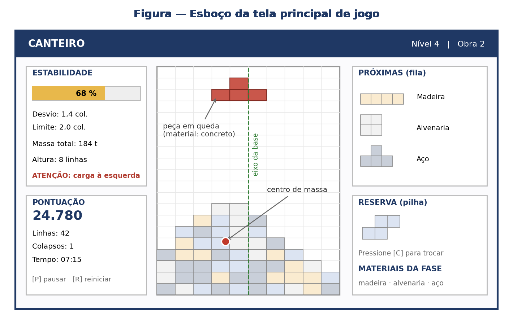
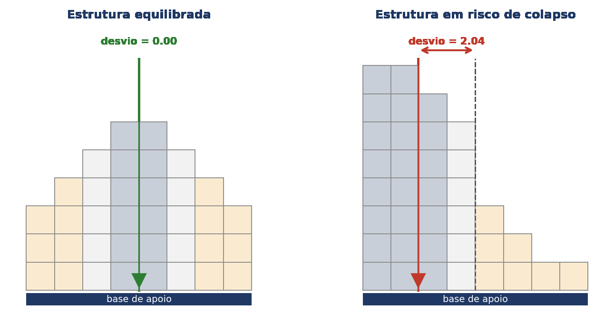
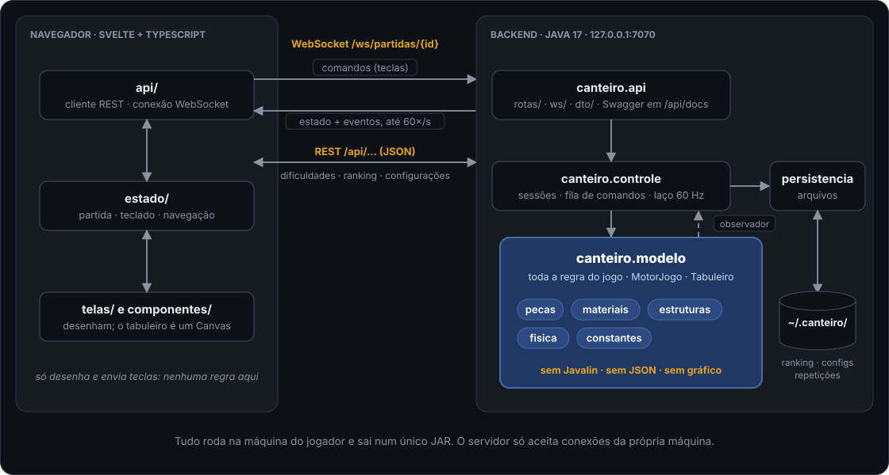
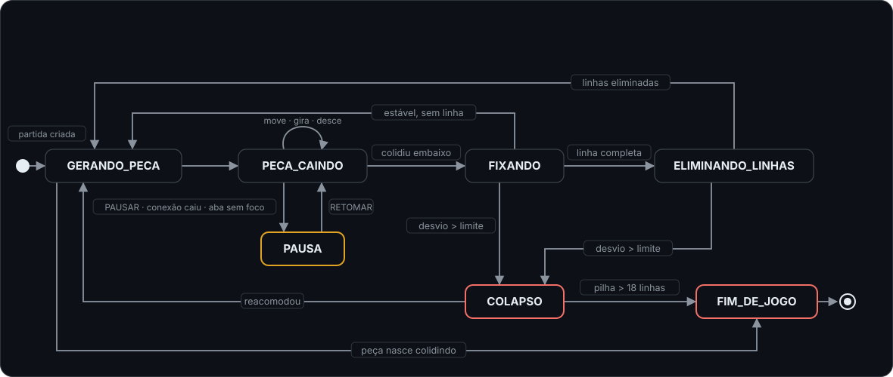
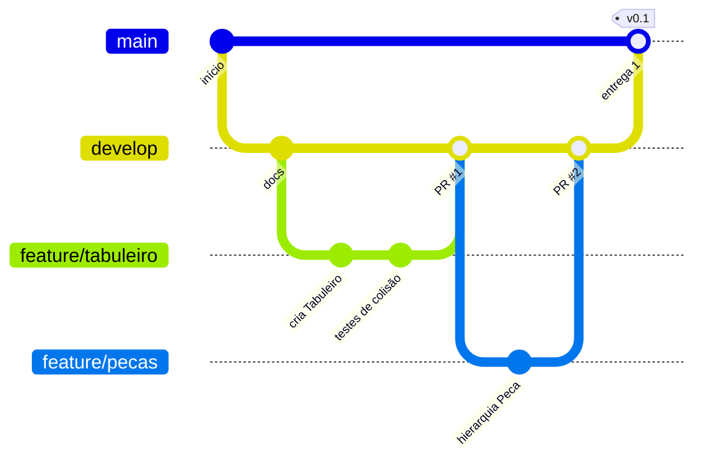

<div align="center">

# 🏗️ CANTEIRO

### Jogo de encaixe de blocos em que a pilha tem massa e precisa ficar de pé.

Não basta fechar linha: é preciso decidir **onde colocar carga**. Cada peça vem em madeira, alvenaria, concreto ou aço. O backend recalcula o **centro de massa** da estrutura a cada peça fixada e, se ele se afastar demais do eixo da base, **a obra desaba**.

<p>
  
  
  <a href="docs/Proposta_Projeto_Canteiro.pdf"></a>
  <a href="https://github.com/mateus-vitor-ferreira-dev/canteiro/actions/workflows/ci.yml"></a>
</p>

<p>
  
  
  
  
  
  
  
</p>

<sub>🧱 <strong>7</strong> formas &nbsp;•&nbsp; 🪵 <strong>4</strong> materiais &nbsp;•&nbsp; 📐 <strong>15</strong> regras de negócio &nbsp;•&nbsp; ✅ <strong>31</strong> requisitos funcionais &nbsp;•&nbsp; ⚙️ <strong>16</strong> não funcionais &nbsp;•&nbsp; 🎯 <strong>60</strong> ciclos/s &nbsp;•&nbsp; 📦 <strong>1</strong> JAR</sub>

<br/><br/>



<sub>Esboço da tela principal. O jogo ainda está sendo construído.</sub>

</div>

---

## 📑 Sumário

- [💡 O que é](#-o-que-é)
- [🎮 Como se joga](#-como-se-joga)
- [✨ Destaques de engenharia](#-destaques-de-engenharia)
- [🧬 Onde entra cada conceito da disciplina](#-onde-entra-cada-conceito-da-disciplina)
- [📋 Requisitos](#-requisitos) ← **o que já está pronto e o que falta**
- [🏛️ Arquitetura](#️-arquitetura)
- [🧭 Onde mexer](#-onde-mexer) ← **peguei uma tarefa: em qual pasta eu mexo?**
- [📂 Estrutura de pastas](#-estrutura-de-pastas)
- [🔄 Ciclo de vida da partida](#-ciclo-de-vida-da-partida)
- [🛠️ Stack](#️-stack)
- [🚀 Rodando localmente](#-rodando-localmente)
- [🧪 Testes](#-testes)
- [📏 Convenções de código](#-convenções-de-código)
- [🌳 Guia de Git da equipe](#-guia-de-git-da-equipe) ← **comece por aqui se você nunca usou Git**
- [🗓️ Cronograma](#️-cronograma)
- [👥 Equipe](#-equipe)

> [!NOTE]
> **Este README é a referência do projeto para a equipe.** A versão formal, com objetivos, requisitos, critérios de aceitação, cronograma, riscos e divisão de responsabilidades, está na **[proposta do projeto](docs/Proposta_Projeto_Canteiro.pdf)**. Para um panorama rápido, veja os **[slides da apresentação](docs/Apresentacao_Canteiro.pdf)**.

---

## 💡 O que é

Os jogos de encaixe de blocos são um problema resolvido há quarenta anos. Existem milhares de implementações e todas fazem a mesma coisa: peças caem, você fecha linhas e as linhas somem. Copiar isso não seria um trabalho autoral, e também não teria nada a ver com engenharia.

O **CANTEIRO** mantém a grade discreta do gênero e acrescenta uma restrição tirada da estática: **a pilha tem massa e essa massa precisa ficar equilibrada sobre a base de apoio**. As peças são elementos construtivos. Cada uma é fabricada num material com densidade própria, e uma linha completa é um pavimento concluído. Enquanto você joga, o sistema faz a análise estrutural da obra: soma as massas, calcula o centro de massa horizontal e compara com o eixo da base. A distância entre os dois vira um **índice de estabilidade**, que fica visível o tempo todo.

Quando o desvio ultrapassa o limite do nível, as camadas acima da linha crítica **se desprendem e caem por gravidade**, coluna a coluna, e o jogador perde pontos. Uma torre de aço encostada numa parede cai antes de uma pirâmide de madeira duas vezes maior. **É esse comportamento contraintuitivo que o jogo ensina.**

<div align="center">


<sub>A estrutura da direita tem <strong>menos</strong> blocos que a da esquerda, e mesmo assim é ela que cai.</sub>
</div>

**Como ele é construído.** O jogo tem duas partes que rodam **na máquina do próprio jogador**:

- o **backend em Java**, dono de todas as regras: física, colisão, estruturas de dados, pontuação e arquivos;
- o **frontend em Svelte 5 com TypeScript**, que roda no navegador, desenha o que o backend manda e envia as teclas.

Tudo sai num **único JAR**. Dois cliques nele sobem o servidor em `127.0.0.1` e abrem o jogo no navegador. Não precisa de internet, e o jogador só precisa ter o Java instalado.

> [!NOTE]
> O modelo físico é **uma simplificação deliberada**. Não simulamos esforço interno, resistência dos materiais, deformação nem tombamento com rotação: o critério de colapso olha só para o deslocamento horizontal do centro de massa. Isso basta para o jogo funcionar, mas **não é análise estrutural de engenharia**, e a própria tela do jogo vai deixar isso claro.

---

## 🎮 Como se joga

| | Regra |
|---|---|
| 🧱 **Tabuleiro** | 10 colunas × 20 linhas visíveis, mais 2 linhas ocultas no topo, onde as peças nascem |
| 🔷 **Peças** | Sempre 4 blocos, em uma das 7 formas canônicas: `I` `O` `T` `S` `Z` `J` `L` |
| 🎲 **Sorteio** | **Método da sacola**: as 7 formas são embaralhadas e todas saem antes de qualquer uma se repetir |
| 👀 **Fila** | O jogador vê as **3 próximas** peças, com forma e material |
| 📥 **Reserva** | Dá para guardar uma peça e trocar pela reservada, **uma vez por peça gerada** |
| 🧹 **Linhas** | Linha completa é eliminada. Eliminar 2, 3 ou 4 linhas de uma vez rende bônus progressivo |
| ⚖️ **Estabilidade** | Vai de 100 % com desvio nulo a 0 % quando o desvio chega ao limite do nível, variando linearmente |
| 💥 **Colapso** | Desvio acima do limite: os blocos acima da linha crítica caem, a pontuação perde o equivalente a **2 linhas** e o contador de colapsos sobe |
| 📈 **Nível** | Sobe a cada **10 linhas**. A queda acelera e o desvio tolerado diminui |
| 🏁 **Fim** | Quando uma peça nasce já colidindo, ou quando há um colapso com a pilha acima de **18 linhas** |

### Os materiais

Forma e material são **independentes**: qualquer forma pode sair em qualquer material. O material define a densidade, a cor, o bônus por linha e o efeito no momento em que a peça é assentada.

| Material | Peso | Bônus por linha | Efeito ao fixar | Aparece a partir do |
|---|---|---|---|---|
| 🪵 **Madeira** | leve | baixo (10) | nenhum | nível 1 |
| 🧱 **Alvenaria** | médio | médio | a definir | nível 1 |
| 🪨 **Concreto** | pesado | alto | a definir | nível 3 |
| 🔩 **Aço** | o mais pesado | o mais alto (40) | **consolida os blocos logo abaixo**, que passam a resistir ao desprendimento no colapso | nível 5, e fica mais frequente a partir do 9 |

> [!TIP]
> Cada material tem **padrão de textura** além da cor (veios na madeira, tijolos na alvenaria, pontilhado no concreto, hachura no aço), para jogadores com daltonismo (RNF06).

### A curva de dificuldade

A dificuldade cresce por dois caminhos ao mesmo tempo, a **velocidade** e o **aperto do limite**. Por isso, quem domina o encaixe continua tendo desafio.

| Nível | Intervalo de queda | Limite de desvio | Materiais |
|---|---|---|---|
| 1 – 2 | 800 ms | 3,0 colunas | madeira, alvenaria |
| 3 – 4 | 650 ms | 2,5 colunas | + concreto |
| 5 – 6 | 500 ms | 2,0 colunas | todos |
| 7 – 8 | 380 ms | 1,7 coluna | todos |
| 9 – 10 | 280 ms | 1,4 coluna | todos, com aço mais frequente |
| 11+ | 200 ms | 1,2 coluna | todos, com aço mais frequente |

<sub>São os valores iniciais. Eles vão ser ajustados nos testes com jogadores a partir da semana 8.</sub>

---

## ✨ Destaques de engenharia

**O centro de massa é recalculado em tempo constante, não varrendo o tabuleiro.** A saída ingênua seria percorrer as 200 posições a cada ciclo e refazer a média ponderada. Funciona, mas desperdiça processamento. O `AnalisadorEstrutural` mantém só dois acumuladores: a **massa total** e a **soma dos momentos** (massa × coluna de cada bloco). Fixar um bloco soma nos dois, remover subtrai, e o centro de massa é `momentoX / massaTotal`. **Custo O(1) por bloco alterado, independente da altura da pilha (RNF02).**

**Eliminar uma linha não mexe no momento dos blocos que descem.** Quando uma linha some, os blocos de cima caem, mas **continuam na mesma coluna**, e o momento horizontal só depende da coluna. Então basta descontar os blocos eliminados.

**Um teste confere a otimização contra a versão ingênua.** O ponto mais provável de falha do projeto é um acumulador de massa dessincronizado. Esse tipo de erro gera colapsos que parecem injustos, e o jogador percebe que o jogo está quebrado sem saber explicar por quê. Para pegar isso, um teste aplica **500 operações aleatórias** e compara o cálculo incremental com a varredura completa, com tolerância de `0,001`.

**Só uma thread mexe no jogo.** As teclas chegam pela thread do WebSocket, mas não tocam no motor. Viram um `Comando` e entram numa `ConcurrentLinkedQueue`. O laço da partida, que roda num `ScheduledExecutorService` a cada ~16 ms, esvazia essa fila no começo de cada ciclo. **Sem trava, sem condição de corrida**, e com o jogo **determinístico**: com a mesma semente e os mesmos comandos, a partida termina com a mesma pontuação. É isso que torna a repetição possível.

**Toda mensagem leva o estado inteiro.** O backend não manda "a peça desceu uma linha", manda o tabuleiro completo, a peça, o placar e a estabilidade, até 60 vezes por segundo. Parece desperdício, mas cabe em menos de 4 KB, e ganha-se muito: **se uma mensagem se perder, a próxima corrige tudo**, e o frontend nunca precisa juntar pedaços nem pode ficar dessincronizado.

**Em máquina lenta, perde-se o desenho, nunca a regra.** O backend simula a 60 ciclos por segundo, sempre. O frontend guarda o último estado recebido e redesenha o Canvas a cada `requestAnimationFrame`. Se o computador não aguentar, o que cai é a taxa de quadros da tela. A partida continua igual, porque um jogo que muda de comportamento conforme o hardware está quebrado.

**O modelo não sabe que existe um servidor.** O `modelo` (com todos os subpacotes), o `controle` e a `persistencia` **não podem importar Javalin, JSON nem nada gráfico**. Isso é garantido por um teste que reprova o build. É o que permite criar um `MotorJogo`, rodar milhares de jogadas e conferir o resultado num teste JUnit, sem subir servidor nem abrir navegador (RNF08).

**O frontend não tem regra de jogo.** Ele não calcula colisão, pontuação nem estabilidade: recebe tudo pronto e desenha. Isso mantém o conteúdo da disciplina no Java e deixa o Svelte simples para quem está começando. **A pontuação do ranking nunca vem do navegador**: o frontend manda só o id da partida e o nome, e o backend lê a pontuação da própria sessão.

**Duas hierarquias em vez de uma: 11 classes em vez de 28.** Forma e material são dimensões independentes. Juntar as duas numa hierarquia só exigiria uma classe para cada combinação (7 × 4). Separadas e ligadas por composição, ficam 7 subclasses de `Peca` e 4 de `Material`. **Criar um quinto material é escrever uma classe e registrá-la no catálogo**, sem tocar no motor.

**Um JAR, dois cliques.** Na hora de empacotar, o Maven compila o Svelte com um Node próprio, baixado só para isso, e coloca o resultado dentro do JAR. O Javalin serve esses arquivos e a API na mesma porta. **O jogador não precisa de Node, de npm nem de internet** (RNF16).

**Local de verdade.** O servidor escuta **só em `127.0.0.1`**: outro computador na mesma rede não consegue nem ver que ele existe (RNF13). Mensagens malformadas pelo WebSocket viram um evento `ERRO`, e a partida continua (RNF14).

---

## 🧬 Onde entra cada conceito da disciplina

Nenhuma estrutura de dados está aqui para cumprir o enunciado. **Cada uma existe porque o jogo precisa dela.** E todas estão **no Java**.

| Conceito | Onde aparece | Por que esta estrutura, e não outra |
|---|---|---|
| **Herança** | `Peca` → `PecaI`, `PecaO`, `PecaT`, `PecaS`, `PecaZ`, `PecaJ`, `PecaL` · `Material` → `Madeira`, `Alvenaria`, `Concreto`, `Aco` | O que é comum a todas as peças (blocos, material, rotação, giro) e a todos os materiais (nome, densidade, cor) fica fatorado na superclasse abstrata |
| **Polimorfismo** | `formas()`, `aoFixar()`, `bonusLinha()` | O motor pede a forma à peça e o efeito ao material **sem saber qual é qual**. Não há cadeia de `if` nem `switch` por tipo |
| **Interfaces** | `ObservadorPartida`, `Atualizavel` | O motor avisa que o estado mudou sem saber quem está ouvindo. É assim que o modelo fala com o WebSocket sem conhecê-lo |
| **Fila** (`ArrayDeque`) | Próximas peças | Consumo em ordem de chegada, inserção sempre no fim e remoção O(1) |
| **Fila concorrente** (`ConcurrentLinkedQueue`) | Comandos do jogador | É a fronteira entre a thread do WebSocket e a do laço, sem precisar de trava |
| **Pilha** (`Deque`) | Peça reservada · histórico de jogadas | Reserva e desfazer operam sobre o último elemento. A pilha da reserva já permite, no futuro, guardar várias peças |
| **Lista** (`ArrayList`) | Blocos de uma peça · linhas completas · blocos desprendidos | Acesso sequencial na colisão e na serialização |
| **Tabela hash** (`HashMap`) | Catálogo de materiais · ranking · sessões de partida | Material buscado pelo código a cada peça, sessão buscada pelo id que vem na URL do WebSocket, nome do jogador apontando para a melhor pontuação: tudo em O(1) |
| **Matriz** | Grade do tabuleiro | Acesso O(1) por linha e coluna. Checar uma linha completa percorre só 10 posições |
| **Vetor de acumuladores** | Massa por coluna | É o que torna o centro de massa O(1) |
| **Recursividade** | Reacomodação dos blocos no colapso | A queda por gravidade propaga coluna a coluna |
| **Exceções** | Leitura dos arquivos · validação das mensagens | Leitura defensiva com valores padrão, e mensagem inválida que vira erro em vez de derrubar a partida |

---

## 📋 Requisitos

Os critérios de aceitação de cada requisito estão na [proposta do projeto](docs/Proposta_Projeto_Canteiro.pdf) (seção 12). Aqui fica a lista e, principalmente, **o andamento de cada requisito**.

| Status | Significado |
|---|---|
| ✅ | Pronto e testado |
| 🟡 | Começado: parte já está na `develop` |
| ⬜ | Ainda não começado |
| 🔁 | Regra de código: vale para todo PR, não tem "pronto" |

**Andamento:** 28 prontos e 4 começados, de 31 funcionais e 16 não funcionais. As regras de negócio entram junto com o modelo, a partir das semanas 3 – 4.

> [!TIP]
> **Quem termina um requisito atualiza o status aqui, no mesmo PR.** Na coluna *Onde está*, cite o número do PR (`#12`). O checklist do PR lembra disso.

### Regras de negócio

<details>
<summary><strong>RN01 – RN15</strong>: as regras do jogo, todas no backend</summary>

| Código | Regra |
|---|---|
| RN01 | O tabuleiro tem 10 colunas e 20 linhas visíveis, mais 2 linhas ocultas de geração no topo |
| RN02 | Todo elemento é composto por exatamente quatro blocos unitários conexos, em uma das sete formas canônicas (I, O, T, S, Z, J, L) |
| RN03 | O material do elemento é sorteado entre os liberados na fase e determina densidade, cor e multiplicador de pontos |
| RN04 | A sequência de elementos é gerada pelo método da sacola: as sete formas são embaralhadas e distribuídas antes que qualquer uma se repita |
| RN05 | O jogador pode reservar um elemento por vez. A troca só pode ser feita uma vez a cada elemento gerado |
| RN06 | Uma linha é eliminada quando suas 10 posições estão ocupadas. Eliminações simultâneas de 2, 3 ou 4 linhas recebem bônus progressivo |
| RN07 | A massa de um bloco é a densidade do seu material vezes o volume unitário. A massa da estrutura é a soma das massas dos blocos |
| RN08 | O centro de massa horizontal é a média das colunas dos blocos, ponderada pela massa de cada um |
| RN09 | O desvio é o módulo da diferença entre o centro de massa e o eixo central da base de apoio, em colunas |
| RN10 | O índice de estabilidade é 100 % com desvio nulo e 0 % quando o desvio atinge o limite do nível, variando linearmente |
| RN11 | Há colapso quando o desvio ultrapassa o limite do nível. Os blocos acima da linha de maior concentração de massa se desprendem e são reacomodados por gravidade, coluna a coluna |
| RN12 | Cada colapso subtrai da pontuação o equivalente a duas linhas eliminadas e incrementa o contador de colapsos |
| RN13 | A partida termina se um elemento recém-gerado colidir imediatamente com a estrutura, ou se houver colapso com a pilha ocupando mais de 18 linhas |
| RN14 | O nível avança a cada 10 linhas eliminadas. A cada nível, o intervalo de queda diminui e o limite de desvio é reduzido |
| RN15 | Só entram no ranking pontuações de partidas concluídas sem uso do desfazer |

</details>

### Requisitos funcionais

**Prior.:** E = essencial, entra na versão mínima; D = desejável, se houver prazo. **Lado:** ☕ backend, 🌐 frontend.

<details open>
<summary><strong>RF01 – RF31</strong></summary>

| Código | Descrição | Prior. | Lado | Status | Onde está |
|---|---|:-:|:-:|:-:|---|
| RF01 | Exibir um menu principal com nova partida, ranking, repetições, configurações e sair | E | 🌐 | ⬜ |  |
| RF02 | Permitir escolher entre três dificuldades, que definem a velocidade inicial de queda e o limite de desvio | E | ☕ 🌐 | ✅ | GET /api/dificuldades (#4), POST /api/partidas (#23) e a tela: escolher a dificuldade cria e abre a partida (#8, #25) |
| RF03 | Gerar elementos continuamente enquanto a partida estiver em andamento | E | ☕ | 🟡 | O motor gera peças continuamente a partir de uma FontePecas (#20); falta a sacola (#12) |
| RF04 | Atribuir a cada elemento um material sorteado entre os liberados na fase | E | ☕ | 🟡 | Materiais e catálogo (#9); falta sortear o material de cada peça |
| RF05 | Exibir os três próximos elementos da fila, com forma e material | E | ☕ 🌐 | ✅ | As 3 próximas peças, com forma e material, ao lado do tabuleiro (#23, #25) |
| RF06 | Descer o elemento em queda uma linha a cada intervalo definido pelo nível | E | ☕ | ✅ | Queda contada em ciclos, no intervalo do nível atual (#20, #22) |
| RF07 | Mover o elemento em queda para a esquerda e para a direita, respeitando as bordas e os blocos fixados | E | ☕ | ✅ | Colisão no tabuleiro (#11) e movimento no motor (#20) |
| RF08 | Girar o elemento nos dois sentidos, com deslocamento corretivo quando a rotação simples causar sobreposição | E | ☕ | ✅ | Peças no padrão SRS (#10) e rotação com deslocamento corretivo nos dois sentidos (#21) |
| RF09 | Permitir a queda instantânea do elemento até a primeira posição de apoio | E | ☕ | ✅ | Queda instantânea até o primeiro apoio, com peça fantasma (#20) |
| RF10 | Permitir reservar o elemento em queda e trocá-lo pelo reservado, uma vez por elemento | E | ☕ | ⬜ |  |
| RF11 | Fixar o elemento quando ele colidir com o fundo ou com um bloco fixado | E | ☕ | ✅ | Fixação na grade (#11), acionada pelo motor ao bater embaixo (#20) |
| RF12 | Identificar e eliminar as linhas completas após a fixação, descendo as linhas de cima | E | ☕ | ✅ | Linhas completas eliminadas e as de cima descendo (#20) |
| RF13 | Calcular a pontuação considerando linhas simultâneas, material predominante e nível | E | ☕ | ✅ | Base por linhas simultâneas × nível × bônus do material predominante (#22) |
| RF14 | Recalcular o centro de massa sempre que a composição do tabuleiro mudar | E | ☕ | ✅ | Centro de massa incremental, atualizado a cada bloco fixado ou eliminado (#28) |
| RF15 | Exibir continuamente o índice de estabilidade, o desvio corrente e o limite tolerado | E | ☕ 🌐 | ✅ | Índice, desvio e limite sempre na tela, e o eixo e o centro de massa desenhados no tabuleiro (#28, #25) |
| RF16 | Sinalizar visualmente a aproximação do limite de desvio antes do colapso | E | 🌐 | ✅ | Painel com barra, medidor do centro de massa em relação ao eixo e aviso do lado da carga no alerta (#29) |
| RF17 | Executar o colapso quando o desvio ultrapassar o limite, reacomodando os blocos desprendidos | E | ☕ | ✅ | Linha crítica, queda recursiva, penalidade e evento COLAPSO (#28), com a animação de 1 s na tela (#29) |
| RF18 | Avançar de nível a cada dez linhas, ajustando velocidade e limite de desvio | E | ☕ | ✅ | Sobe a cada 10 linhas, acelera a queda e aperta o limite de desvio (#22, #28) |
| RF19 | Permitir pausar e retomar a partida | E | ☕ 🌐 | ✅ | P ou Esc pausa e retoma, com a camada de pausa (#20, #23, #25) |
| RF20 | Encerrar a partida nas condições de fim de jogo e exibir a tela de resultado | E | ☕ 🌐 | 🟡 | O motor encerra a partida nas duas condições da RN13 (#20, #28); falta a tela de fim (#32) |
| RF21 | Registrar a pontuação no ranking persistente, com o nome informado pelo jogador | E | ☕ 🌐 | ⬜ |  |
| RF22 | Exibir o ranking com as dez melhores pontuações | E | ☕ 🌐 | ⬜ |  |
| RF23 | Registrar em pilha todas as jogadas executadas na partida | E | ☕ | ⬜ |  |
| RF24 | Reproduzir passo a passo uma partida encerrada, a partir do histórico | D | ☕ 🌐 | ⬜ |  |
| RF25 | Exibir, ao fim da partida, um relatório com a evolução do índice de estabilidade e a distribuição de materiais | D | ☕ 🌐 | ⬜ |  |
| RF26 | Oferecer, no modo treino, o desfazer da última jogada | D | ☕ | ⬜ |  |
| RF27 | Permitir configurar as teclas de comando | D | ☕ 🌐 | ⬜ |  |
| RF28 | Tocar efeitos sonoros para fixação, eliminação de linha e colapso | D | 🌐 | ⬜ |  |
| RF29 | Ao abrir o JAR, subir o servidor e abrir o jogo no navegador padrão. Se não for possível abrir o navegador, mostrar o endereço no terminal | E | ☕ | ✅ | Sobe o servidor e abre o navegador (#4), com o frontend dentro do JAR (#8) |
| RF30 | Pausar a partida automaticamente quando a conexão com o navegador cair ou quando a aba do jogo perder o foco | E | ☕ 🌐 | ✅ | A partida pausa quando a conexão cai (#23) e quando a aba perde o foco (#25) |
| RF31 | Reconectar sozinho após uma queda de conexão e retomar a partida do ponto em que parou | D | ☕ 🌐 | ✅ | Reconecta em intervalos crescentes e volta pausada no mesmo ponto; se o backend reiniciou, avisa que a partida se perdeu (#33) |

</details>

### Requisitos não funcionais

<details open>
<summary><strong>RNF01 – RNF16</strong></summary>

| Código | Categoria | Descrição | Status | Onde está |
|---|---|---|:-:|---|
| RNF01 | Desempenho | O frontend deve desenhar o tabuleiro a 60 quadros por segundo e o backend deve atualizar o estado 60 vezes por segundo, em máquina com processador de dois núcleos e 4 GB de memória | 🟡 | 60 ciclos no backend (#23) e 60 quadros medidos no navegador em 5 s (#25); falta a medição de 10 min (#27) |
| RNF02 | Desempenho | O recálculo do centro de massa deve ser incremental, em tempo constante por bloco alterado, sem percorrer o tabuleiro a cada quadro | ✅ | Dois acumuladores (massa e momento), O(1) por bloco; confere com a varredura após 500 peças (#28) |
| RNF03 | Desempenho | O tempo entre o pressionamento de uma tecla e a resposta visual não deve passar de 50 ms, contando a ida e a volta pelo WebSocket | ✅ | Da tecla ao estado novo: mediana de 13 ms e pior caso de 32 ms, medidos jogando pelo JAR (#25) |
| RNF04 | Portabilidade | O jogo deve rodar sem alteração de código em Windows, Linux e macOS, exigindo do jogador apenas Java 17 ou superior e um navegador atual (Chrome, Firefox, Edge ou Safari, nas duas últimas versões) | ⬜ |  |
| RNF05 | Usabilidade | Os comandos devem ser aprendidos sem manual, com legenda visível na própria tela de jogo | ✅ | Legenda das teclas sempre visível na partida, gerada da mesma tabela que o teclado usa (#25); legenda dos materiais e botões de toque no celular (#59) |
| RNF06 | Usabilidade | As cores dos materiais devem ser distinguíveis também por padrão de textura, atendendo jogadores com daltonismo | ✅ | Textura em cada material (veios, tijolos, pontilhado, hachura) e borda clara nos blocos, legenda com nome e peso; conferido com simulação de protanopia, deuteranopia, tritanopia e escala de cinza (#59) |
| RNF07 | Manutenibilidade | Todas as classes e métodos públicos do backend devem ter Javadoc completo, com parâmetros, retorno e exceções. Os tipos exportados do frontend devem ter comentário TSDoc | 🔁 | O build reprova Javadoc faltando (`./mvnw javadoc:javadoc`) |
| RNF08 | Manutenibilidade | As regras do jogo devem ficar inteiramente na camada de modelo do backend, sem dependência de Javalin, de JSON nem de classes gráficas, permitindo testá-las sem servidor e sem navegador | ✅ | `ArquiteturaTest` (#1, ampliado no #4) |
| RNF09 | Manutenibilidade | Nenhum método ou função com mais de 40 linhas úteis. Nenhuma classe Java com mais de 400 linhas. Nenhum componente Svelte com mais de 200 linhas | 🔁 | Conferido na revisão de cada PR |
| RNF10 | Confiabilidade | Colisão, rotação, eliminação de linhas, centro de massa e a serialização do protocolo devem ter testes automatizados | ✅ | Colisão, rotação, linhas, centro de massa (#11, #20, #21, #28) e serialização do protocolo (#23) |
| RNF11 | Confiabilidade | Falha na leitura dos arquivos de ranking ou de configuração não deve impedir o jogo; o sistema recorre a valores padrão | ⬜ |  |
| RNF12 | Segurança | Arquivos de dados devem ser validados na leitura; conteúdo malformado é rejeitado com registro em log, sem interromper a aplicação | ⬜ |  |
| RNF13 | Segurança | O servidor deve escutar apenas em `127.0.0.1`, nunca em todas as interfaces de rede. Em produção, só a própria origem é aceita; a origem do servidor de desenvolvimento do Vite só é liberada em modo de desenvolvimento | ✅ | Escuta só em `127.0.0.1`; `ServidorWebTest` confirma que o IP de rede é recusado (#4) |
| RNF14 | Confiabilidade | Toda mensagem recebida pela API ou pelo WebSocket deve ser validada. Mensagem malformada ou comando desconhecido gera uma resposta de erro, nunca uma exceção que derrube a partida | ✅ | REST e WebSocket validam tudo: JSON malformado vira erro 400 ou evento ERRO, e a partida continua (#4, #23) |
| RNF15 | Manutenibilidade | O protocolo entre backend e frontend deve estar documentado e tipado dos dois lados: `record`s no Java e tipos no TypeScript. O TypeScript roda em modo `strict`, sem `any` | ✅ | Swagger nas rotas REST (#43); record e protocolo.ts espelhados, com teste de serialização contra exemplos fixos (#23) |
| RNF16 | Portabilidade | O comando de empacotamento deve gerar um único JAR que já contenha o frontend compilado. O jogador não precisa de Node.js | ✅ | `./mvnw package` gera um JAR com o backend (#4) e o frontend compilado (#8) |

</details>

---

## 🏛️ Arquitetura

<p align="center">

</p>

<sub>Os diagramas deste README saem de <a href="docs/imagens/diagramas/gerar.py"><code>docs/imagens/diagramas/gerar.py</code></a>. Para mudar um, edite o script e rode <code>python3 docs/imagens/diagramas/gerar.py</code>.</sub>

O **`MotorJogo`** é o coordenador e **não implementa regra nenhuma, só delega**: pergunta ao `Tabuleiro` se há colisão, pede ao `AnalisadorEstrutural` a verificação de equilíbrio e ao `GeradorPecas` o próximo elemento. A **`SessaoPartida`** é dona de um motor, da fila de comandos e do laço; ela se inscreve como observadora do motor e, a cada mudança, publica o estado no WebSocket.

### O protocolo, em resumo

| Canal | Direção | O que passa |
|---|---|---|
| `POST /api/partidas` | front → back | Cria uma partida com a dificuldade escolhida e devolve o `id` |
| `WS /ws/partidas/{id}` | front → back | `{ "tipo": "COMANDO", "comando": "GIRAR_HORARIO" }` |
| `WS /ws/partidas/{id}` | back → front | `ESTADO` (tabuleiro, peça, fila, reserva, placar, estabilidade) e `EVENTO` (linhas eliminadas, colapso, nível, fim) |
| `GET /api/ranking` · `POST /api/ranking` | ambos | Dez melhores; registro pelo id da partida e nome |
| `GET /api/materiais` · `/api/dificuldades` · `/api/configuracoes` · `/api/repeticoes` | ambos | Catálogo, dificuldades, teclas e repetições |

**As rotas REST estão documentadas no Swagger**, que vem junto com o backend: com ele rodando, abra **`http://127.0.0.1:7070/api/docs`** para ler cada rota e testá-la no navegador. A especificação em JSON fica em `/api/openapi.json`. O Swagger é gerado das anotações `@OpenApi` de cada rota, então ele nunca fica desatualizado.

As mensagens do WebSocket não aparecem no Swagger. A referência delas é o código: os `record`s de `canteiro.api.dto` no backend e `frontend/src/api/protocolo.ts` no frontend.

> [!IMPORTANT]
> **O protocolo existe duas vezes, de propósito:** como `record`s Java em `canteiro.api` e como tipos TypeScript em `frontend/src/api/protocolo.ts`. **Mudou um lado, muda o outro no mesmo PR.**

### Dados persistidos

Não há banco de dados. Tudo fica em arquivos de texto na pasta `~/.canteiro/` do usuário. Os valores padrão vão dentro do JAR e são usados se o arquivo faltar ou vier corrompido.

| Arquivo | Formato | Conteúdo |
|---|---|---|
| `materiais.properties` | chave = valor | Código, nome, densidade, cor e bônus de cada material. Carregado no `HashMap` do catálogo |
| `configuracoes.properties` | chave = valor | Teclas de comando, volume e texturas para daltonismo |
| `ranking.csv` | CSV | Nome, pontuação, nível, linhas, colapsos e data. Só entram partidas **sem uso do desfazer** (RN15) |
| `repeticoes/<data>.txt` | uma jogada por linha | Semente do gerador e, para cada jogada, o ciclo e o comando: o suficiente para reconstruir a partida inteira |

---

## 🧭 Onde mexer

> **Para quem está chegando agora.** Esta seção responde uma pergunta só: *"peguei uma tarefa, em qual pasta eu mexo?"*. A explicação técnica de cada pasta vem logo depois, em [📂 Estrutura de pastas](#-estrutura-de-pastas).

### O projeto em três pastas

| Pasta | O que é | Pense nela como |
|---|---|---|
| 📁 **`backend/`** | O jogo de verdade, em Java: regras, física, pontos, arquivos | **O juiz.** Decide tudo: se a peça cabe, se a obra caiu, quantos pontos vale |
| 📁 **`frontend/`** | A tela, em Svelte: o que o jogador vê e as teclas que ele aperta | **O placar.** Só mostra o que o juiz decidiu e avisa quando o jogador aperta uma tecla |
| 📁 **`docs/`** | Os documentos: proposta, apresentação, e em breve o manual da equipe e os roteiros de teste | **A pasta do professor.** Tudo o que é para ler, não para rodar |

Se você está na dúvida entre o backend e o frontend, faça a pergunta: **"isso é uma regra do jogo?"** Se for, é backend. O frontend nunca calcula nada, só desenha.

### Quero fazer… vou para…

| Quero… | Vou para | Tarefas no board |
|---|---|---|
| Criar ou mudar uma peça ou um material | `backend/src/main/java/canteiro/modelo/pecas/` e `.../modelo/materiais/` | #9, #10 |
| Mexer no tabuleiro, no motor ou nas regras de pontos | `backend/src/main/java/canteiro/modelo/` | #11, #20, #21, #22 |
| Mexer na sacola de peças, na fila, na reserva ou no histórico | `backend/src/main/java/canteiro/modelo/estruturas/` | #12, #13, #14 |
| Mexer no centro de massa e no colapso | `backend/src/main/java/canteiro/modelo/fisica/` | #28 |
| Ler ou gravar arquivo (ranking, configurações, replay) | `backend/src/main/java/canteiro/persistencia/`, com os valores padrão em `backend/src/main/resources/dados/` | #24, #31, #35 |
| Criar uma rota nova na API | `backend/.../api/rotas/` (a rota, com `@OpenApi`) e `backend/.../api/dto/` (o formato do JSON). Depois, o mesmo tipo em `frontend/src/api/protocolo.ts` e a função em `frontend/src/api/cliente.ts` | #23, #31 |
| Criar ou mudar uma tela | `frontend/src/telas/<NomeDaTela>/` (uma pasta por tela) | #25, #26, #32 |
| Criar um pedaço de tela usado por **mais de uma** tela | `frontend/src/componentes/` | #29 |
| Mudar cores, fontes ou as texturas dos materiais | `frontend/src/estilos/` | — |
| Colocar um som ou uma imagem | `frontend/public/sons/` ou `frontend/public/imagens/` | #38 |
| Escrever um teste automático do backend | `backend/src/test/java/canteiro/`, **no mesmo pacote** da classe testada | toda tarefa de programação |
| Escrever um teste automático do frontend | Ao lado do arquivo testado, com o final `.test.ts` | toda tarefa de programação |
| Escrever um roteiro de teste manual | `docs/testes/` | #17, #27 |
| Escrever o manual da equipe | `docs/EQUIPE.md` | #18 |
| Atualizar o andamento de um requisito | Este README, seção [📋 Requisitos](#-requisitos) | #19 |
| Relatório, slides, documentos de entrega | `docs/` | #39 |
| Registrar um bug ou uma ideia | Não é pasta: é uma **issue nova**, com o modelo certo, no [board](https://github.com/users/mateus-vitor-ferreira-dev/projects/5) | — |

### Um exemplo de ponta a ponta: a lista de dificuldades

A tela de escolher a dificuldade já funciona. Seguir o caminho dela pelos arquivos é o jeito mais rápido de entender como as pastas conversam. Toda funcionalidade nova vai seguir o mesmo caminho.

| Passo | Arquivo | O que ele faz |
|---|---|---|
| 1. A regra | [`modelo/Dificuldade.java`](backend/src/main/java/canteiro/modelo/Dificuldade.java) | Diz quais são as três dificuldades e os valores de cada uma. **É aqui que se muda um valor do jogo** |
| 2. O formato do JSON | [`api/dto/DificuldadeDto.java`](backend/src/main/java/canteiro/api/dto/DificuldadeDto.java) | Transforma a regra no formato que vai para o navegador |
| 3. A rota | [`api/rotas/RotasDificuldades.java`](backend/src/main/java/canteiro/api/rotas/RotasDificuldades.java) | Responde em `GET /api/dificuldades`. A anotação `@OpenApi` faz ela aparecer no Swagger (`/api/docs`) |
| 4. O tipo no frontend | [`src/api/protocolo.ts`](frontend/src/api/protocolo.ts) | O mesmo formato do passo 2, agora em TypeScript |
| 5. A chamada | [`src/api/cliente.ts`](frontend/src/api/cliente.ts) | A função `listarDificuldades()`, que busca os dados no backend |
| 6. A tela | [`src/telas/NovaPartida/NovaPartida.svelte`](frontend/src/telas/NovaPartida/NovaPartida.svelte) | Chama a função do passo 5 e desenha os três cartões |

E cada passo tem o seu teste: [`DificuldadeTest`](backend/src/test/java/canteiro/modelo/DificuldadeTest.java) (passo 1), [`ServidorWebTest`](backend/src/test/java/canteiro/api/ServidorWebTest.java) (passos 2 e 3), [`cliente.test.ts`](frontend/src/api/cliente.test.ts) (passo 5) e [`NovaPartida.test.ts`](frontend/src/telas/NovaPartida/NovaPartida.test.ts) (passo 6).

### As pastas de cada um

| Quem | Onde vai trabalhar na maior parte do tempo |
|---|---|
| **Mateus** | `backend/.../modelo/` (motor, peças, materiais, física), `backend/.../api/` e `controle/` (servidor e WebSocket), `frontend/src/telas/Partida/` e `componentes/` |
| **Marcelo** | `backend/.../modelo/estruturas/` (sacola, fila, pilha, histórico), `backend/.../persistencia/` (arquivos e ranking) e as telas de apoio em `frontend/src/telas/` (Menu, Ranking, Repetições, Relatório, Configurações) |
| **Wanessa** | `docs/` (roteiros de teste, manual da equipe, relatório), este README (seção de requisitos) e o [board](https://github.com/users/mateus-vitor-ferreira-dev/projects/5). **Não precisa abrir `backend/src` nem `frontend/src`**: para testar o jogo, basta rodar o JAR ([🚀 Rodando localmente](#-rodando-localmente)) |

### O que ninguém edita à mão

| Pasta ou arquivo | Por quê |
|---|---|
| `backend/target/`, `frontend/node_modules/`, `frontend/dist/` | São gerados pelo Maven e pelo npm, e nem vão para o GitHub. Se algo estranho acontecer, pode apagar: eles voltam no próximo build |
| `frontend/package-lock.json` | O npm atualiza sozinho quando alguém instala uma dependência. Vai no commit, mas não se edita |
| `backend/mvnw`, `backend/mvnw.cmd`, `backend/.mvn/` | O Maven Wrapper. Só se usa, nunca se mexe |
| Arquivos `.gitkeep` | Só existem para a pasta vazia aparecer no GitHub. Quando a pasta ganhar o primeiro arquivo de verdade, pode apagar o `.gitkeep` dela |

---

## 📂 Estrutura de pastas

```
canteiro/
├── backend/                         O JOGO EM JAVA (projeto Maven)
│   ├── src/
│   │   ├── main/
│   │   │   ├── java/canteiro/
│   │   │   │   ├── app/             main: sobe o servidor e abre o navegador
│   │   │   │   ├── api/             ServidorWeb
│   │   │   │   │   ├── rotas/       uma classe por recurso: RotasDificuldades...
│   │   │   │   │   ├── ws/          CanalPartida (WebSocket)
│   │   │   │   │   └── dto/         records do protocolo + conversão
│   │   │   │   ├── controle/        sessões, fila de comandos, laço
│   │   │   │   ├── modelo/          TODA a regra do jogo: motor, tabuleiro, dificuldades
│   │   │   │   │   ├── pecas/       Peca + as 7 formas
│   │   │   │   │   ├── materiais/   Material + os 4 materiais
│   │   │   │   │   ├── estruturas/  sacola, fila, pilha, histórico
│   │   │   │   │   ├── fisica/      centro de massa, estabilidade, colapso
│   │   │   │   │   └── constantes/  dimensões e limites do jogo
│   │   │   │   └── persistencia/    ranking, materiais, repetições
│   │   │   └── resources/
│   │   │       └── dados/           valores padrão dos arquivos
│   │   └── test/
│   │       ├── java/canteiro/       testes (espelham os pacotes de main)
│   │       └── resources/arquivos/  arquivos de entrada dos testes
│   ├── .mvn/wrapper/                configuração do Maven Wrapper
│   ├── mvnw · mvnw.cmd              Maven sem precisar instalar
│   └── pom.xml                      a receita do backend
├── frontend/                        A INTERFACE (Svelte + TypeScript)
│   ├── src/
│   │   ├── api/                     cliente REST, WebSocket, tipos do protocolo
│   │   ├── telas/                   uma pasta por tela
│   │   │   ├── NovaPartida/         NovaPartida.svelte + NovaPartida.test.ts
│   │   │   └── Partida/             Partida.svelte + os componentes só dela
│   │   ├── componentes/             só o que mais de uma tela usa: Tabuleiro...
│   │   ├── estado/                  partida, teclado, navegacao
│   │   ├── estilos/                 cores, fontes, texturas dos materiais
│   │   └── util/                    funções puras
│   ├── public/                      ícone, sons/, imagens/
│   ├── index.html
│   ├── package.json                 a receita do frontend
│   └── vite.config.ts
├── docs/
│   ├── Proposta_Projeto_Canteiro.pdf  proposta do projeto
│   ├── Apresentacao_Canteiro.pdf    slides para a apresentação em vídeo
│   ├── EQUIPE.md                    manual da equipe (a criar, #18)
│   ├── testes/                      roteiros de teste manual (a criar, #17)
│   └── imagens/                     imagens do README e o gerador dos diagramas
├── .github/pull_request_template.md
├── .editorconfig · .gitattributes · .gitignore
└── README.md
```

> [!NOTE]
> A árvore mostra o destino. Algumas pastas ainda estão vazias (só com `.gitkeep`) e vão sendo preenchidas conforme o [cronograma](#️-cronograma).

### Por que o backend está dividido assim

**A pasta diz de qual camada é o código, e a camada diz o que ele pode usar.** Para decidir onde uma classe nova vai morar, pergunte *"isso é regra do jogo, é coordenação ou é comunicação?"*. Regra vai para `modelo` (ou um subpacote dele). Coordenação da partida vai para `controle`. Rota, WebSocket e JSON vão para `api`. Arquivo vai para `persistencia`. **Na raiz de `canteiro/` só existem essas cinco camadas**, e o `ArquiteturaTest` reprova o build se aparecer uma sexta.

| Pasta | O que mora aqui | Por que separado | Javalin / JSON? |
|---|---|---|---|
| `app/` | Só a classe `Aplicacao`, com o `main` | É o único lugar que conhece **todas** as camadas e as liga. Também abre o navegador (RF29) | ✅ |
| `api/` | `ServidorWeb`, que liga tudo | **Tudo o que sabe que existe HTTP fica aqui.** Se amanhã trocássemos o Javalin, só esta pasta mudaria | ✅ |
| `api/rotas/` | Uma classe por recurso: `RotasDificuldades`, `RotasRanking`... | O `ServidorWeb` não cresce a cada rota nova; cada recurso fica num arquivo pequeno | ✅ |
| `api/ws/` | `CanalPartida`: comandos chegando, estado e eventos saindo | O WebSocket tem ciclo de vida próprio (conectar, cair, reconectar) | ✅ |
| `api/dto/` | Os `record`s do protocolo e a conversão entre modelo e DTO | Espelho de `frontend/src/api/protocolo.ts`. **Não podem importar o Javalin** | só JSON |
| `controle/` | `GerenciadorPartidas`, `SessaoPartida`, `Comando` | Coordena uma partida no tempo: recebe comandos, roda o laço, avisa quando o estado muda. Não sabe o que é JSON | ❌ |
| `modelo/` | `MotorJogo`, `Tabuleiro`, `Bloco`, `Dificuldade`, estados da partida | **O coração do jogo, e toda regra mora aqui dentro.** Tem que dar para rodar uma partida inteira num teste, sem servidor | ❌ |
| `modelo/pecas/` | `Peca` (abstrata) e as 7 formas | Uma hierarquia inteira de herança, junta para ser fácil de achar e comparar | ❌ |
| `modelo/materiais/` | `Material` (abstrata) e os 4 materiais | A segunda hierarquia, independente da primeira. A cor é um número RGB, não `java.awt.Color` | ❌ |
| `modelo/estruturas/` | Gerador por sacola, fila de próximas, pilha de reserva, histórico | As estruturas de dados que a disciplina avalia, fáceis de mostrar e testar sozinhas | ❌ |
| `modelo/fisica/` | `AnalisadorEstrutural`: acumuladores, centro de massa, índice, colapso | **O diferencial do projeto** e o ponto mais provável de bug. Merece pacote e testes próprios | ❌ |
| `modelo/constantes/` | `COLUNAS = 10`, `LINHAS = 20`... | Os "números mágicos" proibidos têm um lugar para morar | ❌ |
| `persistencia/` | Catálogo de materiais, configurações, ranking, repetições | Arquivo tem outro tipo de erro (sumiu, veio corrompido). Isolado, o tratamento defensivo fica num lugar só | ❌ |

> [!IMPORTANT]
> **O ❌ não é sugestão, é teste.** O `ArquiteturaTest` lê os `import` de cada arquivo desses pacotes, **incluindo os subpacotes**, e reprova o build se encontrar Javalin, Jackson, `java.awt`, `javax.swing` ou uma camada de cima.

### Por que o frontend está dividido assim

**O frontend só desenha e envia teclas.** Se você está escrevendo uma conta de colisão, pontuação ou estabilidade no TypeScript, ela está no lugar errado: é o backend que calcula.

| Pasta | O que mora aqui | Por que separado |
|---|---|---|
| `api/` | `cliente.ts` (REST), `conexao.ts` (WebSocket com reconexão) e `protocolo.ts` (tipos) | **Único lugar que fala com o backend.** As telas não fazem `fetch` direto; chamam funções daqui |
| `telas/` | **Uma pasta por tela**: `Menu`, `NovaPartida`, `Partida`, `FimDePartida`, `Ranking`, `Repeticoes`, `Relatorio`, `Configuracoes`. Dentro dela, o componente da tela, o teste e os componentes que só ela usa (em `Partida/`: `FilaProximas`, `Reserva`, `Placar`, `LegendaTeclas`) | Quem mexe numa tela acha tudo num lugar só. Qual tela aparece é decidido por `estado/navegacao.svelte.ts`, sem biblioteca de rotas |
| `componentes/` | Só o que **mais de uma tela** usa: `Tabuleiro` (Canvas, usado na partida e no replay) e `PainelEstabilidade` | Pedaços reaproveitáveis que recebem dados por *props* (`$props()`) e desenham. Um componente começa na pasta da tela e só vem para cá quando a segunda tela precisar dele |
| `estado/` | Módulos `.svelte.ts` com runas: `partida` (conecta, guarda o último estado, envia comandos), `teclado` (tecla → comando) e `navegacao` (tela atual) | O estado que várias telas usam, fora dos componentes para eles ficarem pequenos |
| `estilos/` | Cores, fontes e as texturas de cada material | Um lugar só para a identidade visual e para o padrão de daltonismo (RNF06) |
| `util/` | Funções puras: converter cor RGB, formatar números e tempo | Sem Svelte, sem rede: as mais fáceis de testar |
| `public/` | `icone.svg`, `sons/`, `imagens/` | Arquivos servidos como estão, sem passar pelo build. Um som em `public/sons/colapso.mp3` é usado como `/sons/colapso.mp3` |

**Imports com `@/`.** `@/` aponta para `src/`, então `import { listarDificuldades } from "@/api/cliente"` funciona igual de qualquer pasta, sem `../../`. Use caminho relativo (`./`) só para arquivos da mesma pasta.

### E as outras pastas

| Pasta ou arquivo | Para que serve |
|---|---|
| `backend/src/main/resources/dados/` | Os valores padrão (`materiais.properties`, `configuracoes.properties`) que vão **dentro do JAR** e entram em ação se o arquivo do usuário faltar ou vier corrompido (RNF11) |
| `backend/src/test/java/` | Os testes, **nos mesmos pacotes do código testado**: o teste de `modelo/fisica/AnalisadorEstrutural` fica em `test/.../modelo/fisica/AnalisadorEstruturalTest`. No frontend, o teste fica ao lado do arquivo, com o sufixo `.test.ts` |
| `backend/src/test/resources/arquivos/` | Arquivos de entrada **feitos para quebrar**: ranking vazio, linha malformada, caractere inválido (RNF12) |
| `backend/.mvn/`, `mvnw`, `mvnw.cmd` | O Maven Wrapper: todos usam **a mesma versão do Maven**, sem instalar nada |
| `docs/` | A proposta do projeto e os slides da apresentação, em PDF, as imagens deste README e, em breve, o manual da equipe (`EQUIPE.md`) e os roteiros de teste manual (`testes/`) |
| `.github/` | O modelo de PR: todo PR novo já abre com o checklist |
| `.gitignore` | Impede que `target/`, `node_modules/`, `dist/`, `.idea/` e arquivos do sistema entrem no repositório |
| `.gitattributes` | Resolve o problema de fim de linha entre Windows e Linux (`CRLF` × `LF`), que senão faz o Git achar que o arquivo inteiro mudou |
| `.editorconfig` | UTF-8, LF e indentação iguais em qualquer editor |
| `target/`, `node_modules/`, `dist/` | **Não versionadas.** São geradas pelo Maven e pelo npm. Pode apagar quando quiser |

> [!NOTE]
> As pastas vazias têm um arquivo `.gitkeep`. O Git não guarda pasta vazia, e ele só existe para a pasta aparecer no repositório. Quando a pasta ganhar o primeiro arquivo de verdade, o `.gitkeep` pode ser apagado.

---

## 🔄 Ciclo de vida da partida

A partida é uma **máquina de estados finita** no backend. A cada ciclo, o motor olha o estado atual e executa só as transições previstas para ele. O estado vai em toda mensagem, e **o frontend decide qual tela ou camada mostrar a partir dele**. O menu é uma tela do frontend: a partida só passa a existir quando o jogador a cria.

<p align="center">

</p>

### Do aperto da tecla ao desenho

```
navegador   keydown → teclado.svelte.ts traduz a tecla → envia { COMANDO } pelo WebSocket
backend     CanalPartida valida → coloca na fila de comandos da sessão
backend     próximo ciclo (≤ 16 ms):
              1. consome a fila → move/gira, sempre testando colisão antes
              2. o intervalo de queda passou? desce a peça
              3. colidiu? fixa, empilha a jogada, elimina linhas, soma pontos
              4. atualiza os acumuladores → centro de massa → índice
              5. desvio > limite? colapso e penalidade
              6. algo mudou? a sessão converte o estado em DTO e envia { ESTADO }
navegador   partida.svelte.ts guarda o estado → o Canvas redesenha no próximo quadro (≤ 16 ms)
```

Tudo isso precisa caber em **50 ms** (RNF03). Localmente, sem internet no caminho, o esperado é bem menos.

---

## 🛠️ Stack

<table>
  <tbody>
    <tr>
      <td rowspan="4"><strong>Backend</strong></td>
      <td>: <code>record</code>s, <code>switch</code> como expressão e classes seladas onde fizer sentido</td>
    </tr>
    <tr>
      <td>: servidor HTTP e WebSocket, com rotas declaradas num <code>main</code> comum</td>
    </tr>
    <tr>
      <td>  : JSON, log no terminal e documentação das rotas em <code>/api/docs</code></td>
    </tr>
    <tr>
      <td> via <strong>Maven Wrapper</strong> (<code>./mvnw</code>): ninguém precisa instalar o Maven</td>
    </tr>
    <tr>
      <td rowspan="3"><strong>Frontend</strong></td>
      <td> : componentes com runas (<code>$state</code>, <code>$props</code>), sem <code>any</code></td>
    </tr>
    <tr>
      <td>: servidor de desenvolvimento com recarga instantânea e build de produção</td>
    </tr>
    <tr>
      <td> para o gráfico do relatório e <code>&lt;canvas&gt;</code> 2D para o tabuleiro</td>
    </tr>
    <tr>
      <td><strong>Qualidade</strong></td>
      <td>     </td>
    </tr>
    <tr>
      <td><strong>Empacotamento</strong></td>
      <td><code>frontend-maven-plugin</code> compila o Svelte durante o <code>./mvnw package</code> e o coloca dentro do JAR, que sai com todas as dependências embutidas</td>
    </tr>
    <tr>
      <td><strong>Versionamento</strong></td>
      <td> : ramo por funcionalidade e PR para a <code>develop</code></td>
    </tr>
  </tbody>
</table>

### Por que Javalin, e não Spring Boot

O Spring Boot resolve problemas de sistemas grandes: injeção de dependências, acesso a banco, segurança, configuração por ambiente. O CANTEIRO precisa de **meia dúzia de rotas e um WebSocket**. Com o Spring:

- os objetos seriam criados e ligados **pelo framework, por anotações**, justamente a parte que a disciplina quer ver escrita por nós;
- a curva de aprendizado da equipe cresceria sem ganho nenhum para o jogo.

Com o Javalin, o servidor inteiro é algo assim, e **todo objeto é criado com `new`, de forma visível**:

```java
var partidas = new GerenciadorPartidas(catalogo);

Javalin.create(config -> {
    config.staticFiles.add("/publico", Location.CLASSPATH);
    config.routes.get("/api/ranking", ctx -> ctx.json(ranking.dezMelhores()));
    config.routes.post("/api/partidas", ctx -> ctx.json(partidas.criar(ctx.bodyAsClass(NovaPartidaDto.class))));
    config.routes.ws("/ws/partidas/{id}", ws -> new CanalPartida(partidas).registrar(ws));
}).start("127.0.0.1", 7070);
```

---

## 🚀 Rodando localmente

> [!NOTE]
> **O que já dá para ver:** a tela de escolha da dificuldade, com os dados vindos do backend. A partida em si chega com o modelo, a partir das semanas 3 – 4.

### 1. Pré-requisitos

| Requisito | Versão | Quem precisa | Como conferir |
|---|---|---|---|
| **JDK** | 17 ou superior | todos | `java -version` e `javac -version` |
| **Git** | recente | todos | `git --version` |
| **Node.js** | 20.19+ ou 22.12+ (o Vite 8 exige) | só quem mexe no **frontend** | `node -v` |

**Não precisa instalar o Maven.** O `backend/` traz o **Maven Wrapper** (`mvnw`): na primeira execução ele baixa a versão certa sozinho, e todos usam exatamente a mesma.

> [!TIP]
> **JDK 17:** [adoptium.net](https://adoptium.net/temurin/releases/?version=17), pacote **JDK**. No Ubuntu, `sudo apt install openjdk-17-jdk`. No IntelliJ, *File → Project Structure → SDK → Download JDK*.
> **Node.js:** [nodejs.org](https://nodejs.org), versão **LTS**.

### 2. Clonar

```bash
git clone https://github.com/mateus-vitor-ferreira-dev/canteiro.git
cd canteiro
```

Nunca usou Git? Leia antes o [guia de Git da equipe](#-guia-de-git-da-equipe).

### 3. Desenvolvendo: dois terminais

No dia a dia, backend e frontend rodam **separados**, cada um no seu terminal. Assim, mudar uma tela recarrega o navegador na hora, sem reiniciar o Java.

```bash
# Terminal 1 · backend em http://127.0.0.1:7070
cd backend
./mvnw compile exec:java

# Terminal 2 · frontend em http://localhost:5173 (abra este no navegador)
cd frontend
npm install        # só na primeira vez, ou quando o package.json mudar
npm run dev
```

O Vite repassa as chamadas `/api` e `/ws` para o backend, então para o navegador parece um servidor só.

**Documentação das rotas:** `http://127.0.0.1:7070/api/docs` (Swagger), ou `http://localhost:5173/api/docs` pelo Vite.

> [!TIP]
> **No IntelliJ:** abra a pasta `canteiro/backend` (*File → Open*); ele reconhece o `pom.xml`. Para subir o backend, abra `Aplicacao.java` e clique no ▶ ao lado do `main`. **No VS Code:** abra a pasta `canteiro` inteira e instale o *Extension Pack for Java*, o *ESLint* e o *Prettier*.

### 4. Gerando o JAR

```bash
cd backend
./mvnw package
java -jar target/canteiro.jar     # ou dois cliques no arquivo
```

O `package` compila o frontend com um Node próprio, baixado em `backend/target/node` só para isso, e coloca o resultado dentro do JAR. **Quem for só jogar não precisa de Node.** A primeira vez demora mais, por causa do download.

Precisa só de um JAR rápido, sem as telas? `./mvnw package -Dfrontend.pular=true`.

### 5. Comandos

**Backend**, de dentro de `backend/`. No **CMD ou PowerShell do Windows**, troque `./mvnw` por `mvnw.cmd`.

| Comando | O que faz |
|---|---|
| `./mvnw compile exec:java` | Sobe o backend para desenvolvimento. O Swagger fica em `http://127.0.0.1:7070/api/docs` |
| `./mvnw test` | Roda os testes do backend. **Não mexe no frontend**, por isso é rápido |
| `./mvnw verify` | Compila, testa e empacota. **Rode antes de abrir um PR** |
| `./mvnw package` | Gera `target/canteiro.jar`, com o frontend dentro. Com `-Dfrontend.pular=true`, gera sem o frontend |
| `./mvnw javadoc:javadoc` | Gera a documentação em `target/reports/apidocs/`. **Falha se algo público estiver sem Javadoc** (RNF07) |
| `./mvnw clean` | Apaga a pasta `target/` |

**Frontend**, de dentro de `frontend/`.

| Comando | O que faz |
|---|---|
| `npm install` | Instala as dependências (cria `node_modules/`) |
| `npm run dev` | Sobe o Vite em `http://localhost:5173`, com recarga instantânea |
| `npm test` | Roda os testes com Vitest (`npm run test:watch` fica rodando a cada mudança) |
| `npm run check` | Confere os tipos do TypeScript e dos componentes Svelte |
| `npm run lint` | Confere o código com ESLint e a formatação com Prettier |
| `npm run format` | Formata tudo com Prettier |
| `npm run build` | Confere os tipos e gera o build de produção em `dist/` |

### 6. Problemas comuns

| Sintoma | Causa | Solução |
|---|---|---|
| `./mvnw: No such file or directory` · `mvnw não é reconhecido` | Você está na raiz do repositório | `cd backend` |
| `./mvnw: Permission denied` | O arquivo perdeu a permissão de execução | `chmod +x mvnw` |
| `'.' não é reconhecido como um comando` (Windows) | `./mvnw` é sintaxe do Linux | No CMD ou PowerShell use `mvnw.cmd` |
| `JAVA_HOME not found` · `JAVA_HOME is not defined correctly` | O wrapper não achou o JDK | Instale o JDK 17 e aponte a variável `JAVA_HOME` para a pasta dele |
| `O CANTEIRO exige Java 17 ou superior` | O Java ativo é antigo | `java -version`. Troque o JDK padrão ou o `JAVA_HOME` |
| `A porta 7070 já está em uso` · `Address already in use` | O backend já está rodando em outro terminal, ou outro programa usa a porta | Feche o outro. Para descobrir quem usa a porta: `ss -ltnp \| grep 7070` (Linux) ou `netstat -ano \| findstr 7070` (Windows) |
| A tela abre, mas fica em "Reconectando..." | O backend não está rodando | Suba o terminal 1 |
| `npm: command not found` | Node.js não instalado | Instale o Node LTS. Só é preciso para mexer no frontend |
| `Cannot find module` depois de um `git pull` | Alguém adicionou uma dependência | `npm install` de novo |
| `ArquiteturaTest` falhou | Alguém importou Javalin, JSON, gráfico ou uma camada de cima dentro do modelo | A mensagem mostra o arquivo e a linha. Mova o código para `api` ou `app` |
| `javadoc:javadoc` falhou com `warning: no comment` | Classe ou método público sem Javadoc | Documente o que a mensagem aponta |

---

## 🧪 Testes

A maior parte do esforço de teste fica nos **testes de unidade do modelo, no backend**, que é onde moram as regras que podem errar sem ninguém perceber. Acima deles, testes da API e do WebSocket com o servidor em memória. No frontend, testes dos componentes que têm lógica de apresentação. **O teste é escrito junto com a regra, não deixado para o fim.**

```bash
cd backend && ./mvnw test      # JUnit 5
cd frontend && npm test        # Vitest
```

**O CI roda tudo sozinho em todo PR** ([GitHub Actions](https://github.com/mateus-vitor-ferreira-dev/canteiro/actions/workflows/ci.yml)): testes, arquitetura e Javadoc do backend; ESLint, Prettier, tipos, testes e build do frontend. Com os dois verdes, ele gera o **JAR completo** e deixa para baixar em *Actions → a execução → Artifacts → canteiro-jar*. É o jeito mais fácil de testar o jogo de um PR sem compilar nada.

**Já existem:**

| Teste | O que garante |
|---|---|
| `ArquiteturaTest` | Separação de camadas: só as cinco camadas na raiz · nada de Javalin, JSON ou classe gráfica fora de `app` e `api` · DTOs sem Javalin (RNF08) |
| `ServidorWebTest` | `GET /api/dificuldades` devolve as três dificuldades em JSON (RF02) · o servidor recusa conexão pelo IP de rede da máquina (RNF13) |
| `DificuldadeTest` | Cada dificuldade cai mais rápido, tolera menos desvio e libera ao menos os materiais da anterior (RF02) |
| `cliente.test.ts` 🌐 | O cliente REST devolve as dificuldades · transforma a resposta de erro da API em `ErroApi` · avisa quando o backend não está rodando |
| `NovaPartida.test.ts` 🌐 | A tela mostra queda, limite e materiais de cada dificuldade · mostra a mensagem de erro quando o backend não responde |
| `formatacao.test.ts` 🌐 | Colunas e segundos com vírgula decimal e plural certo · cor RGB do backend vira cor CSS |

**Previstos:**

| Alvo | O que vai ser testado | Lado |
|---|---|---|
| **Colisão** | Peça encostada em cada uma das 4 bordas · sobre um bloco fixado · em espaço livre · parcialmente acima do topo | ☕ |
| **Rotação** | As 4 rotações das 7 formas · rotação junto às paredes · peça `I` em espaço mínimo · rotação recusada | ☕ |
| **Gerador** | Em 200 peças, nenhuma forma se repete antes de a sacola esvaziar · material só entre os liberados na fase | ☕ |
| **Linhas** | 1, 2, 3 e 4 linhas simultâneas · linha que não está no topo · nenhuma linha · descida correta | ☕ |
| **Centro de massa** | Estrutura simétrica · simétrica na geometria mas não na massa · coluna única · **incremental × varredura após 500 operações** | ☕ |
| **Colapso** | Desvio logo abaixo do limite · logo acima · pilha na altura crítica · reacomodação correta | ☕ |
| **Pontuação** | Multiplicadores por linhas, material e nível · penalidade de colapso · subida de nível | ☕ |
| **Persistência** | Arquivo ausente · vazio · linha malformada · caractere inválido · nome repetido no ranking | ☕ |
| **Repetição** | Reexecutar uma partida gravada tem que dar a mesma pontuação e o mesmo tabuleiro final | ☕ |
| **API e WebSocket** | Cada rota com entrada válida e inválida · JSON malformado vira `ERRO` · fechar a conexão pausa a partida | ☕ |
| **Protocolo** | O JSON gerado bate com os exemplos fixos · mensagem de estado abaixo de 4 KB | ☕ |
| **Componentes** | Alerta de estabilidade abaixo do limiar · legenda segue as teclas configuradas · tela de reconexão | 🌐 |
| **Teclado** | Tecla configurada gera o comando certo · tecla segurada não duplica comando | 🌐 |

### Metas de desempenho

| Métrica | Meta |
|---|---|
| Quadros por segundo no navegador | ≥ 55 durante 10 minutos seguidos |
| Ciclos por segundo no backend | 60 ± 1 |
| Tempo da lógica por ciclo | ≤ 4 ms |
| Da tecla ao desenho | ≤ 50 ms |
| Mensagem de estado | ≤ 4 KB |
| Do duplo clique ao menu | ≤ 3 s |
| Memória do backend | ≤ 200 MB após 10 minutos |

---

## 📏 Convenções de código

### Vale para os dois lados

| Regra | Detalhe |
|---|---|
| 🇧🇷 **Português** | Classes, funções, variáveis e comentários em português. Só os termos da linguagem e das bibliotecas ficam em inglês (`$state`, `onclick`, `@Override`) |
| 🔢 **Sem números mágicos** | Dimensões, limites e intervalos em constantes nomeadas |
| 🔌 **Protocolo nos dois lados** | Mudou um DTO em `canteiro.api`? Muda o tipo em `frontend/src/api/protocolo.ts` **no mesmo PR** |

### Backend (Java)

| Regra | Detalhe |
|---|---|
| 🔤 **Nomes** | `PascalCase` para classes · `camelCase` para métodos e atributos · `MAIUSCULAS_COM_SUBLINHADO` para constantes |
| 🔒 **Encapsulamento** | Atributos **sempre** `private`. Acesso de fora só por métodos que preservem as invariantes |
| 📐 **Tamanho** | Nenhum método com mais de **40 linhas úteis**, nenhuma classe com mais de **400** (RNF09) |
| 🚫 **Modelo isolado** | Nada de Javalin, Jackson, `java.awt` ou `javax.swing` fora de `api` e `app` |
| 📦 **DTOs** | São `record`s e ficam só em `canteiro.api.dto`. O modelo nunca é transformado em JSON diretamente |
| 📖 **Swagger** | Toda rota nova, em `canteiro.api.rotas`, tem a anotação `@OpenApi` com resumo, descrição e as respostas possíveis (sucesso e erro). Rota sem anotação não aparece em `/api/docs` |
| 📝 **Javadoc** | Toda classe pública: responsabilidade, `@author`, `@version`. Todo método público: `@param`, `@return`, `@throws` |

### Frontend (TypeScript)

| Regra | Detalhe |
|---|---|
| 🔤 **Nomes** | Componentes em `PascalCase`, um por arquivo (`Tabuleiro.svelte`) · módulos de estado terminam em `.svelte.ts` (`partida.svelte.ts`) · funções e variáveis em `camelCase` |
| 🧩 **Componentes** | Sintaxe do Svelte 5, com runas (`$state`, `$derived`, `$props`) e `<script lang="ts">`. No máximo **200 linhas**; passou disso, divida |
| 🛡️ **Tipos** | TypeScript `strict`, **nada de `any`**. Todo dado que vem do backend tem tipo em `protocolo.ts` |
| 🎨 **Sem regra de jogo** | Componente recebe o estado pronto e desenha. Não calcula colisão, pontos nem estabilidade |
| 🌐 **Rede só em `api/`** | Telas e componentes não chamam `fetch` nem abrem WebSocket direto |
| 📝 **TSDoc** | Tipos exportados, funções de `estado/` e *props* dos componentes com comentário `/** ... */` |

```java
/**
 * Recalcula o centro de massa horizontal da estrutura.
 *
 * <p>Cálculo incremental: usa os acumuladores de massa por coluna,
 * atualizados a cada bloco fixado ou removido (RNF02).</p>
 *
 * @return posição horizontal do centro de massa, em colunas
 * @throws IllegalStateException se a estrutura não possuir blocos
 */
public double centroDeMassa() { ... }
```

```svelte
<!-- Barra do índice de estabilidade, com alerta ao se aproximar do limite (RF15, RF16). -->
<script lang="ts">
  import type { EstabilidadeDto } from "@/api/protocolo";
  import BarraProgresso from "./BarraProgresso.svelte";
  import { LIMIAR_ALERTA } from "@/util/constantes";
  import { formatarColunas } from "@/util/formatacao";

  /** Estabilidade da estrutura, como veio na última mensagem do backend. */
  let { estabilidade }: { estabilidade: EstabilidadeDto } = $props();

  const emAlerta = $derived(estabilidade.indice < LIMIAR_ALERTA);
</script>

<section class="painel" class:painel--alerta={emAlerta}>
  <h2>Estabilidade</h2>
  <BarraProgresso valor={estabilidade.indice} />
  <p>Desvio: {formatarColunas(estabilidade.desvio)}</p>
</section>
```

---

## 🌳 Guia de Git da equipe

> **Para quem nunca usou Git direito.** Leia uma vez com calma, do começo ao fim. Depois, no dia a dia, você só vai precisar da [colinha](#-colinha-o-dia-a-dia-em-8-comandos).

### O que é Git, em 1 minuto

O **Git** é um programa que tira **fotos do projeto** ao longo do tempo. Cada foto se chama **commit**. Com isso dá para ver o que mudou, quem mudou e quando, e voltar atrás se algo quebrar.

O **GitHub** é o site onde fica a **cópia oficial** do projeto, que todo mundo compartilha. Cada integrante tem uma **cópia local** no próprio computador, trabalha nela e depois **envia** (`push`) as mudanças para o GitHub.

Um **branch** (ramo) é uma **linha paralela de trabalho**. Você cria um ramo, mexe à vontade, e nada do que você faz ali afeta o trabalho dos outros até ser revisado e juntado (*merge*) ao ramo principal.

### Os ramos deste repositório



| Ramo | Para que serve | Quem mexe |
|---|---|---|
| `main` | Versão **estável**, a que é entregue ao professor | **Ninguém mexe direto.** Só recebe a `develop` numa entrega |
| `develop` | Onde o trabalho de todos se junta. É o **ramo padrão** | **Ninguém mexe direto.** Só recebe PRs |
| `feature/...`, `fix/...` etc. | O **seu** trabalho do momento | Você |

> [!IMPORTANT]
> **A `main` e a `develop` são protegidas.** O GitHub **recusa** push direto nelas, force push e exclusão. Todo código entra por **Pull Request (PR)**. Se você tentar dar `git push` na `develop`, vai receber o erro `GH013: Repository rule violations found`, e isso é o sistema funcionando, não um problema. Veja em [problemas comuns](#-problemas-comuns).

### Passo 0: preparar o computador (uma vez só)

**1. Instale o Git**

| Sistema | Como |
|---|---|
| **Windows** | Baixe em [git-scm.com](https://git-scm.com/download/win) e avance com as opções padrão. Depois use o **Git Bash** para os comandos deste guia |
| **Linux** (Ubuntu/Debian) | `sudo apt install git` |
| **macOS** | `xcode-select --install` ou `brew install git` |

**2. Diga ao Git quem você é.** Use **o mesmo e-mail da sua conta do GitHub**. É ele que liga o commit ao seu perfil, e é assim que o professor vê a contribuição de cada um.

```bash
git config --global user.name "Seu Nome Completo"
git config --global user.email "seu-email-do-github@exemplo.com"
git config --global init.defaultBranch main
git config --global pull.rebase false
```

**3. Faça login no GitHub pelo terminal.** O jeito mais fácil é pelo **GitHub CLI** ([cli.github.com](https://cli.github.com)):

```bash
gh auth login
# escolha: GitHub.com → HTTPS → Yes (autenticar o Git) → Login with a web browser
```

> [!WARNING]
> O GitHub **não aceita mais a sua senha** no `git push`. Se o terminal pedir senha, use o `gh auth login` acima ou um *Personal Access Token*. Detalhes em [problemas comuns](#-problemas-comuns).

**4. Aceite o convite.** O dono do repositório te adiciona como colaborador. O convite chega por e-mail e também aparece em [github.com/notifications](https://github.com/notifications). Sem aceitar, você não consegue enviar nada.

**5. Baixe o projeto:**

```bash
git clone https://github.com/mateus-vitor-ferreira-dev/canteiro.git
cd canteiro
git branch          # deve mostrar: * develop
```

### O ciclo de trabalho, passo a passo

Toda tarefa, seja ela grande ou pequena, segue **os mesmos 7 passos**.

#### 1️⃣ Atualize a `develop`

Antes de começar qualquer coisa, pegue o que os outros já juntaram:

```bash
git switch develop
git pull
```

#### 2️⃣ Crie o seu ramo a partir dela

```bash
git switch -c feature/gerador-de-pecas
```

O `-c` quer dizer *criar*. A partir daqui, tudo o que você fizer fica no seu ramo.

**Como dar nome ao ramo:** `tipo/descricao-curta`, com letras minúsculas, sem acento e com hífen no lugar do espaço.

| Prefixo | Quando usar | Exemplo |
|---|---|---|
| `feature/` | Funcionalidade nova | `feature/rotacao-com-deslocamento` |
| `fix/` | Correção de bug | `fix/colisao-borda-direita` |
| `test/` | Só testes | `test/centro-de-massa` |
| `docs/` | Documentação, README, Javadoc | `docs/javadoc-tabuleiro` |
| `refactor/` | Reorganizar código sem mudar o comportamento | `refactor/extrai-analisador` |
| `chore/` | Configuração, build, `.gitignore` | `chore/configura-maven` |

#### 3️⃣ Trabalhe e confira o que mudou

```bash
git status          # quais arquivos mudaram?
git diff            # o que exatamente mudou dentro deles?
```

Use o `git status` **o tempo todo**. Ele é o painel de controle do Git e quase sempre diz qual é o próximo comando.

#### 4️⃣ Faça o commit (tire a foto)

```bash
git add backend/src/main/java/canteiro/modelo/GeradorPecas.java   # escolhe o que vai na foto
git commit -m "feat(modelo): adiciona gerador de peças com método da sacola"
```

O `git add .` adiciona **tudo** o que mudou. É prático, mas **rode o `git status` antes** para não mandar junto algo que não devia.

**Faça commits pequenos e frequentes.** Um commit deve ser uma unidade de mudança que faz sentido sozinha. Vários commits pequenos são melhores que um commit gigante no fim do dia.

**Como escrever a mensagem.** Siga este padrão:

```
tipo(onde): o que foi feito, no presente
```

| Tipo | Uso | Exemplo |
|---|---|---|
| `feat` | Funcionalidade nova | `feat(fisica): calcula centro de massa incremental` |
| `fix` | Correção | `fix(modelo): impede peça I de atravessar a parede ao girar` |
| `test` | Testes | `test(fisica): compara incremental com varredura completa` |
| `docs` | Documentação | `docs(readme): adiciona tabela de controles` |
| `refactor` | Reorganização | `refactor(modelo): extrai verificação de linha completa` |
| `chore` | Configuração | `chore: adiciona plugin do Javadoc ao pom` |

✅ `feat(api): adiciona rota do ranking`
❌ `mudanças` · ❌ `arrumei umas coisas` · ❌ `aaaa` · ❌ `versão final agora vai`

#### 5️⃣ Envie o ramo para o GitHub

Na **primeira** vez que você envia um ramo:

```bash
git push -u origin feature/gerador-de-pecas
```

Nas próximas, basta:

```bash
git push
```

#### 6️⃣ Abra o Pull Request

O PR é o pedido: *"revisem meu ramo e juntem na `develop`"*. Tem dois jeitos de abrir.

**Pelo site:** depois do push, o GitHub mostra um botão amarelo **"Compare & pull request"**. Confira se está **`base: develop` ← `compare: seu-ramo`**. A descrição já vem com um **modelo e um checklist**. Preencha:

- **Título:** igual a uma mensagem de commit, por exemplo `feat(modelo): gerador de peças com método da sacola`
- **Descrição:** o que foi feito, como testar e qual requisito atende (por exemplo `RF03`, `RN04`)

**Pelo terminal:**

```bash
gh pr create --base develop --title "feat(modelo): gerador de peças" --body "Implementa RF03/RN04. Testes em GeradorPecasTest."
```

#### 7️⃣ Revisão, merge e limpeza

1. Um colega lê o código na aba **Files changed** do PR e comenta o que precisar.
2. Pediram ajuste? **Não abra outro PR.** Corrija no mesmo ramo, faça commit e dê `git push`, e o PR se atualiza sozinho.
3. Tudo certo: clique em **Squash and merge**. Todos os seus commits viram um só na `develop`, **com você como autor**.
4. Apague o ramo no botão **Delete branch** e limpe o seu computador:

```bash
git switch develop
git pull
git branch -d feature/gerador-de-pecas
```

**Voltou para o passo 1.** 🔁

### Quando dá conflito

Um conflito acontece quando **você e outra pessoa mudaram a mesma linha** do mesmo arquivo. O Git não sabe qual versão manter e pergunta para você. **Não é erro nem desastre**, é só uma pergunta.

Para trazer as novidades da `develop` para o seu ramo:

```bash
git switch develop
git pull
git switch feature/meu-ramo
git merge develop
```

Se der conflito, o arquivo vai ficar assim:

```java
<<<<<<< HEAD
private static final int COLUNAS = 10;       // ← a sua versão
=======
private static final int COLUNAS_TABULEIRO = 10;   // ← a versão que veio da develop
>>>>>>> develop
```

Para resolver:

1. **Edite o arquivo** e deixe só o código certo. Pode ser uma versão, a outra ou uma mistura das duas.
2. **Apague as três linhas de marcação** (`<<<<<<<`, `=======` e `>>>>>>>`).
3. Salve e finalize:

```bash
git add Tabuleiro.java
git commit -m "merge: integra develop no ramo do gerador"
git push
```

> [!TIP]
> O **IntelliJ** e o **VS Code** têm uma tela própria para conflitos, com os botões *Accept Current*, *Accept Incoming* e *Accept Both*. É bem mais fácil que editar à mão. Se não souber qual versão manter, **pergunte a quem escreveu a outra** antes de apagar o código.

**Para ter menos conflito:** faça ramos curtos, que durem **dias, não semanas**. Traga a `develop` para o seu ramo com frequência. Combine com o grupo quem mexe em qual classe.

### Desfazendo coisas

| Situação | Comando |
|---|---|
| Quero jogar fora o que mudei num arquivo (**ainda sem commit**) | `git restore Arquivo.java` |
| Dei `git add` num arquivo por engano | `git restore --staged Arquivo.java` |
| Errei a mensagem do último commit (**ainda sem push**) | `git commit --amend -m "mensagem certa"` |
| Quero desfazer o último commit mas manter as mudanças (**ainda sem push**) | `git reset --soft HEAD~1` |
| Fiz commit na `develop` sem querer (**ainda sem push**) | `git switch -c feature/nome` e depois `git switch develop` e `git reset --hard origin/develop`. O commit vai para o ramo novo e a `develop` volta a ficar limpa |
| Quero guardar mudanças por um tempo para trocar de ramo | `git stash` para guardar e `git stash pop` para trazer de volta |
| Quero ver o histórico | `git log --oneline --graph` |
| Já dei push de um commit errado | **Não reescreva o histórico.** Corrija com um commit novo ou use `git revert <id-do-commit>` |

> [!CAUTION]
> `git reset --hard` **apaga de vez** as mudanças que ainda não viraram commit. Antes de usar, rode `git status` e tenha certeza.

### 🚫 Nunca faça

- ❌ **Trabalhar direto na `develop` ou na `main`.** Sempre crie um ramo. O GitHub vai recusar o push de qualquer jeito.
- ❌ **`git push --force`** em ramo que outra pessoa também usa.
- ❌ **Commitar arquivos gerados**, como `target/`, `node_modules/`, `dist/`, `*.class`, `.idea/` ou `.vscode/`. O `.gitignore` já barra esses arquivos.
- ❌ **Fazer merge do seu próprio PR sem ninguém ter olhado**, a não ser que o grupo combine o contrário.
- ❌ **Passar dias sem dar push.** Se o computador der problema, o trabalho que não foi para o GitHub se perde.
- ❌ **Apagar o conteúdo de um conflito sem entender o que ele é.**
- ❌ **Usar uma conta do GitHub ou um e-mail que não são seus.** A contribuição fica registrada para outra pessoa.

### 🆘 Problemas comuns

| Mensagem ou sintoma | O que significa | O que fazer |
|---|---|---|
| `GH013: Repository rule violations found` · `Changes must be made through a pull request` | Você tentou dar push direto na `develop` ou na `main` | `git switch -c feature/nome` para levar o trabalho a um ramo novo, depois `git push -u origin feature/nome` e abra um PR |
| `Please tell me who you are` | O Git não sabe o seu nome e e-mail | Faça o [passo 0.2](#passo-0-preparar-o-computador-uma-vez-só) |
| `Support for password authentication was removed` | O GitHub não aceita senha | `gh auth login`, ou gere um token em *Settings → Developer settings → Personal access tokens* e use no lugar da senha |
| `Permission denied` · `403` | Você não é colaborador, ou não aceitou o convite | Aceite o convite em [github.com/notifications](https://github.com/notifications) |
| `Updates were rejected because the remote contains work that you do not have` | Alguém enviou algo para o seu ramo antes de você | `git pull` e depois `git push` |
| `Your local changes would be overwritten` | Você tem mudanças sem commit e tentou trocar de ramo ou dar pull | Faça commit, ou `git stash`, rode o comando e depois `git stash pop` |
| `CONFLICT (content): Merge conflict in ...` | Duas pessoas mudaram a mesma linha | Veja [quando dá conflito](#quando-dá-conflito) |
| `You are in 'detached HEAD' state` | Você entrou num commit antigo em vez de num ramo | `git switch develop` |
| O terminal abriu uma tela estranha (Vim) pedindo mensagem | Você rodou `git commit` sem o `-m` | Digite `:q!` e Enter para sair, e rode de novo com `-m "mensagem"` |
| O commit aparece no GitHub sem a sua foto | O e-mail do commit não bate com o da sua conta | `git config --global user.email` com o e-mail do GitHub |

### 📋 Colinha: o dia a dia em 8 comandos

```bash
git switch develop && git pull           # 1. atualiza a develop
git switch -c feature/minha-tarefa       # 2. cria o seu ramo
git status                               # 3. o que mudou?
git add .                                # 4. separa as mudanças
git commit -m "feat(onde): o que fez"    # 5. tira a foto
git push -u origin feature/minha-tarefa  # 6. envia (depois só "git push")
gh pr create --base develop              # 7. abre o PR (ou pelo site)
git switch develop && git pull           # 8. depois do merge, volta e atualiza
```

### 📖 Glossário

| Termo | Significado |
|---|---|
| **Repositório** | A pasta do projeto, com todo o histórico dele |
| **Commit** | Uma "foto" das mudanças, com autor, data e mensagem |
| **Branch / ramo** | Uma linha paralela de trabalho |
| **`origin`** | O apelido do repositório no GitHub |
| **Push** | Enviar os seus commits para o GitHub |
| **Pull** | Trazer do GitHub os commits dos outros |
| **Clone** | A primeira cópia do repositório para o seu computador |
| **Merge** | Juntar um ramo em outro |
| **Pull Request (PR)** | O pedido de revisão e merge de um ramo, feito no GitHub |
| **Conflito** | Duas mudanças na mesma linha, que precisam de decisão humana |
| **Staging** | A área onde ficam os arquivos que vão entrar no próximo commit (`git add`) |
| **HEAD** | O ponto onde você está agora no histórico |

---

## 🗓️ Cronograma

| Semanas | Etapa | Lado | Entrega |
|---|---|---|---|
| ✅ 1 – 2 | Requisitos, modelagem de classes e arquitetura | — | [Proposta do projeto](docs/Proposta_Projeto_Canteiro.pdf) |
| 🔄 3 | Revisão da arquitetura; Javalin; projeto Svelte; build único; protocolo | ☕ 🌐 | Arquitetura revisada e esqueleto ponta a ponta |
| ⬜ 3 – 4 | Modelo: peças, materiais, tabuleiro e colisão, com testes | ☕ | Núcleo testado, sem interface |
| ⬜ 5 – 6 | Motor, rotação, linhas, pontuação; laço e WebSocket; tela de partida mínima | ☕ 🌐 | Jogável no navegador, ainda sem estabilidade |
| ⬜ 7 – 8 | Acumuladores, centro de massa, índice e colapso; painel de estabilidade | ☕ 🌐 | **Mecânica diferencial completa** |
| ⬜ 9 – 10 | Telas completas, animações, texturas, retorno visual, reconexão | 🌐 | Interface integrada |
| ⬜ 11 | Persistência, ranking, repetição, configurações e relatório | ☕ 🌐 | Requisitos desejáveis |
| ⬜ 12 | Testes com jogadores, balanceamento, Javadoc e empacotamento | ☕ 🌐 | **Entrega final** |

### Entregáveis

- 📦 **Código-fonte**: o repositório completo, com `backend/`, `frontend/`, testes e arquivos de dados de exemplo
- ☕ **Executável**: um único JAR com o frontend embutido, que abre com dois cliques
- 📚 **Javadoc**: páginas geradas a partir dos comentários do código do backend
- 📝 **Relatório de plataforma e desvios**: o ambiente usado e o que mudou em relação ao planejado, com o porquê. O principal desvio até aqui é a troca da interface em Swing por uma interface no navegador
- 🗂️ **[Proposta do projeto](docs/Proposta_Projeto_Canteiro.pdf)**: resumo, requisitos, cronograma, riscos e divisão de responsabilidades
- 🎬 **[Apresentação](docs/Apresentacao_Canteiro.pdf)**: 15 slides em linguagem simples, para gravar a tela narrando

---

## 👥 Equipe

> [!TIP]
> **As tarefas estão no [board do CANTEIRO](https://github.com/users/mateus-vitor-ferreira-dev/projects/5)**, por sprint e por integrante. Todo trabalho começa como uma issue lá, vira um ramo, volta como PR e só fecha no merge. Para abrir uma issue nova, use um dos modelos (funcionalidade, tarefa técnica ou bug).

| Integrante | GitHub | Responsabilidades |
|---|---|---|
| Mateus Vitor Ferreira | [@mateus-vitor-ferreira-dev](https://github.com/mateus-vitor-ferreira-dev) | ☕ Arquitetura, servidor e protocolo · motor do jogo · física e colapso · 🌐 tela de partida · build e integração contínua |
| Marcelo Camillo De Paula Leite | [@WendigoAwake](https://github.com/WendigoAwake) | ☕ Estruturas de dados · persistência · 🌐 telas de apoio (menu, ranking, repetições, relatório, configurações) |
| Wanessa Kylie Silva Medeiros | [@WanessaK21](https://github.com/WanessaK21) | 📋 Requisitos · 🧪 plano de testes e validação com jogadores · ♿ usabilidade e acessibilidade · 📝 documentação e apresentações |

Os testes automatizados são escritos por quem programa, no mesmo PR; os roteiros manuais, os testes de aceitação e a validação com jogadores ficam com a frente de testes. A divisão completa está na [proposta do projeto](docs/Proposta_Projeto_Canteiro.pdf) (seção 16).

---

<div align="center">
<sub><strong>CANTEIRO</strong> · Programação Aplicada à Engenharia · Universidade Federal de Lavras · 2026</sub>
</div>
