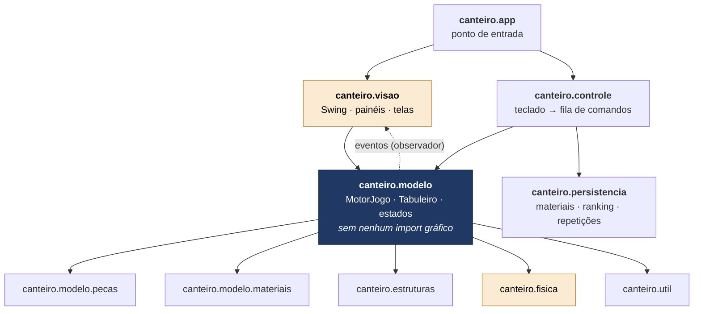
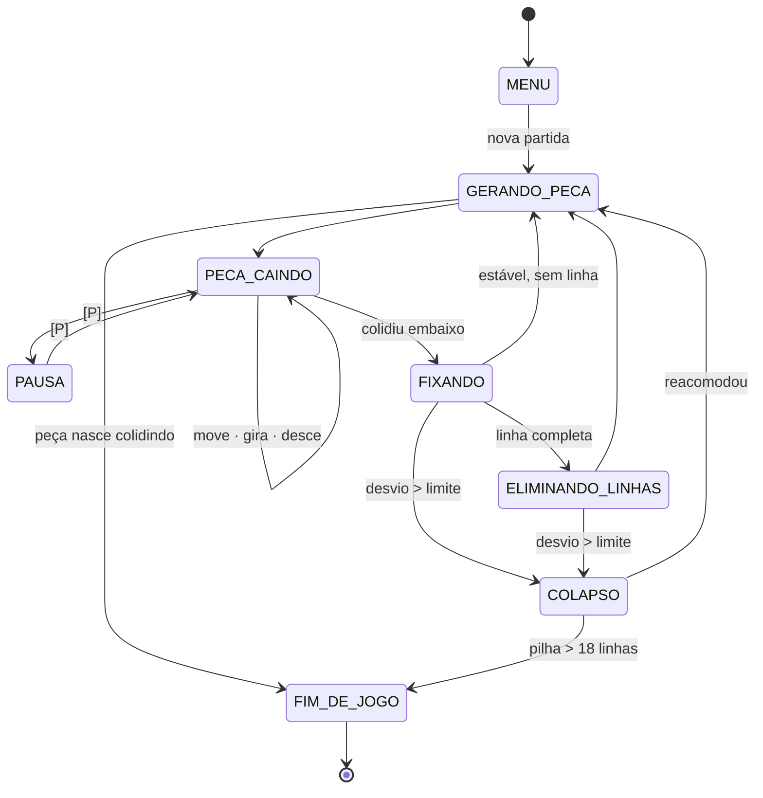
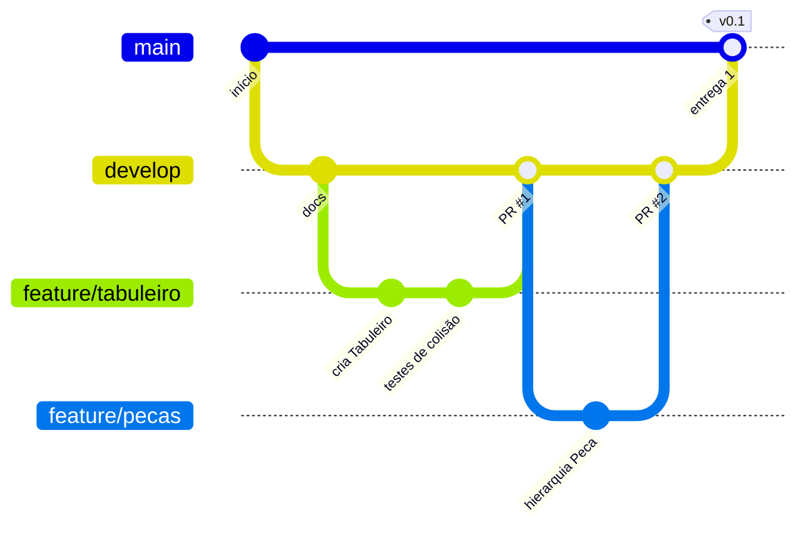

<div align="center">

# 🏗️ CANTEIRO

### Jogo de encaixe de blocos em que a pilha tem massa e precisa ficar de pé.

Não basta fechar linha: é preciso decidir **onde colocar carga**. Cada peça vem em madeira, alvenaria, concreto ou aço. O jogo recalcula o **centro de massa** da estrutura a cada peça fixada e, se ele se afastar demais do eixo da base, **a obra desaba**.

<p>
  
  
</p>

<p>
  
  
  
  
  
</p>

<sub>🧱 <strong>7</strong> formas &nbsp;•&nbsp; 🪵 <strong>4</strong> materiais &nbsp;•&nbsp; 📐 <strong>15</strong> regras de negócio &nbsp;•&nbsp; ✅ <strong>28</strong> requisitos funcionais &nbsp;•&nbsp; ⚙️ <strong>12</strong> não funcionais &nbsp;•&nbsp; 🎯 <strong>60</strong> quadros/s</sub>

<br/><br/>


<sub>Esboço da tela principal, tirado da especificação. O jogo ainda está sendo construído.</sub>

</div>

---

## 📑 Sumário

- [💡 O que é](#-o-que-é)
- [🎮 Como se joga](#-como-se-joga)
- [✨ Destaques de engenharia](#-destaques-de-engenharia)
- [🧬 Onde entra cada conceito da disciplina](#-onde-entra-cada-conceito-da-disciplina)
- [🏛️ Arquitetura](#️-arquitetura)
- [📂 Estrutura de pastas](#-estrutura-de-pastas)
- [🔄 Ciclo de vida da partida](#-ciclo-de-vida-da-partida)
- [🛠️ Stack](#️-stack)
- [🚀 Rodando localmente](#-rodando-localmente)
- [🧪 Testes](#-testes)
- [📏 Convenções de código](#-convenções-de-código)
- [🌳 Guia de Git da equipe](#-guia-de-git-da-equipe) ← **comece por aqui se você nunca usou Git**
- [🗓️ Cronograma](#️-cronograma)
- [👥 Equipe](#-equipe)

---

## 💡 O que é

Os jogos de encaixe de blocos são um problema resolvido há quarenta anos. Existem milhares de implementações e todas fazem a mesma coisa: peças caem, você fecha linhas e as linhas somem. Copiar isso não seria um trabalho autoral, e também não teria nada a ver com engenharia.

O **CANTEIRO** mantém a grade discreta do gênero e acrescenta uma restrição tirada da estática: **a pilha tem massa e essa massa precisa ficar equilibrada sobre a base de apoio**. As peças são elementos construtivos. Cada uma é fabricada num material com densidade própria, e uma linha completa é um pavimento concluído. Enquanto você joga, o sistema faz a análise estrutural da obra: soma as massas, calcula o centro de massa horizontal e compara com o eixo da base. A distância entre os dois vira um **índice de estabilidade**, que fica visível o tempo todo.

Quando o desvio ultrapassa o limite do nível, as camadas acima da linha crítica **se desprendem e caem por gravidade**, coluna a coluna, e o jogador perde pontos. Uma torre de aço encostada numa parede cai antes de uma pirâmide de madeira duas vezes maior. **É esse comportamento contraintuitivo que o jogo ensina.**

<div align="center">


<sub>A estrutura da direita tem <strong>menos</strong> blocos que a da esquerda, e mesmo assim é ela que cai.</sub>
</div>

> [!NOTE]
> O modelo físico é **uma simplificação deliberada**. Não simulamos esforço interno, resistência dos materiais, deformação nem tombamento com rotação: o critério de colapso olha só para o deslocamento horizontal do centro de massa. Isso basta para o jogo funcionar, mas **não é análise estrutural de engenharia**, e a própria tela do jogo vai deixar isso claro.

---

## 🎮 Como se joga

| | Regra |
|---|---|
| 🧱 **Tabuleiro** | 10 colunas × 20 linhas visíveis, mais 2 linhas ocultas no topo, onde as peças nascem |
| 🔷 **Peças** | Sempre 4 blocos, em uma das 7 formas canônicas: `I` `O` `T` `S` `Z` `J` `L` |
| 🎲 **Sorteio** | **Método da sacola**: as 7 formas são embaralhadas e todas saem antes de qualquer uma se repetir |
| 👀 **Fila** | O jogador vê as **3 próximas** peças, com forma e material |
| 📥 **Reserva** | Dá para guardar uma peça e trocar pela reservada, **uma vez por peça gerada** |
| 🧹 **Linhas** | Linha completa é eliminada. Eliminar 2, 3 ou 4 linhas de uma vez rende bônus progressivo |
| ⚖️ **Estabilidade** | Vai de 100 % com desvio nulo a 0 % quando o desvio chega ao limite do nível, variando linearmente |
| 💥 **Colapso** | Desvio acima do limite: os blocos acima da linha crítica caem, a pontuação perde o equivalente a **2 linhas** e o contador de colapsos sobe |
| 📈 **Nível** | Sobe a cada **10 linhas**. A queda acelera e o desvio tolerado diminui |
| 🏁 **Fim** | Quando uma peça nasce já colidindo, ou quando há um colapso com a pilha acima de **18 linhas** |

### Os materiais

Forma e material são **independentes**: qualquer forma pode sair em qualquer material. O material define a densidade, a cor, o bônus por linha e o efeito no momento em que a peça é assentada.

| Material | Peso | Bônus por linha | Efeito ao fixar | Aparece a partir do |
|---|---|---|---|---|
| 🪵 **Madeira** | leve | baixo (10) | nenhum | nível 1 |
| 🧱 **Alvenaria** | médio | médio | a definir | nível 1 |
| 🪨 **Concreto** | pesado | alto | a definir | nível 3 |
| 🔩 **Aço** | o mais pesado | o mais alto (40) | **consolida os blocos logo abaixo**, que passam a resistir ao desprendimento no colapso | nível 5, e fica mais frequente a partir do 9 |

> [!TIP]
> As cores dos materiais também terão **padrão de textura**, para jogadores com daltonismo (RNF06).

### A curva de dificuldade

A dificuldade cresce por dois caminhos ao mesmo tempo, a **velocidade** e o **aperto do limite**. Por isso, quem domina o encaixe continua tendo desafio.

| Nível | Intervalo de queda | Limite de desvio | Materiais |
|---|---|---|---|
| 1 – 2 | 800 ms | 3,0 colunas | madeira, alvenaria |
| 3 – 4 | 650 ms | 2,5 colunas | + concreto |
| 5 – 6 | 500 ms | 2,0 colunas | todos |
| 7 – 8 | 380 ms | 1,7 coluna | todos |
| 9 – 10 | 280 ms | 1,4 coluna | todos, com aço mais frequente |
| 11+ | 200 ms | 1,2 coluna | todos, com aço mais frequente |

<sub>São os valores iniciais. Eles vão ser ajustados nos testes com jogadores a partir da semana 8.</sub>

---

## ✨ Destaques de engenharia

**O centro de massa é recalculado em tempo constante, não varrendo o tabuleiro.** A saída ingênua seria percorrer as 200 posições a cada quadro e refazer a média ponderada. Funciona, mas desperdiça processamento. O `AnalisadorEstrutural` mantém só dois acumuladores: a **massa total** e a **soma dos momentos** (massa × coluna de cada bloco). Fixar um bloco soma nos dois, remover subtrai, e o centro de massa é `momentoX / massaTotal`. **Custo O(1) por bloco alterado, independente da altura da pilha (RNF02).**

**Eliminar uma linha não mexe no momento dos blocos que descem.** Quando uma linha some, os blocos de cima caem, mas **continuam na mesma coluna**, e o momento horizontal só depende da coluna. Então basta descontar os blocos eliminados. Essa observação deixa a rotina de eliminação bem mais simples.

**Um teste confere a otimização contra a versão ingênua.** O ponto mais provável de falha do projeto é um acumulador de massa dessincronizado. Esse tipo de erro gera colapsos que parecem injustos, e o jogador percebe que o jogo está quebrado sem saber explicar por quê. Para pegar isso, um teste aplica **500 operações aleatórias** e compara o cálculo incremental com a varredura completa, com tolerância de `0,001`.

**Rotação com deslocamento corretivo, para a peça não travar na parede.** Na implementação ingênua, girar uma peça encostada na parede é recusado, e o jogador sente isso como travamento. Aqui, se a rotação colide, o motor testa em ordem: 1 coluna à esquerda, 1 à direita, 2 à esquerda, 2 à direita e 1 linha acima. A primeira posição válida vence. A sequência de tentativas é **definida por peça**, porque a `I` é longa e precisa de tentativas mais amplas.

**A entrada do teclado vai para uma fila e só é aplicada no quadro seguinte.** Apertar uma tecla não mexe na peça na hora. O comando é enfileirado e consumido no começo do próximo quadro. Assim a peça nunca sofre alterações concorrentes e o jogo fica **determinístico**, o que é condição para o recurso de repetição: com a mesma semente e os mesmos comandos, a partida termina com a mesma pontuação e o mesmo tabuleiro.

**Em máquina lenta, perde-se o desenho, nunca a lógica.** O laço roda num `javax.swing.Timer` de ~16 ms, e a atualização do estado é separada do redesenho. Se o computador não aguentar, o que cai é a taxa de quadros. A simulação continua avançando igual, porque um jogo que muda de comportamento conforme o hardware está quebrado.

**O modelo não sabe que existe uma janela.** O pacote `canteiro.modelo` **não pode importar nenhuma classe gráfica**. Essa regra é fácil de verificar e é ela que permite criar o motor, rodar milhares de jogadas e conferir o resultado num teste JUnit, sem abrir tela nenhuma (RNF08). O modelo avisa a visão por **observadores**: os painéis se inscrevem e o motor só conhece o contrato de observador.

**Duas hierarquias em vez de uma: 11 classes em vez de 28.** Forma e material são dimensões independentes. Juntar as duas numa hierarquia só exigiria uma classe para cada combinação (7 × 4). Separadas e ligadas por composição, ficam 7 subclasses de `Peca` e 4 de `Material`. **Criar um quinto material é escrever uma classe e registrá-la no catálogo**, sem tocar no motor.

**Arquivo corrompido não derruba a partida.** Existem dois tipos de falha. **Erro de programação**, como pedir o centro de massa de uma estrutura vazia, lança exceção não verificada e deve estourar durante o desenvolvimento, porque é defeito. **Erro de ambiente**, como `ranking.csv` ausente ou malformado, é registrado em log e o jogo segue com valores padrão (RNF11 e RNF12). O jogador nunca perde uma partida por causa de um arquivo de ranking.

---

## 🧬 Onde entra cada conceito da disciplina

Nenhuma estrutura de dados está aqui para cumprir o enunciado. **Cada uma existe porque o jogo precisa dela.**

| Conceito | Onde aparece | Por que esta estrutura, e não outra |
|---|---|---|
| **Herança** | `Peca` → `PecaI`, `PecaO`, `PecaT`, `PecaS`, `PecaZ`, `PecaJ`, `PecaL` · `Material` → `Madeira`, `Alvenaria`, `Concreto`, `Aco` | O que é comum a todas as peças (blocos, material, rotação, giro) e a todos os materiais (nome, densidade, cor) fica fatorado na superclasse abstrata |
| **Polimorfismo** | `formas()`, `aoFixar()`, `bonusLinha()` | O motor pede a forma à peça e o efeito ao material **sem saber qual é qual**. Não há cadeia de `if` nem `switch` por tipo |
| **Interfaces** | `Desenhavel`, `Atualizavel` | Contratos implementados por tudo que participa do laço do jogo |
| **Fila** (`ArrayDeque`) | Próximas peças · comandos do teclado | Consumo em ordem de chegada, inserção sempre no fim e remoção O(1) |
| **Pilha** (`Deque`) | Peça reservada · histórico de jogadas | Reserva e desfazer operam sobre o último elemento. A pilha da reserva já permite, no futuro, guardar várias peças sem reescrever a classe |
| **Lista** (`ArrayList`) | Blocos de uma peça · linhas completas · blocos desprendidos | Acesso sequencial no desenho e na checagem de colisão |
| **Tabela hash** (`HashMap`) | Catálogo de materiais · ranking | Material buscado pelo código milhares de vezes por partida, em O(1). No ranking, o nome do jogador aponta para a melhor pontuação dele, sem duplicatas |
| **Matriz** | Grade do tabuleiro | Acesso O(1) por linha e coluna. Checar uma linha completa percorre só 10 posições |
| **Vetor de acumuladores** | Massa por coluna | É o que torna o centro de massa O(1) |
| **Recursividade** | Reacomodação dos blocos no colapso | A queda por gravidade propaga coluna a coluna |
| **Exceções** | Leitura dos arquivos de dados | Leitura defensiva, com recuperação por valores padrão |

---

## 🏛️ Arquitetura

MVC com uma quarta camada isolada para persistência. **As setas mostram quem conhece quem. A camada de modelo não aponta para cima.**



O **`MotorJogo`** é o coordenador e **não implementa regra nenhuma, só delega**. Ele recebe comandos do controlador, pergunta ao `Tabuleiro` se há colisão, pede ao `AnalisadorEstrutural` a verificação de equilíbrio e ao `GeradorPecas` o próximo elemento. Concentrar a coordenação numa classe só mantém as outras pequenas e testáveis isoladamente.

### Dados persistidos

Não há banco de dados. São três arquivos de texto no diretório do usuário:

| Arquivo | Formato | Conteúdo |
|---|---|---|
| `materiais.properties` | chave = valor | Código, nome, densidade, cor e bônus de cada material. Carregado no `HashMap` do catálogo |
| `ranking.csv` | CSV | Nome, pontuação, nível, linhas, colapsos e data. Só entram partidas **sem uso do desfazer** (RN15) |
| `repeticao_<data>.txt` | uma jogada por linha | Instante, comando e **semente do gerador**, o suficiente para reconstruir a partida inteira |

---

## 📂 Estrutura de pastas

```
canteiro/
├── backend/                         O JOGO EM JAVA (projeto Maven)
│   ├── src/
│   │   ├── main/
│   │   │   ├── java/canteiro/       código do jogo
│   │   │   │   ├── app/             ponto de entrada (main)
│   │   │   │   ├── visao/           telas e painéis
│   │   │   │   ├── controle/        teclado → comandos
│   │   │   │   ├── modelo/          motor, tabuleiro, estados da partida
│   │   │   │   │   ├── pecas/       Peca + as 7 formas
│   │   │   │   │   └── materiais/   Material + os 4 materiais
│   │   │   │   ├── estruturas/      fila, pilha, histórico
│   │   │   │   ├── fisica/          centro de massa, estabilidade, colapso
│   │   │   │   ├── persistencia/    ranking, materiais, repetições
│   │   │   │   └── util/            constantes e auxiliares
│   │   │   └── resources/           arquivos que vão dentro do JAR
│   │   │       ├── dados/           materiais.properties padrão
│   │   │       ├── imagens/         texturas e ícones
│   │   │       └── sons/            efeitos sonoros
│   │   └── test/
│   │       ├── java/canteiro/       testes (espelham os pacotes de main)
│   │       └── resources/arquivos/  arquivos de entrada dos testes
│   ├── .mvn/wrapper/                configuração do Maven Wrapper
│   ├── mvnw · mvnw.cmd              Maven sem precisar instalar
│   └── pom.xml                      a receita do projeto
├── frontend/                        A INTERFACE (em planejamento)
├── docs/                            especificação e imagens do README
│   └── imagens/
├── .github/
│   └── pull_request_template.md     checklist que aparece em todo PR
├── .editorconfig                    mesma formatação em qualquer editor
├── .gitattributes                   fim de linha certo no Windows e no Linux
├── .gitignore                       o que o Git não deve versionar
└── README.md
```

**O repositório tem duas partes que não se misturam.** Em `backend/` fica o jogo em Java: regras, física, estruturas de dados e persistência, com o seu próprio build. Em `frontend/` vai ficar a interface. Cada parte tem as suas ferramentas e roda por conta própria. **Por enquanto, todo o trabalho acontece no `backend/`.**

### Por que o código do backend está dividido assim

**A pasta diz de qual camada é o código, e a camada diz o que ele pode usar.** Os pacotes seguem a Figura 5 da especificação. A pergunta para decidir onde uma classe nova vai morar é *"isso é regra do jogo ou é tela?"*. Regra vai para `modelo`, `fisica` ou `estruturas`. Tela vai para `visao`. Tecla vai para `controle`. Arquivo vai para `persistencia`.

| Pasta | O que mora aqui | Por que separado | Pode usar Swing? |
|---|---|---|---|
| `app/` | Só a classe `Aplicacao`, com o `main` | É o único lugar que conhece **todas** as camadas e as liga umas às outras. Fora daqui, ninguém cria tudo | ✅ |
| `visao/` | `JanelaPrincipal`, painéis do tabuleiro, da estabilidade, da fila, telas de menu, pausa, ranking | Desenhar é um trabalho diferente de decidir. A visão **lê** o estado e desenha, nunca muda uma regra | ✅ |
| `controle/` | Leitura do teclado e a fila de comandos | Tecla não mexe na peça na hora. Vira comando, entra na fila e o motor aplica no próximo quadro. Isso mantém o jogo reproduzível | ✅ |
| `modelo/` | `MotorJogo`, `Tabuleiro`, `Bloco`, estados da partida | **O coração do jogo.** Tem que dar para rodar uma partida inteira num teste, sem abrir janela | ❌ |
| `modelo/pecas/` | `Peca` (abstrata) e `PecaI`, `PecaO`, `PecaT`, `PecaS`, `PecaZ`, `PecaJ`, `PecaL` | Uma hierarquia inteira de herança. Juntas ficam fáceis de achar e comparar | ❌ |
| `modelo/materiais/` | `Material` (abstrata) e `Madeira`, `Alvenaria`, `Concreto`, `Aco` | A segunda hierarquia, independente da primeira. A cor fica como número RGB, não como `java.awt.Color` | ❌ |
| `estruturas/` | Gerador por sacola, fila de próximas, pilha de reserva, histórico de jogadas | São as estruturas de dados que a disciplina avalia. Separadas, ficam fáceis de mostrar e de testar sozinhas | ❌ |
| `fisica/` | `AnalisadorEstrutural`: acumuladores, centro de massa, índice, colapso | **O diferencial do projeto** e o ponto mais provável de bug. Merece pacote e testes próprios | ❌ |
| `persistencia/` | Leitura do catálogo de materiais, ranking em CSV, arquivos de repetição | Mexer com arquivo tem outro tipo de erro (arquivo sumiu, veio corrompido). Isolado, o tratamento defensivo fica num lugar só | ❌ |
| `util/` | Constantes (`COLUNAS = 10`, `LINHAS = 20`...) e auxiliares sem regra | Os "números mágicos" proibidos pela convenção têm um lugar para morar | ❌ |

> [!IMPORTANT]
> **O ❌ não é sugestão, é teste.** O `ArquiteturaTest` lê os `import` de cada arquivo desses pacotes e **reprova o build** se encontrar `javax.swing`, `java.awt` ou uma camada de cima. Ele também impede o modelo de importar a persistência, porque quem liga os dois é o controle.

### E as outras pastas

<sub>Os caminhos que começam com <code>src/</code>, <code>.mvn/</code>, <code>mvnw</code> e <code>pom.xml</code> ficam dentro de <code>backend/</code>.</sub>

| Pasta ou arquivo | Para que serve |
|---|---|
| `backend/` | O projeto Java inteiro. Todo comando `./mvnw` roda **de dentro desta pasta** |
| `frontend/` | A interface do jogo. **Ainda vazia**: a tecnologia vai ser definida quando o backend estiver de pé |
| `src/main/resources/` | Tudo o que o jogo **lê** mas não é código: o `materiais.properties` padrão (usado se o do usuário estiver faltando ou corrompido, RNF11), texturas para daltônicos (RNF06) e sons (RF28). Vai **dentro do JAR**, então funciona em qualquer computador |
| `src/test/java/` | Os testes, **nos mesmos pacotes do código testado**. O teste de `fisica/AnalisadorEstrutural` fica em `test/.../fisica/AnalisadorEstruturalTest`. Assim o teste enxerga o que é do pacote e é fácil de achar |
| `src/test/resources/arquivos/` | Arquivos de entrada **feitos para quebrar**: ranking vazio, linha malformada, caractere inválido. É com eles que se testa a leitura defensiva (RNF12) |
| `docs/` | A especificação em PDF, a proposta e as imagens deste README |
| `.github/` | O modelo de PR: todo PR novo já abre com o checklist preenchível |
| `.mvn/`, `mvnw`, `mvnw.cmd` | O Maven Wrapper. Garante que os três usam **a mesma versão do Maven**, sem instalar nada |
| `pom.xml` | A receita: versão do Java, dependência do JUnit, nome do JAR, classe principal e regras do Javadoc |
| `.gitignore` | Impede que `target/`, `.class`, `.idea/` e arquivos do sistema entrem no repositório |
| `.gitattributes` | Resolve o problema clássico de Windows × Linux com fim de linha (`CRLF` × `LF`), que senão faz o Git achar que o arquivo inteiro mudou |
| `.editorconfig` | UTF-8, 4 espaços e LF em qualquer editor. O IntelliJ lê sozinho; o VS Code precisa da extensão *EditorConfig* |
| `backend/target/` | **Não versionada.** É onde o Maven coloca o que gera: `.class`, o JAR e o Javadoc. Pode apagar quando quiser (`./mvnw clean`) |

> [!NOTE]
> As pastas vazias têm um arquivo `.gitkeep`. O Git não guarda pasta vazia, e ele só existe para a pasta aparecer no repositório. Quando a pasta ganhar o primeiro arquivo de verdade, o `.gitkeep` pode ser apagado.

---

## 🔄 Ciclo de vida da partida

A partida é uma **máquina de estados finita**, o que evita um monte de variáveis booleanas de controle. A cada quadro, o motor olha o estado atual e executa só as transições previstas para ele.



### O que acontece em cada quadro (~16 ms)

```
1. consome a fila de comandos → move/gira, sempre testando colisão antes
2. o intervalo de queda do nível passou?          não → vai para o 7
3. desce a peça uma linha                          não colidiu → vai para o 7
4. colidiu: fixa a peça, empilha a jogada no histórico, elimina as linhas completas, soma a pontuação
5. atualiza os acumuladores de massa → centro de massa → índice de estabilidade
6. desvio > limite? executa o colapso e aplica a penalidade
7. tira a próxima peça da fila e redesenha
```

---

## 🛠️ Stack

<table>
  <tbody>
    <tr>
      <td><strong>Linguagem</strong></td>
      <td>: registros, <code>switch</code> como expressão e classes seladas onde fizer sentido</td>
    </tr>
    <tr>
      <td><strong>Interface</strong></td>
      <td>: vem com o JDK. O JavaFX foi descartado porque exige dependência externa desde o Java 11</td>
    </tr>
    <tr>
      <td><strong>Build</strong></td>
      <td> via <strong>Maven Wrapper</strong> (<code>./mvnw</code>): compila, roda os testes, gera o JAR executável e o Javadoc. Ninguém precisa instalar o Maven</td>
    </tr>
    <tr>
      <td><strong>Qualidade</strong></td>
      <td> </td>
    </tr>
    <tr>
      <td><strong>Dependências</strong></td>
      <td>Só a biblioteca padrão do Java. <strong>A única exceção é o JUnit</strong></td>
    </tr>
    <tr>
      <td><strong>Editor</strong></td>
      <td> : cada um usa o que preferir</td>
    </tr>
    <tr>
      <td><strong>Versionamento</strong></td>
      <td> : ramo por funcionalidade e PR para a <code>develop</code></td>
    </tr>
  </tbody>
</table>

### Por que não Spring Boot

O Spring Boot resolve problemas de **servidor**: injeção de dependências em larga escala, API REST, acesso a banco, configuração por ambiente. O CANTEIRO não tem nenhum desses problemas. É um aplicativo **desktop**, local, de uma pessoa só, sem rede e sem banco (seção 1.4). Trazer o Spring significaria:

- **Quebrar a premissa 2.11**, que permite só a biblioteca padrão do Java, com exceção da de testes.
- **Esconder justamente o que a disciplina avalia.** Com o Spring, os objetos são criados e ligados pelo framework, por anotações. Aqui queremos que herança, polimorfismo e a ligação entre as classes fiquem **visíveis no código**, escritos por nós.
- **Aumentar a curva de aprendizado** da equipe sem ganho nenhum para o jogo.

O Swing, o `javax.swing.Timer` e o `java.util` resolvem tudo o que o projeto precisa.

---

## 🚀 Rodando localmente

### 1. Pré-requisitos

| Requisito | Versão | Como conferir |
|---|---|---|
| **JDK** | 17 ou superior | `java -version` e `javac -version` |
| **Git** | qualquer versão recente | `git --version` |

**Não precisa instalar o Maven.** O projeto traz o **Maven Wrapper** (`mvnw`): na primeira execução ele baixa a versão certa do Maven sozinho, e todos na equipe usam exatamente a mesma.

> [!TIP]
> **Onde baixar o JDK 17:** [adoptium.net](https://adoptium.net/temurin/releases/?version=17), escolhendo o seu sistema e o pacote **JDK**. No Ubuntu, `sudo apt install openjdk-17-jdk`. No IntelliJ, dá para baixar direto em *File → Project Structure → SDK → Download JDK*.

O jogo roda sem nenhuma alteração em **Windows, Linux e macOS** (RNF04). A resolução mínima da janela é **1024 × 768**.

### 2. Clonar

```bash
git clone https://github.com/mateus-vitor-ferreira-dev/canteiro.git
cd canteiro/backend
```

Nunca usou Git? Leia antes o [guia de Git da equipe](#-guia-de-git-da-equipe).

### 3. Comandos

Todos os comandos rodam **dentro da pasta `backend/`**. No **Linux, macOS e Git Bash** use `./mvnw`. No **Prompt de Comando ou PowerShell do Windows** use `mvnw.cmd`.

| Comando | O que faz |
|---|---|
| `./mvnw compile` | Compila o código |
| `./mvnw test` | Roda os testes automatizados |
| `./mvnw verify` | Compila, testa e empacota. **Rode antes de abrir um PR** |
| `./mvnw package` | Gera o JAR executável em `target/canteiro.jar` |
| `java -jar target/canteiro.jar` | Abre o jogo (ou dê dois cliques no JAR) |
| `./mvnw javadoc:javadoc` | Gera a documentação em `target/reports/apidocs/`. **Falha se algo público estiver sem Javadoc** (RNF07) |
| `./mvnw clean` | Apaga a pasta `target/` |

> [!TIP]
> **No IntelliJ:** *File → Open* e escolha a pasta `canteiro/backend`. Ele reconhece o `pom.xml` sozinho. Para jogar, abra `Aplicacao.java` e clique no ▶ ao lado do `main`. **No VS Code:** instale o *Extension Pack for Java* e abra a pasta.

### 4. Problemas comuns

| Sintoma | Causa | Solução |
|---|---|---|
| `./mvnw: No such file or directory` · `mvnw não é reconhecido` | Você está na raiz do repositório, não no backend | `cd backend` |
| `./mvnw: Permission denied` | O arquivo perdeu a permissão de execução | `chmod +x mvnw` |
| `'.' não é reconhecido como um comando` (Windows) | `./mvnw` é sintaxe do Linux | No CMD ou PowerShell use `mvnw.cmd` |
| `JAVA_HOME not found` · `JAVA_HOME is not defined correctly` | O wrapper não achou o JDK | Instale o JDK 17 e configure a variável `JAVA_HOME` apontando para a pasta dele |
| `O CANTEIRO exige Java 17 ou superior` | O Java ativo é antigo | `java -version`. Troque o JDK padrão ou o `JAVA_HOME` |
| `ArquiteturaTest` falhou | Alguém importou Swing, AWT ou uma camada de cima dentro do modelo | A mensagem mostra o arquivo e a linha. Mova o código para `visao` ou `controle` |
| `javadoc:javadoc` falhou com `warning: no comment` | Tem classe ou método público sem Javadoc | Documente o que a mensagem aponta |

### 5. Controles

Todos os comandos são pelo teclado, com a legenda sempre visível na tela do jogo (RNF05). As teclas definitivas serão decididas na implementação. As já definidas na especificação são **[P] pausar**, **[R] reiniciar** e **[C] trocar pela peça reservada**.

---

## 🧪 Testes

A maior parte do esforço de teste fica em **testes de unidade da camada de modelo**, que é onde moram as regras que podem errar sem ninguém perceber. Só a navegação entre as telas é verificada manualmente. **O teste é escrito junto com a regra, não deixado para o fim.**

```bash
cd backend
./mvnw test
```

**Já existe:** o `ArquiteturaTest`, que garante que o modelo não importa nada gráfico (RNF08). **Previstos:**

| Alvo | O que vai ser testado |
|---|---|
| **Colisão** | Peça encostada em cada uma das 4 bordas · sobre um bloco fixado · em espaço livre · parcialmente acima do topo |
| **Rotação** | As 4 rotações das 7 formas · rotação junto às paredes · peça `I` em espaço mínimo · rotação recusada |
| **Gerador** | Em 200 peças, nenhuma forma se repete antes de a sacola esvaziar · material só entre os liberados na fase |
| **Linhas** | 1, 2, 3 e 4 linhas simultâneas · linha que não está no topo · nenhuma linha · descida correta das linhas de cima |
| **Centro de massa** | Estrutura simétrica · simétrica na geometria mas não na massa · coluna única · **incremental × varredura completa após 500 operações** |
| **Colapso** | Desvio logo abaixo do limite · logo acima · pilha na altura crítica · reacomodação correta |
| **Pontuação** | Multiplicadores por linhas, material e nível · penalidade de colapso · subida de nível |
| **Persistência** | Arquivo ausente · vazio · linha malformada · caractere inválido · nome repetido no ranking |
| **Repetição** | Reexecutar uma partida gravada tem que dar a mesma pontuação e o mesmo tabuleiro final |

### Metas de desempenho

| Métrica | Meta |
|---|---|
| Taxa de quadros | ≥ 55 qps durante 10 minutos seguidos |
| Tempo da lógica por quadro | ≤ 4 ms |
| Latência entre tecla e tela | ≤ 50 ms |
| Recálculo do centro de massa | constante, com a pilha em 2, 10 ou 18 linhas |
| Inicialização | ≤ 2 s até o menu |
| Memória | ≤ 200 MB após 10 minutos |

---

## 📏 Convenções de código

| Regra | Detalhe |
|---|---|
| 🇧🇷 **Português** | Classes, métodos, variáveis e comentários em português. Só os termos da própria linguagem ficam em inglês |
| 🔤 **Nomes** | `PascalCase` para classes · `camelCase` para métodos e atributos · `MAIUSCULAS_COM_SUBLINHADO` para constantes |
| 🔒 **Encapsulamento** | Atributos **sempre** `private`. Acesso de fora só por métodos que preservem as invariantes |
| 📐 **Tamanho** | Nenhum método com mais de **40 linhas úteis**, nenhuma classe com mais de **400** (RNF09) |
| 🔢 **Sem números mágicos** | Dimensões, limites e intervalos em constantes nomeadas ou em arquivo de configuração |
| 🚫 **Modelo sem Swing** | Nenhum `import javax.swing` ou `java.awt` dentro de `canteiro.modelo` |
| 📝 **Javadoc** | Toda classe pública: responsabilidade, `@author`, `@version`. Todo método público: `@param`, `@return`, `@throws` |

```java
/**
 * Recalcula o centro de massa horizontal da estrutura.
 *
 * <p>Cálculo incremental: usa os acumuladores de massa por coluna,
 * atualizados a cada bloco fixado ou removido (RNF02).</p>
 *
 * @param tabuleiro estrutura avaliada; não pode ser nulo
 * @return posição horizontal do centro de massa, em colunas
 * @throws IllegalStateException se a estrutura não possuir blocos
 * @see #indiceEstabilidade()
 */
public double centroDeMassa(Tabuleiro tabuleiro) { ... }
```

---

## 🌳 Guia de Git da equipe

> **Para quem nunca usou Git direito.** Leia uma vez com calma, do começo ao fim. Depois, no dia a dia, você só vai precisar da [colinha](#-colinha-o-dia-a-dia-em-8-comandos).

### O que é Git, em 1 minuto

O **Git** é um programa que tira **fotos do projeto** ao longo do tempo. Cada foto se chama **commit**. Com isso dá para ver o que mudou, quem mudou e quando, e voltar atrás se algo quebrar.

O **GitHub** é o site onde fica a **cópia oficial** do projeto, que todo mundo compartilha. Cada integrante tem uma **cópia local** no próprio computador, trabalha nela e depois **envia** (`push`) as mudanças para o GitHub.

Um **branch** (ramo) é uma **linha paralela de trabalho**. Você cria um ramo, mexe à vontade, e nada do que você faz ali afeta o trabalho dos outros até ser revisado e juntado (*merge*) ao ramo principal.

### Os ramos deste repositório



| Ramo | Para que serve | Quem mexe |
|---|---|---|
| `main` | Versão **estável**, a que é entregue ao professor | **Ninguém mexe direto.** Só recebe a `develop` numa entrega |
| `develop` | Onde o trabalho de todos se junta. É o **ramo padrão** | **Ninguém mexe direto.** Só recebe PRs |
| `feature/...`, `fix/...` etc. | O **seu** trabalho do momento | Você |

> [!IMPORTANT]
> **A `main` e a `develop` são protegidas.** O GitHub **recusa** push direto nelas, force push e exclusão. Todo código entra por **Pull Request (PR)**. Se você tentar dar `git push` na `develop`, vai receber o erro `GH013: Repository rule violations found`, e isso é o sistema funcionando, não um problema. Veja em [problemas comuns](#-problemas-comuns).

### Passo 0: preparar o computador (uma vez só)

**1. Instale o Git**

| Sistema | Como |
|---|---|
| **Windows** | Baixe em [git-scm.com](https://git-scm.com/download/win) e avance com as opções padrão. Depois use o **Git Bash** para os comandos deste guia |
| **Linux** (Ubuntu/Debian) | `sudo apt install git` |
| **macOS** | `xcode-select --install` ou `brew install git` |

**2. Diga ao Git quem você é.** Use **o mesmo e-mail da sua conta do GitHub**. É ele que liga o commit ao seu perfil, e é assim que o professor vê a contribuição de cada um.

```bash
git config --global user.name "Seu Nome Completo"
git config --global user.email "seu-email-do-github@exemplo.com"
git config --global init.defaultBranch main
git config --global pull.rebase false
```

**3. Faça login no GitHub pelo terminal.** O jeito mais fácil é pelo **GitHub CLI** ([cli.github.com](https://cli.github.com)):

```bash
gh auth login
# escolha: GitHub.com → HTTPS → Yes (autenticar o Git) → Login with a web browser
```

> [!WARNING]
> O GitHub **não aceita mais a sua senha** no `git push`. Se o terminal pedir senha, use o `gh auth login` acima ou um *Personal Access Token*. Detalhes em [problemas comuns](#-problemas-comuns).

**4. Aceite o convite.** O dono do repositório te adiciona como colaborador. O convite chega por e-mail e também aparece em [github.com/notifications](https://github.com/notifications). Sem aceitar, você não consegue enviar nada.

**5. Baixe o projeto:**

```bash
git clone https://github.com/mateus-vitor-ferreira-dev/canteiro.git
cd canteiro
git branch          # deve mostrar: * develop
```

### O ciclo de trabalho, passo a passo

Toda tarefa, seja ela grande ou pequena, segue **os mesmos 7 passos**.

#### 1️⃣ Atualize a `develop`

Antes de começar qualquer coisa, pegue o que os outros já juntaram:

```bash
git switch develop
git pull
```

#### 2️⃣ Crie o seu ramo a partir dela

```bash
git switch -c feature/gerador-de-pecas
```

O `-c` quer dizer *criar*. A partir daqui, tudo o que você fizer fica no seu ramo.

**Como dar nome ao ramo:** `tipo/descricao-curta`, com letras minúsculas, sem acento e com hífen no lugar do espaço.

| Prefixo | Quando usar | Exemplo |
|---|---|---|
| `feature/` | Funcionalidade nova | `feature/rotacao-com-deslocamento` |
| `fix/` | Correção de bug | `fix/colisao-borda-direita` |
| `test/` | Só testes | `test/centro-de-massa` |
| `docs/` | Documentação, README, Javadoc | `docs/javadoc-tabuleiro` |
| `refactor/` | Reorganizar código sem mudar o comportamento | `refactor/extrai-analisador` |
| `chore/` | Configuração, build, `.gitignore` | `chore/configura-maven` |

#### 3️⃣ Trabalhe e confira o que mudou

```bash
git status          # quais arquivos mudaram?
git diff            # o que exatamente mudou dentro deles?
```

Use o `git status` **o tempo todo**. Ele é o painel de controle do Git e quase sempre diz qual é o próximo comando.

#### 4️⃣ Faça o commit (tire a foto)

```bash
git add backend/src/main/java/canteiro/modelo/GeradorPecas.java   # escolhe o que vai na foto
git commit -m "feat(modelo): adiciona gerador de peças com método da sacola"
```

O `git add .` adiciona **tudo** o que mudou. É prático, mas **rode o `git status` antes** para não mandar junto algo que não devia.

**Faça commits pequenos e frequentes.** Um commit deve ser uma unidade de mudança que faz sentido sozinha. Vários commits pequenos são melhores que um commit gigante no fim do dia.

**Como escrever a mensagem.** Siga este padrão:

```
tipo(onde): o que foi feito, no presente
```

| Tipo | Uso | Exemplo |
|---|---|---|
| `feat` | Funcionalidade nova | `feat(fisica): calcula centro de massa incremental` |
| `fix` | Correção | `fix(modelo): impede peça I de atravessar a parede ao girar` |
| `test` | Testes | `test(fisica): compara incremental com varredura completa` |
| `docs` | Documentação | `docs(readme): adiciona tabela de controles` |
| `refactor` | Reorganização | `refactor(modelo): extrai verificação de linha completa` |
| `chore` | Configuração | `chore: adiciona plugin do Javadoc ao pom` |

✅ `feat(visao): adiciona painel de estabilidade`
❌ `mudanças` · ❌ `arrumei umas coisas` · ❌ `aaaa` · ❌ `versão final agora vai`

#### 5️⃣ Envie o ramo para o GitHub

Na **primeira** vez que você envia um ramo:

```bash
git push -u origin feature/gerador-de-pecas
```

Nas próximas, basta:

```bash
git push
```

#### 6️⃣ Abra o Pull Request

O PR é o pedido: *"revisem meu ramo e juntem na `develop`"*. Tem dois jeitos de abrir.

**Pelo site:** depois do push, o GitHub mostra um botão amarelo **"Compare & pull request"**. Confira se está **`base: develop` ← `compare: seu-ramo`**. A descrição já vem com um **modelo e um checklist**. Preencha:

- **Título:** igual a uma mensagem de commit, por exemplo `feat(modelo): gerador de peças com método da sacola`
- **Descrição:** o que foi feito, como testar e qual requisito atende (por exemplo `RF03`, `RN04`)

**Pelo terminal:**

```bash
gh pr create --base develop --title "feat(modelo): gerador de peças" --body "Implementa RF03/RN04. Testes em GeradorPecasTest."
```

#### 7️⃣ Revisão, merge e limpeza

1. Um colega lê o código na aba **Files changed** do PR e comenta o que precisar.
2. Pediram ajuste? **Não abra outro PR.** Corrija no mesmo ramo, faça commit e dê `git push`, e o PR se atualiza sozinho.
3. Tudo certo: clique em **Squash and merge**. Todos os seus commits viram um só na `develop`, **com você como autor**.
4. Apague o ramo no botão **Delete branch** e limpe o seu computador:

```bash
git switch develop
git pull
git branch -d feature/gerador-de-pecas
```

**Voltou para o passo 1.** 🔁

### Quando dá conflito

Um conflito acontece quando **você e outra pessoa mudaram a mesma linha** do mesmo arquivo. O Git não sabe qual versão manter e pergunta para você. **Não é erro nem desastre**, é só uma pergunta.

Para trazer as novidades da `develop` para o seu ramo:

```bash
git switch develop
git pull
git switch feature/meu-ramo
git merge develop
```

Se der conflito, o arquivo vai ficar assim:

```java
<<<<<<< HEAD
private static final int COLUNAS = 10;       // ← a sua versão
=======
private static final int COLUNAS_TABULEIRO = 10;   // ← a versão que veio da develop
>>>>>>> develop
```

Para resolver:

1. **Edite o arquivo** e deixe só o código certo. Pode ser uma versão, a outra ou uma mistura das duas.
2. **Apague as três linhas de marcação** (`<<<<<<<`, `=======` e `>>>>>>>`).
3. Salve e finalize:

```bash
git add Tabuleiro.java
git commit -m "merge: integra develop no ramo do gerador"
git push
```

> [!TIP]
> O **IntelliJ** e o **VS Code** têm uma tela própria para conflitos, com os botões *Accept Current*, *Accept Incoming* e *Accept Both*. É bem mais fácil que editar à mão. Se não souber qual versão manter, **pergunte a quem escreveu a outra** antes de apagar o código.

**Para ter menos conflito:** faça ramos curtos, que durem **dias, não semanas**. Traga a `develop` para o seu ramo com frequência. Combine com o grupo quem mexe em qual classe.

### Desfazendo coisas

| Situação | Comando |
|---|---|
| Quero jogar fora o que mudei num arquivo (**ainda sem commit**) | `git restore Arquivo.java` |
| Dei `git add` num arquivo por engano | `git restore --staged Arquivo.java` |
| Errei a mensagem do último commit (**ainda sem push**) | `git commit --amend -m "mensagem certa"` |
| Quero desfazer o último commit mas manter as mudanças (**ainda sem push**) | `git reset --soft HEAD~1` |
| Fiz commit na `develop` sem querer (**ainda sem push**) | `git switch -c feature/nome` e depois `git switch develop` e `git reset --hard origin/develop`. O commit vai para o ramo novo e a `develop` volta a ficar limpa |
| Quero guardar mudanças por um tempo para trocar de ramo | `git stash` para guardar e `git stash pop` para trazer de volta |
| Quero ver o histórico | `git log --oneline --graph` |
| Já dei push de um commit errado | **Não reescreva o histórico.** Corrija com um commit novo ou use `git revert <id-do-commit>` |

> [!CAUTION]
> `git reset --hard` **apaga de vez** as mudanças que ainda não viraram commit. Antes de usar, rode `git status` e tenha certeza.

### 🚫 Nunca faça

- ❌ **Trabalhar direto na `develop` ou na `main`.** Sempre crie um ramo. O GitHub vai recusar o push de qualquer jeito.
- ❌ **`git push --force`** em ramo que outra pessoa também usa.
- ❌ **Commitar arquivos gerados**, como `target/`, `*.class`, `.idea/` ou `.vscode/`. O `.gitignore` já barra esses arquivos.
- ❌ **Fazer merge do seu próprio PR sem ninguém ter olhado**, a não ser que o grupo combine o contrário.
- ❌ **Passar dias sem dar push.** Se o computador der problema, o trabalho que não foi para o GitHub se perde.
- ❌ **Apagar o conteúdo de um conflito sem entender o que ele é.**
- ❌ **Usar uma conta do GitHub ou um e-mail que não são seus.** A contribuição fica registrada para outra pessoa.

### 🆘 Problemas comuns

| Mensagem ou sintoma | O que significa | O que fazer |
|---|---|---|
| `GH013: Repository rule violations found` · `Changes must be made through a pull request` | Você tentou dar push direto na `develop` ou na `main` | `git switch -c feature/nome` para levar o trabalho a um ramo novo, depois `git push -u origin feature/nome` e abra um PR |
| `Please tell me who you are` | O Git não sabe o seu nome e e-mail | Faça o [passo 0.2](#passo-0-preparar-o-computador-uma-vez-só) |
| `Support for password authentication was removed` | O GitHub não aceita senha | `gh auth login`, ou gere um token em *Settings → Developer settings → Personal access tokens* e use no lugar da senha |
| `Permission denied` · `403` | Você não é colaborador, ou não aceitou o convite | Aceite o convite em [github.com/notifications](https://github.com/notifications) |
| `Updates were rejected because the remote contains work that you do not have` | Alguém enviou algo para o seu ramo antes de você | `git pull` e depois `git push` |
| `Your local changes would be overwritten` | Você tem mudanças sem commit e tentou trocar de ramo ou dar pull | Faça commit, ou `git stash`, rode o comando e depois `git stash pop` |
| `CONFLICT (content): Merge conflict in ...` | Duas pessoas mudaram a mesma linha | Veja [quando dá conflito](#quando-dá-conflito) |
| `You are in 'detached HEAD' state` | Você entrou num commit antigo em vez de num ramo | `git switch develop` |
| O terminal abriu uma tela estranha (Vim) pedindo mensagem | Você rodou `git commit` sem o `-m` | Digite `:q!` e Enter para sair, e rode de novo com `-m "mensagem"` |
| O commit aparece no GitHub sem a sua foto | O e-mail do commit não bate com o da sua conta | `git config --global user.email` com o e-mail do GitHub |

### 📋 Colinha: o dia a dia em 8 comandos

```bash
git switch develop && git pull           # 1. atualiza a develop
git switch -c feature/minha-tarefa       # 2. cria o seu ramo
git status                               # 3. o que mudou?
git add .                                # 4. separa as mudanças
git commit -m "feat(onde): o que fez"    # 5. tira a foto
git push -u origin feature/minha-tarefa  # 6. envia (depois só "git push")
gh pr create --base develop              # 7. abre o PR (ou pelo site)
git switch develop && git pull           # 8. depois do merge, volta e atualiza
```

### 📖 Glossário

| Termo | Significado |
|---|---|
| **Repositório** | A pasta do projeto, com todo o histórico dele |
| **Commit** | Uma "foto" das mudanças, com autor, data e mensagem |
| **Branch / ramo** | Uma linha paralela de trabalho |
| **`origin`** | O apelido do repositório no GitHub |
| **Push** | Enviar os seus commits para o GitHub |
| **Pull** | Trazer do GitHub os commits dos outros |
| **Clone** | A primeira cópia do repositório para o seu computador |
| **Merge** | Juntar um ramo em outro |
| **Pull Request (PR)** | O pedido de revisão e merge de um ramo, feito no GitHub |
| **Conflito** | Duas mudanças na mesma linha, que precisam de decisão humana |
| **Staging** | A área onde ficam os arquivos que vão entrar no próximo commit (`git add`) |
| **HEAD** | O ponto onde você está agora no histórico |

---

## 🗓️ Cronograma

| Semanas | Etapa | Entrega |
|---|---|---|
| ✅ 1 – 2 | Requisitos, modelagem de classes e arquitetura | [Documentação](docs/CANTEIRO_Documentacao-1.pdf) |
| ⬜ 3 – 4 | Modelo: peças, materiais, tabuleiro e colisão, com testes | Núcleo funcional em modo texto |
| ⬜ 5 – 6 | Motor, rotação com deslocamento, linhas e pontuação | Jogável, ainda sem estabilidade |
| ⬜ 7 – 8 | Acumuladores, centro de massa, índice e colapso | **Mecânica diferencial completa** |
| ⬜ 9 – 10 | Interface gráfica, telas, animações e realimentação visual | Versão gráfica integrada |
| ⬜ 11 | Persistência, ranking, repetição e relatório final | Requisitos desejáveis |
| ⬜ 12 | Testes com jogadores, balanceamento, Javadoc e empacotamento | **Entrega final** |

### Entregáveis

- 📦 **Código-fonte**: projeto Maven completo, com testes e arquivos de dados de exemplo
- ☕ **Executável**: JAR único, que abre com dois cliques
- 📚 **Javadoc**: páginas geradas a partir dos comentários do código
- 📝 **Relatório de plataforma e desvios**: o ambiente usado, o que mudou em relação à especificação e por quê
- 📄 **[Especificação](docs/CANTEIRO_Documentacao-1.pdf)**: requisitos, diagramas e estratégias, em PDF

---

## 👥 Equipe

| Integrante | GitHub |
|---|---|
| Mateus Vitor Ferreira | [@mateus-vitor-ferreira-dev](https://github.com/mateus-vitor-ferreira-dev) |
| Marcelo Camillo De Paula Leite | [@WendigoAwake](https://github.com/WendigoAwake) |
| Wanessa Kylie Silva Medeiros | _a confirmar_ |

---

<div align="center">
<sub><strong>CANTEIRO</strong> · Programação Aplicada à Engenharia · Universidade Federal de Lavras · 2026</sub>
</div>
