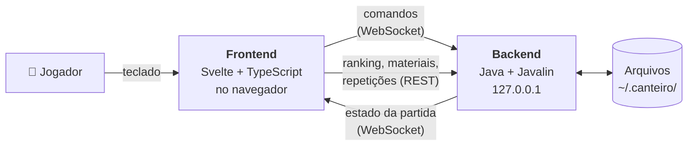
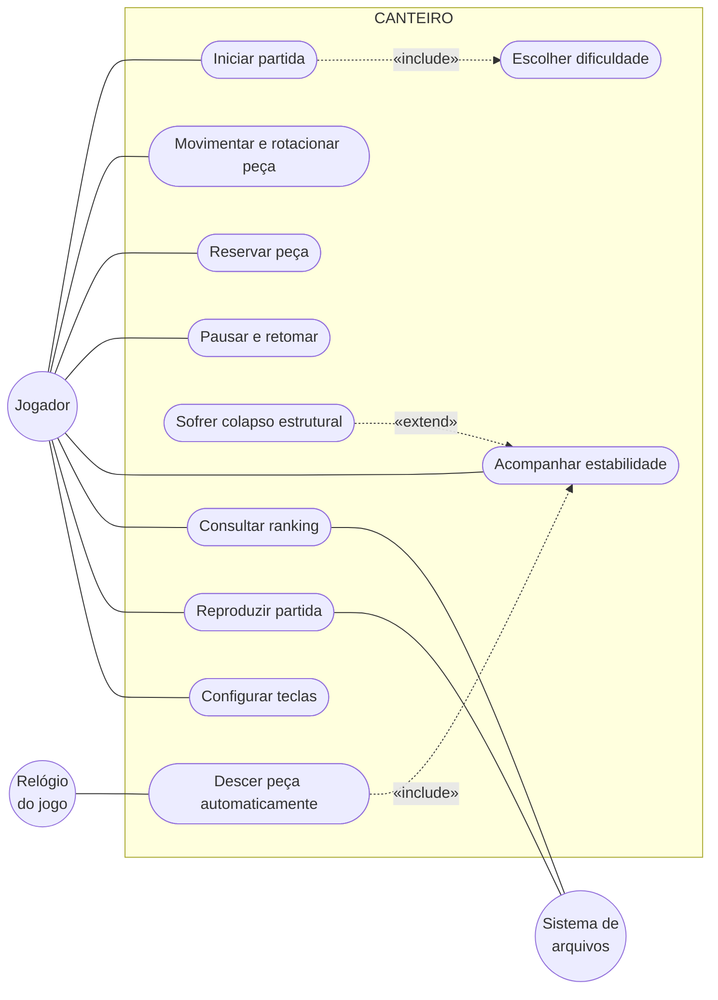
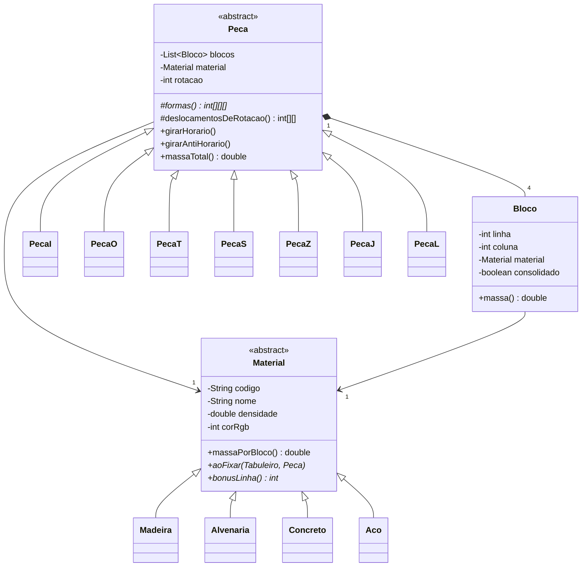
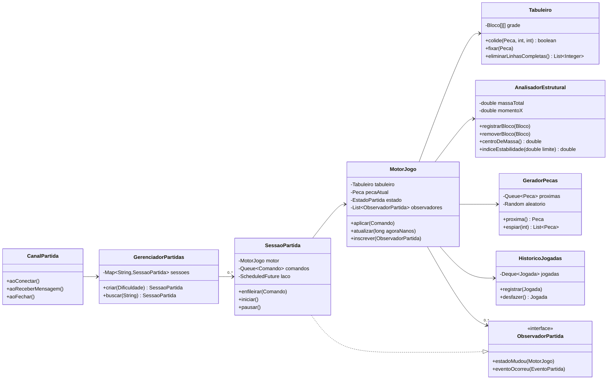
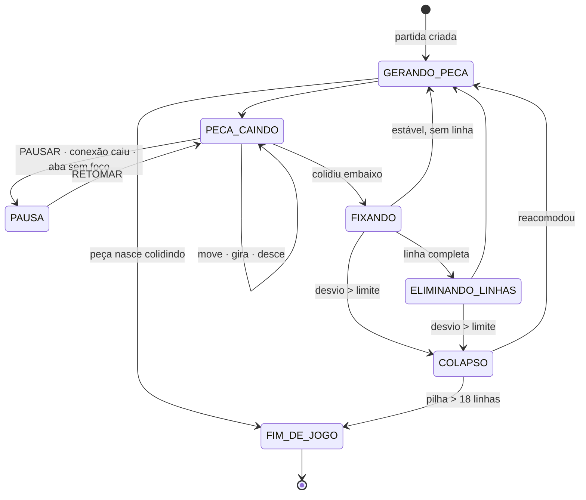
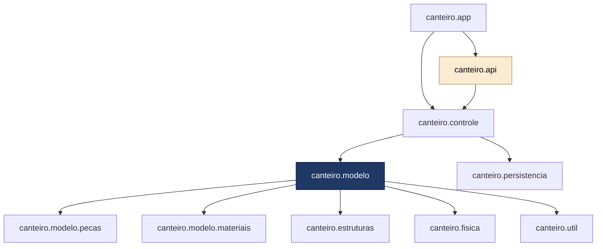
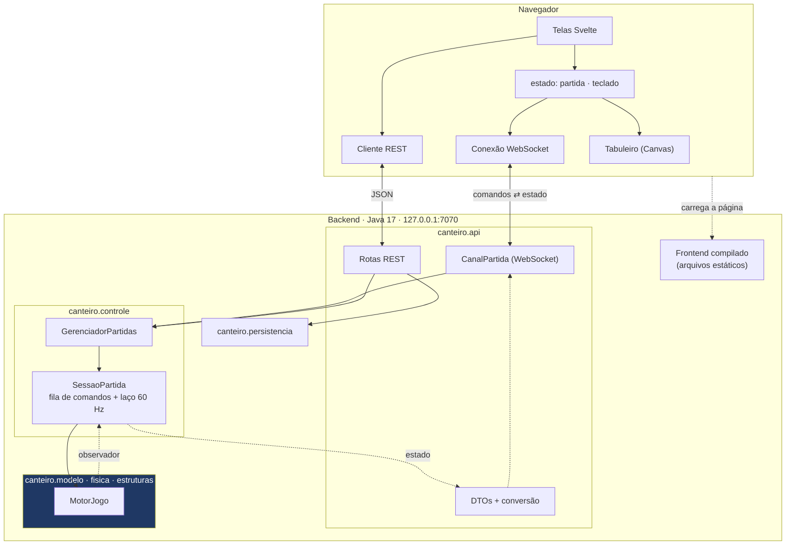

# CANTEIRO — Especificação do projeto

**Jogo de encaixe de blocos com restrição de estabilidade estrutural**

Universidade Federal de Lavras · Programação Aplicada à Engenharia · Projeto final · 2026

| Versão | Data | Descrição |
|---|---|---|
| 1.0 | 2026-09 | Especificação original, com interface em Swing ([PDF](CANTEIRO_Documentacao-1.pdf)) |
| 2.0 | 2026-09-23 | Arquitetura cliente-servidor local: backend em Java com Javalin e frontend em React com TypeScript. Este documento substitui a versão 1.0 |
| **2.1** | **2026-09-24** | **Frontend passa de React para Svelte 5 com TypeScript. Backend, protocolo e requisitos não mudam** |

| Integrante | GitHub |
|---|---|
| Mateus Vitor Ferreira | [@mateus-vitor-ferreira-dev](https://github.com/mateus-vitor-ferreira-dev) |
| Marcelo Camillo De Paula Leite | [@WendigoAwake](https://github.com/WendigoAwake) |
| Wanessa Kylie Silva Medeiros | a confirmar |

---

## Sumário

0. [O que mudou da versão 1.0](#0-o-que-mudou-da-versão-10)
1. [Introdução](#1-introdução)
2. [Levantamento de requisitos](#2-levantamento-de-requisitos)
3. [Estratégias de codificação](#3-estratégias-de-codificação)
4. [Resultados esperados](#4-resultados-esperados)
5. [Conclusão](#5-conclusão)

---

## 0. O que mudou da versão 1.0

A versão 1.0 previa um aplicativo desktop com interface em Swing. Na versão 2.0, o jogo passa a ter **duas partes**:

- um **backend em Java**, que continua dono de **todas as regras do jogo**: física, colisão, estruturas de dados e persistência;
- um **frontend em Svelte 5 com TypeScript**, que roda no navegador e só **desenha o estado** e **envia os comandos** do jogador.

As duas partes conversam **na própria máquina do jogador**. O jogo continua local, monousuário e sem internet, e continua sendo entregue como **um único arquivo JAR**. Ao ser aberto, ele sobe o servidor e abre o navegador sozinho.

### 0.1. Por que a mudança

- **Interface mais rica com menos esforço.** Animações, sobreposições translúcidas, gráficos do relatório e texturas para daltonismo são bem mais simples de fazer com HTML, CSS e Canvas do que desenhando componente por componente no Swing.
- **Separação de camadas mais forte.** Na versão 1.0, a proibição de o modelo depender da interface era uma regra de disciplina. Agora a interface está em **outra linguagem e outro processo**: o modelo simplesmente não tem como chamar a tela.
- **O conteúdo da disciplina fica onde estava.** Herança, polimorfismo, pilha, fila, lista, tabela hash, recursividade e exceções continuam todos no código Java. O frontend não tem regra de jogo.
- **Formação da equipe.** Contato com uma arquitetura cliente-servidor, um protocolo de mensagens e um framework de frontend moderno.

**Por que Svelte e não React.** O frontend do CANTEIRO é fino: recebe o estado, desenha num Canvas e troca de tela. O Svelte 5 faz isso com menos código de apoio. Um estado reativo é só `$state`, sem `useState`, `useEffect`, `useRef` nem lista de dependências para manter em dia, e o laço de `requestAnimationFrame` do tabuleiro lê uma variável comum, sem cuidados para não disparar renderizações. Como o Svelte é compilado, o pacote final também fica menor, o que ajuda no JAR único (RNF16) e em máquina fraca (RNF01). A versão 2.0 desta especificação previa React; a troca foi feita na 2.1, antes de existir código no frontend.

### 0.2. Tabela de desvios

Esta tabela alimenta o entregável *Relatório de plataforma e desvios* (seção 4.10).

| Item | Versão 1.0 | Versão 2.0 | Justificativa |
|---|---|---|---|
| Interface | Swing, dentro do JDK | Svelte 5 + TypeScript, no navegador | Interface mais rica e separação de camadas garantida por construção |
| Laço de atualização | `javax.swing.Timer` de ~16 ms | `ScheduledExecutorService` de ~16 ms no backend; `requestAnimationFrame` no frontend | O laço de regras deixa de depender da interface |
| Comunicação modelo → visão | Observadores dentro do mesmo processo | Observadores no backend, que publicam o estado por **WebSocket** | A visão agora está em outro processo |
| Dependências | Só a biblioteca padrão do Java, exceto os testes (premissa 2.11) | Backend: Javalin, Jackson e SLF4J. Frontend: Svelte e Chart.js | Não existe servidor WebSocket no JDK. O Javalin foi escolhido em vez do Spring Boot por ser pequeno e explícito (seção 3.1) |
| Pacote `canteiro.visao` | Telas em Swing | **Removido.** Substituído por `canteiro.api` (rotas e WebSocket) e pela pasta `frontend/` | A visão passou para o frontend |
| Execução | Duplo clique no JAR abre a janela | Duplo clique no JAR sobe o servidor em `127.0.0.1` e abre o navegador | Mantém o entregável "executável único" |
| Plataforma | Java 17 em Windows, Linux e macOS | Java 17 e um navegador atual. Node.js 20+ **só para quem desenvolve o frontend** | O jogador final continua precisando só do Java |
| Testes | JUnit 5 | JUnit 5 no backend; Vitest e Testing Library no frontend | Cada lado testado com a ferramenta da sua linguagem |
| Requisitos | RF01–RF28, RNF01–RNF12 | RF01–RF31, RNF01–RNF16 | Novos requisitos de conexão, protocolo e segurança local |

**O que não mudou:** as regras de negócio RN01–RN15, as duas hierarquias de classes, as estruturas de dados, o cálculo incremental do centro de massa, a regra de colapso, a máquina de estados, os arquivos persistidos e a curva de balanceamento.

---

## 1. Introdução

### 1.1. Contextualização

Jogos digitais estão entre os domínios mais férteis para o ensino de programação orientada a objetos. Um jogo reúne, num único software, entidades com comportamento próprio, um laço de simulação que evolui no tempo, uma interface que precisa responder ao usuário sem travar e um conjunto de regras que muda conforme o estado do sistema.

Os jogos de encaixe de blocos, popularizados na década de 1980, formam um gênero em que peças geométricas descem por um tabuleiro e devem ser posicionadas para formar linhas horizontais completas, que são eliminadas. Na forma tradicional, é um problema já muito explorado e com soluções amplamente documentadas.

O CANTEIRO parte desse gênero, mas acrescenta uma restrição tirada da análise estrutural: **a pilha construída pelo jogador tem massa, e essa massa precisa ficar equilibrada sobre a base de apoio**. Não basta preencher lacunas: é preciso decidir onde colocar carga.

### 1.2. Motivação e justificativa

- **Acadêmica.** A disciplina exige pilhas, filas, listas, tabelas hash, herança e polimorfismo, e o jogo tem um uso natural para cada um deles. A fila de próximas peças, a pilha de reservas, a matriz do tabuleiro e o dicionário de materiais existem porque o jogo precisa deles, e não porque o enunciado os pede.
- **Engenharia.** O jogador precisa observar o centro de massa de uma estrutura, distribuir materiais de densidades diferentes e evitar que a construção tombe. Isso liga o exercício de programação à mecânica dos sólidos e à estática.
- **Originalidade.** Existem milhares de implementações do gênero clássico. A mecânica de estabilidade, com materiais de densidade distinta, centro de massa calculado continuamente e colapso parcial da pilha, não foi encontrada pelo grupo em nenhuma delas.

#### 1.2.1. Trabalhos correlatos

| Categoria | O que oferece | O que falta |
|---|---|---|
| Implementações fiéis do gênero clássico | Referência para encaixe, rotação e eliminação de linhas | Nenhum elemento físico. Reproduzi-las não seria trabalho autoral |
| Jogos comerciais de empilhamento com física | Consequência física das decisões | Simulação contínua de corpos rígidos, sem a precisão da grade discreta |
| Ferramentas didáticas de estática | Centro de gravidade e polígono de apoio | Sem pressão de tempo, pontuação nem decisão sob incerteza |

O CANTEIRO fica no espaço entre as três: a precisão da grade discreta, a consequência física e o conteúdo conceitual.

### 1.3. Objetivos

#### 1.3.1. Objetivo geral

Desenvolver um jogo de encaixe de blocos, o **CANTEIRO**, com as regras escritas em **Java** e a interface em **Svelte 5 com TypeScript**, em que a validade da estrutura construída depende do equilíbrio da sua distribuição de massa, aplicando de forma justificada os conceitos de programação orientada a objetos e de estruturas de dados estudados na disciplina.

#### 1.3.2. Objetivos específicos

- Modelar as sete formas de peça e os quatro materiais em **duas hierarquias de classes independentes**, exercitando herança e polimorfismo.
- Implementar um motor de jogo que trate queda, movimento, rotação com correção de posição, colisão e eliminação de linhas em tempo real.
- Implementar o **cálculo incremental do centro de massa** e a regra de colapso associada.
- Usar **fila** para as próximas peças e os comandos de entrada, **pilha** para a reserva e o histórico, **lista** para a composição das peças e **tabela hash** para o catálogo de materiais, o ranking e as sessões de partida.
- Expor o jogo por uma **API REST** e um **canal WebSocket**, com um protocolo de mensagens documentado e tipado dos dois lados.
- Construir a interface em **Svelte 5 com TypeScript**, com desenho do tabuleiro em Canvas a 60 quadros por segundo e indicação visual contínua do índice de estabilidade.
- Persistir ranking, configurações e repetições em arquivo, permitindo reexecutar uma partida encerrada.
- Documentar todas as classes públicas com Javadoc e cobrir as regras críticas com testes automatizados nos dois lados.
- Entregar tudo como **um único JAR executável**.

### 1.4. Escopo e público-alvo

O sistema é **local e monousuário**. O backend escuta apenas em `127.0.0.1`, e a interface abre no navegador da própria máquina. Não há dependência de internet nem de servidor externo.

Destina-se a jogadores casuais a partir de doze anos e, em segundo plano, a estudantes de engenharia que queiram uma noção intuitiva de equilíbrio de cargas.

**Fora do escopo desta versão:** multijogador, ranking compartilhado pela internet, hospedagem em servidor público, adversário controlado por computador, edição de fases pelo usuário e versão para dispositivos móveis.

---

## 2. Levantamento de requisitos

### 2.1. Metodologia adotada

Sem cliente externo, o levantamento foi conduzido pelo próprio grupo em três rodadas. Na primeira, os integrantes jogaram implementações livres do gênero e listaram os comportamentos que consideraram essenciais. Na segunda, a lista foi confrontada com a mecânica de estabilidade, e cada item foi mantido, alterado ou descartado. Na terceira, os itens restantes viraram requisitos verificáveis e foram priorizados pela técnica **MoSCoW**. Na versão 2.0, a mesma lista foi revista à luz da nova arquitetura, o que gerou os requisitos RF29–RF31 e RNF13–RNF16.

### 2.2. Visão geral do produto

O CANTEIRO simula a construção de uma edificação. O jogador recebe, um a um, elementos construtivos formados por quatro blocos e deve encaixá-los na estrutura. Cada elemento é fabricado em um material, **madeira, alvenaria, concreto ou aço**, que define densidade, cor e pontuação. Linhas horizontais completas representam pavimentos concluídos e são eliminadas.

Ao mesmo tempo, o sistema faz a análise estrutural da pilha. A cada elemento fixado, o centro de massa é recalculado e comparado com o eixo da base de apoio. A distância entre os dois vira um **índice de estabilidade**, exibido continuamente. Quando o desvio ultrapassa o limite do nível, ocorre o **colapso**: as camadas acima da linha crítica desabam, os blocos são reacomodados por gravidade e o jogador perde pontos.



#### 2.2.1. Atores do sistema

| Ator | Descrição |
|---|---|
| **Jogador** | Único ator humano. Inicia partidas, controla os elementos em queda, consulta o ranking e assiste às repetições |
| **Relógio do jogo** | Ator temporal. Dispara a atualização do estado no backend em intervalos regulares, provocando a queda automática dos elementos |
| **Navegador** | Ator externo. Executa o frontend, capta o teclado, mantém a conexão WebSocket e desenha o estado recebido |
| **Sistema de arquivos** | Ator externo. Fornece e recebe os dados persistidos: catálogo de materiais, configurações, ranking e repetições |

### 2.3. Regras de negócio

Inalteradas em relação à versão 1.0.

| Código | Regra |
|---|---|
| RN01 | O tabuleiro tem 10 colunas e 20 linhas visíveis, mais 2 linhas ocultas de geração no topo |
| RN02 | Todo elemento é composto por exatamente quatro blocos unitários conexos, em uma das sete formas canônicas (I, O, T, S, Z, J, L) |
| RN03 | O material do elemento é sorteado entre os liberados na fase e determina densidade, cor e multiplicador de pontos |
| RN04 | A sequência de elementos é gerada pelo **método da sacola**: as sete formas são embaralhadas e distribuídas antes que qualquer uma se repita |
| RN05 | O jogador pode reservar um elemento por vez. A troca só pode ser feita uma vez a cada elemento gerado |
| RN06 | Uma linha é eliminada quando suas 10 posições estão ocupadas. Eliminações simultâneas de 2, 3 ou 4 linhas recebem bônus progressivo |
| RN07 | A massa de um bloco é a densidade do seu material vezes o volume unitário. A massa da estrutura é a soma das massas dos blocos |
| RN08 | O centro de massa horizontal é a média das colunas dos blocos, ponderada pela massa de cada um |
| RN09 | O desvio é o módulo da diferença entre o centro de massa e o eixo central da base de apoio, em colunas |
| RN10 | O índice de estabilidade é 100 % com desvio nulo e 0 % quando o desvio atinge o limite do nível, variando linearmente |
| RN11 | Há colapso quando o desvio ultrapassa o limite do nível. Os blocos acima da linha de maior concentração de massa se desprendem e são reacomodados por gravidade, coluna a coluna |
| RN12 | Cada colapso subtrai da pontuação o equivalente a duas linhas eliminadas e incrementa o contador de colapsos |
| RN13 | A partida termina se um elemento recém-gerado colidir imediatamente com a estrutura, ou se houver colapso com a pilha ocupando mais de 18 linhas |
| RN14 | O nível avança a cada 10 linhas eliminadas. A cada nível, o intervalo de queda diminui e o limite de desvio é reduzido |
| RN15 | Só entram no ranking pontuações de partidas concluídas sem uso do desfazer |

### 2.4. Requisitos funcionais

**E** = essencial, presente na versão mínima entregável. **D** = desejável, implementado se houver prazo. A coluna **Lado** indica onde o requisito é implementado: **B** (backend), **F** (frontend) ou **B+F**.

| Código | Descrição | Prior. | Lado | Regras |
|---|---|---|---|---|
| RF01 | Exibir um menu principal com nova partida, ranking, repetições, configurações e sair | E | F | — |
| RF02 | Permitir escolher entre três dificuldades, que definem a velocidade inicial de queda e o limite de desvio | E | B+F | RN14 |
| RF03 | Gerar elementos continuamente enquanto a partida estiver em andamento | E | B | RN02, RN04 |
| RF04 | Atribuir a cada elemento um material sorteado entre os liberados na fase | E | B | RN03 |
| RF05 | Exibir os três próximos elementos da fila, com forma e material | E | B+F | RN04 |
| RF06 | Descer o elemento em queda uma linha a cada intervalo definido pelo nível | E | B | RN14 |
| RF07 | Mover o elemento em queda para a esquerda e para a direita, respeitando as bordas e os blocos fixados | E | B | RN01 |
| RF08 | Girar o elemento nos dois sentidos, com deslocamento corretivo quando a rotação simples causar sobreposição | E | B | RN02 |
| RF09 | Permitir a queda instantânea do elemento até a primeira posição de apoio | E | B | — |
| RF10 | Permitir reservar o elemento em queda e trocá-lo pelo reservado, uma vez por elemento | E | B | RN05 |
| RF11 | Fixar o elemento quando ele colidir com o fundo ou com um bloco fixado | E | B | — |
| RF12 | Identificar e eliminar as linhas completas após a fixação, descendo as linhas de cima | E | B | RN06 |
| RF13 | Calcular a pontuação considerando linhas simultâneas, material predominante e nível | E | B | RN06, RN03 |
| RF14 | Recalcular o centro de massa sempre que a composição do tabuleiro mudar | E | B | RN07, RN08 |
| RF15 | Exibir continuamente o índice de estabilidade, o desvio corrente e o limite tolerado | E | B+F | RN09, RN10 |
| RF16 | Sinalizar visualmente a aproximação do limite de desvio antes do colapso | E | F | RN10 |
| RF17 | Executar o colapso quando o desvio ultrapassar o limite, reacomodando os blocos desprendidos | E | B | RN11, RN12 |
| RF18 | Avançar de nível a cada dez linhas, ajustando velocidade e limite de desvio | E | B | RN14 |
| RF19 | Permitir pausar e retomar a partida | E | B+F | — |
| RF20 | Encerrar a partida nas condições de fim de jogo e exibir a tela de resultado | E | B+F | RN13 |
| RF21 | Registrar a pontuação no ranking persistente, com o nome informado pelo jogador | E | B+F | RN15 |
| RF22 | Exibir o ranking com as dez melhores pontuações | E | B+F | RN15 |
| RF23 | Registrar em pilha todas as jogadas executadas na partida | E | B | — |
| RF24 | Reproduzir passo a passo uma partida encerrada, a partir do histórico | D | B+F | RF23 |
| RF25 | Exibir, ao fim da partida, um relatório com a evolução do índice de estabilidade e a distribuição de materiais | D | B+F | — |
| RF26 | Oferecer, no modo treino, o desfazer da última jogada | D | B | RF23, RN15 |
| RF27 | Permitir configurar as teclas de comando | D | B+F | — |
| RF28 | Tocar efeitos sonoros para fixação, eliminação de linha e colapso | D | F | — |
| **RF29** | **Ao abrir o JAR, subir o servidor e abrir o jogo no navegador padrão. Se não for possível abrir o navegador, mostrar o endereço no terminal** | E | B | — |
| **RF30** | **Pausar a partida automaticamente quando a conexão com o navegador cair ou quando a aba do jogo perder o foco** | E | B+F | — |
| **RF31** | **Reconectar sozinho após uma queda de conexão e retomar a partida do ponto em que parou** | D | B+F | RF30 |

### 2.5. Requisitos não funcionais

| Código | Categoria | Descrição |
|---|---|---|
| RNF01 | Desempenho | O frontend deve desenhar o tabuleiro a **60 quadros por segundo** e o backend deve atualizar o estado **60 vezes por segundo**, em máquina com processador de dois núcleos e 4 GB de memória |
| RNF02 | Desempenho | O recálculo do centro de massa deve ser incremental, em tempo constante por bloco alterado, sem percorrer o tabuleiro a cada quadro |
| RNF03 | Desempenho | O tempo entre o pressionamento de uma tecla e a resposta visual não deve passar de **50 ms**, contando a ida e a volta pelo WebSocket |
| RNF04 | Portabilidade | O jogo deve rodar sem alteração de código em Windows, Linux e macOS, exigindo do jogador **apenas Java 17 ou superior e um navegador atual** (Chrome, Firefox, Edge ou Safari, nas duas últimas versões) |
| RNF05 | Usabilidade | Os comandos devem ser aprendidos sem manual, com legenda visível na própria tela de jogo |
| RNF06 | Usabilidade | As cores dos materiais devem ser distinguíveis também por **padrão de textura**, atendendo jogadores com daltonismo |
| RNF07 | Manutenibilidade | Todas as classes e métodos públicos do backend devem ter Javadoc completo, com parâmetros, retorno e exceções. Os tipos exportados do frontend devem ter comentário TSDoc |
| RNF08 | Manutenibilidade | As regras do jogo devem ficar inteiramente na camada de modelo do backend, **sem dependência de Javalin, de JSON nem de classes gráficas**, permitindo testá-las sem servidor e sem navegador |
| RNF09 | Manutenibilidade | Nenhum método ou função com mais de 40 linhas úteis. Nenhuma classe Java com mais de 400 linhas. Nenhum componente Svelte com mais de 200 linhas |
| RNF10 | Confiabilidade | Colisão, rotação, eliminação de linhas, centro de massa e a serialização do protocolo devem ter testes automatizados |
| RNF11 | Confiabilidade | Falha na leitura dos arquivos de ranking ou de configuração não deve impedir o jogo; o sistema recorre a valores padrão |
| RNF12 | Segurança | Arquivos de dados devem ser validados na leitura; conteúdo malformado é rejeitado com registro em log, sem interromper a aplicação |
| **RNF13** | **Segurança** | **O servidor deve escutar apenas em `127.0.0.1`, nunca em todas as interfaces de rede. Em produção, só a própria origem é aceita; a origem do servidor de desenvolvimento do Vite só é liberada em modo de desenvolvimento** |
| **RNF14** | **Confiabilidade** | **Toda mensagem recebida pela API ou pelo WebSocket deve ser validada. Mensagem malformada ou comando desconhecido gera uma resposta de erro, nunca uma exceção que derrube a partida** |
| **RNF15** | **Manutenibilidade** | **O protocolo entre backend e frontend deve estar documentado (seção 3.5) e tipado dos dois lados: `record`s no Java e tipos no TypeScript. O TypeScript roda em modo `strict`, sem `any`** |
| **RNF16** | **Portabilidade** | **O comando de empacotamento deve gerar um único JAR que já contenha o frontend compilado. O jogador não precisa de Node.js** |

### 2.6. Diagrama de casos de uso



O colapso é uma **extensão** do acompanhamento da estabilidade: acontece automaticamente quando a condição da RN11 é satisfeita, sem ação direta do jogador.

#### 2.6.1. Caso de uso «Movimentar e rotacionar peça»

| Campo | Conteúdo |
|---|---|
| Ator principal | Jogador |
| Pré-condição | Há uma partida em andamento, não pausada, com um elemento em queda, e o WebSocket está conectado |
| Fluxo principal | 1. O jogador pressiona uma tecla. 2. O frontend traduz a tecla em comando, pela configuração de teclas, e o envia pelo WebSocket. 3. O backend valida a mensagem e a coloca na fila de comandos da partida. 4. No próximo ciclo de atualização, o motor retira o comando e calcula a posição resultante. 5. O motor verifica colisão com as bordas e com os blocos fixados. 6. Sem colisão, aplica a nova posição. 7. O backend envia o novo estado. 8. O frontend desenha o estado no próximo quadro |
| Fluxo alternativo A | 5a. Há colisão na rotação. O motor tenta deslocar o elemento uma e duas colunas para cada lado e uma linha para cima, aplicando a primeira posição válida |
| Fluxo alternativo B | 5b. Há colisão no movimento lateral. O motor descarta o comando e mantém a posição, sem informar erro |
| Fluxo de exceção | 3a. A mensagem é inválida. O backend responde com uma mensagem de erro e a partida continua (RNF14) |
| Pós-condição | O elemento está em uma posição válida do tabuleiro |

#### 2.6.2. Caso de uso «Sofrer colapso estrutural»

| Campo | Conteúdo |
|---|---|
| Ator principal | Sistema, disparado pelo relógio do jogo |
| Pré-condição | Um elemento acaba de ser fixado ou linhas acabam de ser eliminadas |
| Fluxo principal | 1. O analisador recalcula a massa total, o centro de massa e o desvio. 2. Com desvio acima do limite, identifica a linha crítica e desprende os blocos acima dela. 3. Reacomoda os blocos desprendidos por gravidade, coluna a coluna. 4. Aplica a penalidade e incrementa o contador de colapsos. 5. O backend envia o evento `COLAPSO` e o novo estado. 6. O frontend exibe a animação de aproximadamente um segundo e continua desenhando a partida |
| Fluxo alternativo | 3a. A pilha ocupa mais de 18 linhas. A partida é encerrada conforme a RN13 |
| Pós-condição | A estrutura volta a ficar dentro do limite de desvio, ou a partida foi encerrada |

#### 2.6.3. Caso de uso «Perder a conexão» (novo)

| Campo | Conteúdo |
|---|---|
| Ator principal | Navegador |
| Pré-condição | Há uma partida em andamento |
| Fluxo principal | 1. O WebSocket fecha, ou a aba perde o foco. 2. O backend coloca a partida em `PAUSA` (RF30). 3. O frontend mostra "Reconectando..." e tenta reconectar em intervalos crescentes. 4. Ao reconectar, o backend envia o estado completo e a partida continua pausada até o jogador retomar (RF31) |
| Fluxo alternativo | 3a. Sem reconexão em 10 minutos, o backend descarta a sessão. A partida não entra no ranking |
| Pós-condição | A partida continua do ponto em que parou, ou foi descartada |

### 2.7. Modelo de classes

#### 2.7.1. Hierarquias de peças e materiais

A decisão central de modelagem continua sendo **separar forma e material**. A forma determina como o elemento ocupa o espaço e como gira; o material determina a sua massa e a sua pontuação. São dimensões independentes: qualquer forma pode ser fabricada em qualquer material. Numa hierarquia única seriam **28 classes**; em duas hierarquias ligadas por composição, são **11**.



`Peca` concentra o que é comum: a lista de blocos, o material, o índice de rotação e os métodos de giro. O que varia é só a matriz de ocupação de cada rotação, fornecida pelo método abstrato `formas()`. **O motor nunca precisa saber com qual das sete formas está lidando.**

`Material` segue a mesma lógica: guarda código, nome, densidade e cor, e declara abstratos `aoFixar()`, que permite a cada material reagir de um jeito no instante em que o elemento é assentado, e `bonusLinha()`. O aço, por exemplo, dá bônus alto por ser o mais difícil de equilibrar, e ao ser fixado **consolida os blocos logo abaixo**, que passam a resistir ao desprendimento no colapso.

> A cor do material é guardada como **um número RGB** (`int corRgb`), e não como `java.awt.Color`. O modelo não depende de nenhuma biblioteca gráfica (RNF08). O frontend converte o número em cor CSS.

#### 2.7.2. Núcleo do jogo e servidor



`MotorJogo` continua sendo **o coordenador que não implementa regra, só delega**: pergunta ao `Tabuleiro` se há colisão, pede ao `AnalisadorEstrutural` a verificação de equilíbrio e ao `GeradorPecas` o próximo elemento.

As classes novas ficam **fora do modelo**:

- `SessaoPartida` (pacote `controle`) é dona de um motor, de uma fila de comandos e do laço agendado. É observadora do motor: a cada mudança, converte o estado em DTO e o publica no canal.
- `GerenciadorPartidas` (pacote `controle`) guarda as sessões ativas numa **tabela hash** indexada pelo identificador da partida.
- `CanalPartida` (pacote `api`) recebe as mensagens do WebSocket, valida, converte em `Comando` e entrega à sessão.

#### 2.7.3. Estruturas de dados empregadas

| Necessidade | Estrutura | Justificativa |
|---|---|---|
| Sequência de elementos futuros | Fila (`ArrayDeque`) | Consumo estritamente na ordem de chegada, inserção sempre no fim e remoção O(1) |
| Comandos do jogador | Fila concorrente (`ConcurrentLinkedQueue`) | Os comandos chegam pela thread do WebSocket e são consumidos pela thread do laço. A fila é a fronteira entre as duas e dispensa travas |
| Elemento reservado | Pilha (`Deque`) | A reserva é "último a entrar, primeiro a sair". A pilha permite estender a regra para reservas múltiplas sem reescrever a classe |
| Histórico de jogadas | Pilha (`Deque`) | O desfazer exige acesso ao topo, e a reprodução percorre o histórico em ordem inversa de empilhamento |
| Ocupação do tabuleiro | Matriz de objetos | Acesso O(1) por linha e coluna. Checar uma linha completa percorre só 10 posições |
| Blocos de um elemento | Lista (`ArrayList`) | Número fixo de quatro blocos, acessados em sequência na colisão e na serialização |
| Catálogo de materiais | Tabela hash (`HashMap`) | Material buscado pelo código a cada elemento gerado, em O(1) |
| Ranking | Tabela hash + lista ordenada | O mapa associa o nome do jogador à sua melhor pontuação, sem duplicatas. A lista ordenada é derivada só quando o ranking é pedido |
| Sessões de partida | Tabela hash (`ConcurrentHashMap`) | Localiza a sessão pelo identificador vindo na URL do WebSocket, em O(1) e com acesso seguro entre threads |
| Massa acumulada por coluna | Vetor de acumuladores | Atualiza o centro de massa em O(1) por bloco alterado (RNF02) |

### 2.8. Diagrama de estados da partida

A partida é uma **máquina de estados finita**, o que evita a proliferação de variáveis booleanas de controle. A cada ciclo, o motor olha o estado corrente e executa só as transições previstas para ele. O estado é enviado ao frontend em toda mensagem, e **o frontend decide qual tela mostrar a partir dele**.



O estado `MENU` da versão 1.0 deixa de fazer parte da partida: o menu agora é uma **tela do frontend**, e a partida só passa a existir quando o jogador a cria.

### 2.9. Organização em pacotes e pastas

#### 2.9.1. Backend



| Pacote | Responsabilidade | Pode usar Javalin e JSON? |
|---|---|---|
| `canteiro.app` | `main`: sobe o servidor e abre o navegador | ✅ |
| `canteiro.api` | Configuração do Javalin, rotas REST, `CanalPartida` (WebSocket), DTOs (`record`s) e conversão entre modelo e DTO | ✅ |
| `canteiro.controle` | `GerenciadorPartidas`, `SessaoPartida`, `Comando` e o laço agendado | ❌ |
| `canteiro.modelo` e subpacotes | Motor, tabuleiro, peças, materiais, estados | ❌ |
| `canteiro.estruturas` | Gerador por sacola, fila de próximas, pilha de reserva, histórico | ❌ |
| `canteiro.fisica` | Acumuladores, centro de massa, índice e colapso | ❌ |
| `canteiro.persistencia` | Arquivos de materiais, configurações, ranking e repetições | ❌ |
| `canteiro.util` | Constantes e auxiliares | ❌ |

As proibições são verificadas por um teste de arquitetura, que reprova o build se um pacote marcado com ❌ importar `io.javalin`, `com.fasterxml.jackson`, `java.awt`, `javax.swing` ou uma camada de cima.

#### 2.9.2. Frontend

| Pasta | Responsabilidade |
|---|---|
| `src/api/` | Cliente REST, conexão WebSocket com reconexão e os **tipos do protocolo** (espelho dos DTOs do backend) |
| `src/telas/` | Um componente por tela: menu, dificuldade, partida, fim de partida, ranking, repetições, relatório, configurações |
| `src/componentes/` | Peças reutilizáveis: `Tabuleiro` (Canvas), `PainelEstabilidade`, `FilaProximas`, `Reserva`, `Placar`, `LegendaTeclas` |
| `src/estado/` | Estado reativo compartilhado, em módulos `.svelte.ts`: `partida` (estado recebido do WebSocket), `teclado` (teclas → comandos) e `navegacao` (tela atual) |
| `src/estilos/` | Tokens de cor e tipografia, e as texturas dos materiais para daltonismo |
| `src/util/` | Funções puras, como conversão de cor RGB e formatação de números |

**O frontend não tem regra de jogo.** Ele não calcula colisão, pontuação nem estabilidade: recebe tudo pronto do backend e desenha. Isso mantém o conteúdo da disciplina no Java e deixa o frontend pequeno e fácil de manter.

### 2.10. Dados persistidos

Não há banco de dados. A persistência é feita em arquivos de texto na pasta **`~/.canteiro/`** do usuário, criada na primeira execução. Os valores padrão ficam dentro do JAR e são usados sempre que o arquivo do usuário faltar ou estiver corrompido (RNF11).

| Arquivo | Formato | Conteúdo |
|---|---|---|
| `materiais.properties` | chave = valor | Código, nome, densidade, cor e bônus de cada material. Carregado no `HashMap` do catálogo |
| `configuracoes.properties` | chave = valor | Teclas de comando (RF27), volume dos efeitos sonoros e textura para daltonismo ligada ou desligada |
| `ranking.csv` | CSV | Nome, pontuação, nível alcançado, linhas eliminadas, colapsos e data |
| `repeticoes/<data>.txt` | Uma jogada por linha | Semente do gerador e, para cada jogada, o número do ciclo e o comando. É o suficiente para reconstruir a partida inteira |

### 2.11. Premissas e restrições

- O jogo roda numa aba do navegador, com área mínima de **1024 × 768** pixels.
- A entrada durante a partida é **só pelo teclado**. Menus e telas aceitam teclado e mouse.
- A simulação de massa é **bidimensional**, com blocos de volume unitário. Não há simulação de momento fletor, esforço cortante ou deformação.
- O colapso reacomoda os blocos por gravidade vertical simples, sem tombamento lateral nem rotação de blocos.
- O backend usa só a biblioteca padrão do Java, **mais** Javalin (servidor HTTP e WebSocket), Jackson (JSON) e SLF4J (log). Os testes usam JUnit 5.
- O frontend usa Svelte e Chart.js. Os testes usam Vitest e Testing Library.
- **O servidor nunca fica exposto na rede**: escuta apenas em `127.0.0.1` (RNF13).
- Uma partida por vez. Abrir o jogo em duas abas cria duas partidas independentes.

### 2.12. Rastreabilidade entre requisitos e conteúdo da disciplina

| Conceito | Requisitos | Onde aparece |
|---|---|---|
| Herança | RF03, RF04, RF08 | Hierarquias `Peca` e `Material`, com atributos e comportamento comuns nas superclasses abstratas |
| Polimorfismo | RF04, RF08, RF13 | `formas()`, `aoFixar()` e `bonusLinha()` resolvidos em tempo de execução conforme a subclasse |
| Encapsulamento | RNF08 | Estado do tabuleiro e do motor acessível só por métodos que preservam as invariantes |
| Interfaces | RF15, RNF08 | `ObservadorPartida` e `Atualizavel`: o motor avisa sem conhecer quem ouve |
| Fila | RF03, RF05, RF07 | Sequência de elementos futuros e fila de comandos de entrada |
| Pilha | RF10, RF23, RF24, RF26 | Reserva de elemento, histórico de jogadas, desfazer e reprodução |
| Lista | RF03, RF12, RF17 | Composição dos elementos, linhas completas identificadas e blocos desprendidos no colapso |
| Tabela hash | RF04, RF21, RF22 | Catálogo de materiais, ranking por jogador e sessões de partida |
| Tratamento de exceções | RNF11, RNF12, RNF14 | Leitura defensiva dos arquivos e validação das mensagens recebidas |
| Recursividade | RF17 | Reacomodação dos blocos durante o colapso |

---

## 3. Estratégias de codificação

### 3.1. Plataforma e ferramentas

| Item | Definição |
|---|---|
| **Backend** | Java 17 (LTS), com `record`s, `switch` como expressão e classes seladas onde fizer sentido |
| **Servidor** | **Javalin 7**: rotas e WebSocket declarados em poucas linhas, dentro de um `main` comum, sem anotações nem injeção automática de dependências |
| **JSON e log** | Jackson (usado pelo Javalin) e SLF4J com saída simples no terminal |
| **Frontend** | **Svelte 5 + TypeScript** em modo `strict`, com **Vite** como servidor de desenvolvimento e empacotador. Sem SvelteKit: o backend já serve a página, e o jogo não precisa de renderização no servidor |
| **Navegação e gráficos** | Sem biblioteca de rotas: a tela atual é um estado em `navegacao.svelte.ts`, e na partida ela sai do estado enviado pelo backend (seção 2.8). Chart.js para o gráfico de estabilidade do relatório |
| **Desenho do tabuleiro** | `<canvas>` 2D, redesenhado a cada `requestAnimationFrame` |
| **Build** | **Maven** (via Maven Wrapper) para o backend. O `frontend-maven-plugin` compila o frontend durante o empacotamento e o coloca dentro do JAR |
| **Testes** | JUnit 5 no backend; Vitest e Testing Library no frontend |
| **Qualidade** | Javadoc no backend; ESLint e Prettier no frontend |
| **Versionamento** | Git e GitHub, com ramo por funcionalidade e PR revisado para a `develop` |

**Por que Javalin e não Spring Boot.** O Spring Boot resolve problemas de sistemas grandes: injeção de dependências, acesso a banco, segurança, configuração por ambiente. O CANTEIRO precisa de meia dúzia de rotas e um canal WebSocket. Com o Spring, os objetos seriam criados e ligados pelo framework, por anotações, justamente a parte que a disciplina quer ver escrita à mão. Com o Javalin, o `main` cria o servidor, as rotas chamam métodos comuns e todo objeto é criado com `new`, de forma visível.

### 3.2. Arquitetura adotada



A regra que orienta toda a separação continua simples e verificável: **o modelo não sabe que existe um servidor, um JSON ou um navegador**. É possível criar um `MotorJogo`, aplicar milhares de comandos e conferir o resultado num teste JUnit, sem subir o Javalin.

A comunicação do modelo para fora continua sendo por **observador**. A `SessaoPartida` se inscreve no motor; quando o estado muda, ela o converte em DTO e o publica no canal. O motor só conhece o contrato `ObservadorPartida`.

### 3.3. Convenções de código e documentação

**Gerais**

- Todo o código, incluindo identificadores e comentários, é escrito **em português**, com exceção dos termos da própria linguagem e das bibliotecas (`$state`, `onclick`, `ctx`).
- Nenhum número mágico: dimensões, limites e intervalos em constantes nomeadas ou em arquivo de configuração.

**Backend (Java)**

- Classes em `PascalCase`, métodos e atributos em `camelCase`, constantes em `MAIUSCULAS_COM_SUBLINHADO`.
- Atributos sempre privados. Acesso externo só por métodos que preservem as invariantes.
- Nenhum método com mais de 40 linhas úteis; nenhuma classe com mais de 400 (RNF09).
- DTOs são `record`s e ficam só em `canteiro.api`. O modelo nunca é serializado diretamente.
- Toda classe pública tem Javadoc com responsabilidade, `@author` e `@version`. Todo método público documenta `@param`, `@return` e `@throws`.

**Frontend (TypeScript)**

- Componentes em `PascalCase`, um por arquivo (`Tabuleiro.svelte`). Módulos de estado em `camelCase` com extensão `.svelte.ts` (`partida.svelte.ts`). Tipos em `PascalCase`.
- Sintaxe do Svelte 5: runas (`$state`, `$derived`, `$props`, `$effect`) e `<script lang="ts">`. Nada de `any`: o TypeScript roda em modo `strict`.
- Componentes com no máximo 200 linhas (RNF09). Passou disso, divida.
- **Componentes não calculam regra de jogo.** Recebem o estado pronto e desenham.
- Tipos exportados, funções dos módulos de estado e propriedades dos componentes têm comentário TSDoc (`/** ... */`).

```java
/**
 * Recalcula o centro de massa horizontal da estrutura.
 *
 * <p>Cálculo incremental: usa os acumuladores de massa por coluna,
 * atualizados a cada bloco fixado ou removido (RNF02).</p>
 *
 * @return posição horizontal do centro de massa, em colunas
 * @throws IllegalStateException se a estrutura não possuir blocos
 * @see #indiceEstabilidade(double)
 */
public double centroDeMassa() { ... }
```

```svelte
<!-- Barra do índice de estabilidade, com alerta ao se aproximar do limite (RF15, RF16). -->
<script lang="ts">
  import type { EstabilidadeDto } from "../api/protocolo";
  import BarraProgresso from "./BarraProgresso.svelte";
  import { LIMIAR_ALERTA } from "../util/constantes";
  import { formatarColunas } from "../util/formatacao";

  /** Estabilidade da estrutura, como veio na última mensagem do backend. */
  let { estabilidade }: { estabilidade: EstabilidadeDto } = $props();

  const emAlerta = $derived(estabilidade.indice < LIMIAR_ALERTA);
</script>

<section class="painel" class:painel--alerta={emAlerta}>
  <h2>Estabilidade</h2>
  <BarraProgresso valor={estabilidade.indice} />
  <p>Desvio: {formatarColunas(estabilidade.desvio)}</p>
  <p>Limite: {formatarColunas(estabilidade.limite)}</p>
</section>
```

### 3.4. Uso de herança e polimorfismo

O ponto em que o polimorfismo mais economiza código é o tratamento das rotações. Sem ele, o motor precisaria de uma cadeia de condicionais para descobrir qual matriz de ocupação usar. Com a hierarquia, o motor só pede a forma à peça:

```java
public abstract class Peca {
    private final List<Bloco> blocos;
    private final Material material;
    private int rotacao;

    /** Matrizes de ocupação de cada rotação, definidas pela subclasse. */
    protected abstract int[][][] formas();

    public void girarHorario() {
        rotacao = (rotacao + 1) % formas().length;
    }

    public double massaTotal() {
        return blocos.size() * material.massaPorBloco();
    }
}

public final class PecaT extends Peca {
    private static final int[][][] FORMAS = { /* quatro rotações */ };

    @Override
    protected int[][][] formas() { return FORMAS; }
}
```

O mesmo vale para os materiais: `aoFixar()` permite que cada um produza um efeito diferente no assentamento, sem que o motor conheça esses efeitos.

```java
public final class Aco extends Material {
    @Override
    public void aoFixar(Tabuleiro tabuleiro, Peca peca) {
        // pesado: consolida os blocos imediatamente abaixo,
        // que passam a resistir ao desprendimento no colapso
        tabuleiro.consolidarAbaixo(peca);
    }

    @Override
    public int bonusLinha() { return 40; }
}
```

### 3.5. Protocolo entre backend e frontend

Toda comunicação é JSON. O backend escuta em `http://127.0.0.1:7070`. Durante o desenvolvimento, o Vite roda em `http://localhost:5173` e repassa `/api` e `/ws` para o backend.

#### 3.5.1. API REST

| Método | Rota | Corpo enviado | Resposta | Requisito |
|---|---|---|---|---|
| `GET` | `/api/dificuldades` | — | As três dificuldades com velocidade inicial, limite de desvio e materiais liberados | RF02 |
| `GET` | `/api/materiais` | — | Catálogo de materiais: código, nome, densidade, cor e bônus | RF04, RNF06 |
| `POST` | `/api/partidas` | `{ "dificuldade": "NORMAL", "modoTreino": false }` | `{ "id": "a1b2c3" }`: a partida é criada e aguarda a conexão WebSocket | RF02 |
| `GET` | `/api/partidas/{id}/relatorio` | — | Evolução do índice de estabilidade e distribuição de materiais | RF25 |
| `GET` | `/api/ranking` | — | As dez melhores pontuações | RF22 |
| `POST` | `/api/ranking` | `{ "partidaId": "a1b2c3", "nome": "Ana" }` | A posição alcançada. **A pontuação é lida da partida no backend, nunca enviada pelo frontend** | RF21, RN15 |
| `GET` | `/api/repeticoes` | — | Lista das repetições salvas | RF24 |
| `POST` | `/api/repeticoes/{id}/reproduzir` | — | `{ "id": "r9x8" }`: cria uma sessão de reprodução, assistida pelo mesmo canal WebSocket | RF24 |
| `GET` | `/api/configuracoes` | — | Teclas, volume e texturas | RF27 |
| `PUT` | `/api/configuracoes` | Mesmo formato do `GET` | As configurações validadas e gravadas | RF27 |

Erros seguem sempre o mesmo formato, com status HTTP adequado (`400`, `404` ou `409`):

```json
{ "erro": "NOME_INVALIDO", "mensagem": "O nome deve ter entre 1 e 20 caracteres." }
```

#### 3.5.2. Canal WebSocket `/ws/partidas/{id}`

**Frontend → backend: comandos**

```json
{ "tipo": "COMANDO", "comando": "GIRAR_HORARIO" }
```

| Comando | Efeito | Requisito |
|---|---|---|
| `ESQUERDA` · `DIREITA` | Move uma coluna | RF07 |
| `DESCER` | Desce uma linha | RF06 |
| `QUEDA_INSTANTANEA` | Desce até o primeiro apoio e fixa | RF09 |
| `GIRAR_HORARIO` · `GIRAR_ANTI_HORARIO` | Gira com deslocamento corretivo | RF08 |
| `RESERVAR` | Troca com a peça reservada | RF10 |
| `PAUSAR` · `RETOMAR` | Pausa ou retoma | RF19, RF30 |
| `DESFAZER` | Desfaz a última jogada, só no modo treino | RF26 |

**Backend → frontend: estado**

Enviado sempre que o estado muda, **no máximo 60 vezes por segundo**. Cada mensagem é o estado completo: se uma mensagem se perder, a próxima corrige tudo, e o frontend não precisa juntar pedaços.

```json
{
  "tipo": "ESTADO",
  "ciclo": 5210,
  "estado": "PECA_CAINDO",
  "tabuleiro": [[null, "MAD", "ACO", ...], ...],
  "pecaAtual": { "forma": "T", "material": "CON", "blocos": [[0, 4], [1, 3], [1, 4], [1, 5]] },
  "pecaFantasma": [[17, 4], [18, 3], [18, 4], [18, 5]],
  "proximas": [{ "forma": "I", "material": "MAD" }, { "forma": "O", "material": "ALV" }, { "forma": "L", "material": "ACO" }],
  "reserva": { "forma": "S", "material": "ALV" },
  "placar": { "pontuacao": 24780, "linhas": 42, "nivel": 4, "colapsos": 1, "tempoSegundos": 435 },
  "estabilidade": { "indice": 0.68, "desvio": 1.4, "limite": 2.0, "centroDeMassa": 3.6, "eixo": 5.0, "alerta": true }
}
```

**Backend → frontend: eventos**

Enviados no instante em que acontecem, para o frontend tocar animação e som (RF28):

```json
{ "tipo": "EVENTO", "evento": "LINHAS_ELIMINADAS", "dados": { "linhas": [18, 19] } }
```

| Evento | Quando |
|---|---|
| `PECA_FIXADA` | Uma peça foi assentada |
| `LINHAS_ELIMINADAS` | Uma ou mais linhas foram eliminadas |
| `COLAPSO` | Houve colapso; `dados` traz os blocos desprendidos e o destino de cada um, para a animação |
| `NIVEL_SUBIU` | O jogador avançou de nível |
| `FIM_DE_JOGO` | A partida acabou; `dados` traz o resumo |
| `ERRO` | Mensagem inválida recebida (RNF14). A partida continua |

Os tipos desse protocolo existem **duas vezes, de propósito**: como `record`s em `canteiro.api` e como `type`s em `frontend/src/api/protocolo.ts`. Toda mudança no protocolo altera os dois lados **no mesmo PR**, e um teste de serialização no backend confere o JSON gerado contra exemplos fixos.

### 3.6. Algoritmos centrais

#### 3.6.1. Ciclo de atualização

O laço roda **no backend**, numa thread por partida, agendada por um `ScheduledExecutorService` a cada ~16 ms (60 ciclos por segundo). Os comandos chegam pela thread do WebSocket e **não mexem no motor na hora**: entram numa `ConcurrentLinkedQueue` e são consumidos no início do ciclo seguinte. Assim, **só a thread do laço altera o motor**, a peça nunca sofre alterações concorrentes e a partida fica reproduzível, o que é condição para o recurso de repetição.

Cada ciclo executa:

1. Consumir os comandos da fila e aplicar movimento ou rotação, sempre testando colisão antes.
2. Verificar se o intervalo de queda do nível se esgotou. Se não, ir para o passo 7.
3. Descer a peça uma linha e testar colisão. Sem colisão, ir para o passo 7.
4. Com colisão: fixar a peça, empilhar a jogada no histórico, eliminar as linhas completas e apurar a pontuação.
5. Atualizar os acumuladores de massa, recalcular o centro de massa e o índice de estabilidade.
6. Se o desvio passar do limite, executar o colapso e aplicar a penalidade.
7. Se algo mudou, avisar os observadores. A sessão converte o estado em DTO e o envia pelo WebSocket.

**No frontend**, o desenho é separado da chegada das mensagens. O módulo `partida.svelte.ts` guarda o último estado recebido, e o `Tabuleiro` redesenha o Canvas a cada `requestAnimationFrame` com o que tiver. Em máquina lenta, o que cai é a taxa de quadros da tela; **a simulação no backend continua no mesmo ritmo**, porque um jogo que muda de comportamento conforme o equipamento está quebrado.

#### 3.6.2. Detecção de colisão

A colisão é verificada por tentativa: o motor calcula a posição candidata e consulta o tabuleiro. Como cada peça tem quatro blocos, a verificação percorre quatro posições, com custo constante. Os limites do tabuleiro são testados **antes** do acesso à matriz, evitando índices inválidos.

```java
public boolean colide(Peca peca, int linha, int coluna) {
    for (Bloco b : peca.blocosNaPosicao(linha, coluna)) {
        if (b.getColuna() < 0 || b.getColuna() >= COLUNAS) return true;
        if (b.getLinha() >= LINHAS) return true;
        int l = b.getLinha();
        if (l >= 0 && grade[l][b.getColuna()] != null) return true;
    }
    return false;
}
```

#### 3.6.3. Rotação com deslocamento corretivo

Girar uma peça encostada numa parede resulta, na implementação ingênua, em rotação recusada, e o jogador sente isso como travamento. A estratégia é tentar a rotação e, havendo colisão, testar em ordem: uma coluna à esquerda, uma à direita, duas à esquerda, duas à direita e uma linha acima. A primeira posição válida é aplicada; se nenhuma for, a rotação é descartada. A sequência é **definida por peça**, porque a `I`, por ser longa, exige tentativas mais amplas.

#### 3.6.4. Cálculo incremental do centro de massa

Recalcular a média ponderada percorrendo as 200 posições a cada ciclo atenderia à correção, mas desperdiçaria processamento. Para ter custo constante (RNF02), o sistema mantém dois acumuladores: a **massa total** e a **soma dos momentos** (massa × coluna de cada bloco). Ao fixar um bloco, os dois são incrementados; ao remover, decrementados.

```java
public void registrarBloco(Bloco b) {
    double m = b.massa();
    massaTotal += m;
    momentoX += m * (b.getColuna() + 0.5);
}

public void removerBloco(Bloco b) {
    double m = b.massa();
    massaTotal -= m;
    momentoX -= m * (b.getColuna() + 0.5);
}

public double centroDeMassa() {
    if (massaTotal <= 0) throw new IllegalStateException("estrutura vazia");
    return momentoX / massaTotal;
}
```

Na eliminação de linha, basta descontar os blocos eliminados: os que descem **continuam na mesma coluna** e não alteram o momento horizontal.

#### 3.6.5. Colapso estrutural

Constatado o desvio excessivo, o sistema identifica a **linha crítica**, a linha logo abaixo do ponto em que a concentração de massa fica assimétrica, e desprende todos os blocos acima dela. Os blocos desprendidos são reacomodados coluna a coluna, descendo até encontrar apoio. A reacomodação é **recursiva por coluna**. O evento `COLAPSO` leva ao frontend a posição de origem e de destino de cada bloco, para a animação.

### 3.7. Tratamento de exceções

A estratégia distingue três tipos de falha:

- **Falha de programação**, como pedir o centro de massa de uma estrutura vazia. Lança exceção não verificada e deve estourar durante o desenvolvimento, porque é defeito.
- **Falha de ambiente**, como arquivo de ranking ausente ou corrompido. É tratada: o sistema registra em log e segue com valores padrão (RNF11 e RNF12). O jogador nunca perde uma partida por causa de um arquivo.
- **Entrada inválida**, como JSON malformado ou comando desconhecido. O `CanalPartida` e as rotas validam **antes** de chegar ao controle, respondem com erro e a partida continua (RNF14). Nenhuma exceção atravessa o WebSocket.

No frontend, falhas de rede aparecem para o jogador como mensagens claras ("Reconectando...", "Não foi possível salvar no ranking"), nunca como tela em branco.

### 3.8. Estratégia de testes

A verificação segue a pirâmide usual. A maior parte do esforço fica em **testes de unidade da camada de modelo do backend**, onde moram as regras que podem errar sem ninguém perceber. Acima deles, testes da API e do canal WebSocket com o servidor rodando em memória. No frontend, testes de componente para o que tem lógica de apresentação (alerta de estabilidade, legenda de teclas, telas de erro). Só a experiência visual completa é verificada manualmente. **O teste é escrito junto com a regra, não deixado para o fim.** O detalhamento está na seção 4.8.

### 3.9. Controle de versão e trabalho em equipe

O repositório usa **ramificação por funcionalidade**. Cada integrante trabalha num ramo próprio, criado a partir da `develop`, e integra por **pull request revisado por outro integrante**, com *squash and merge*. A `main` e a `develop` são protegidas: não aceitam push direto, force push nem exclusão. A `main` só recebe a `develop` nas entregas. O histórico produz o registro individual de contribuição exigido pela disciplina.

O repositório tem duas pastas de primeiro nível, `backend/` e `frontend/`, cada uma com o seu build. Um PR pode mexer nas duas quando a mudança exigir, **principalmente quando alterar o protocolo**.

---

## 4. Resultados esperados

### 4.1. Produto final previsto

Um **único arquivo JAR**, que abre com dois cliques em qualquer sistema com Java 17. Ao abrir, ele sobe o servidor em `127.0.0.1`, abre o jogo no navegador padrão e mostra o menu principal. O JAR contém o jogo completo, o frontend compilado e os valores padrão dos arquivos de dados. O jogo deve ser jogável por uma pessoa sem instrução além da legenda de teclas exibida na tela.

### 4.2. Interface prevista

A tela de partida se divide em três regiões. **Ao centro**, o tabuleiro de 10 × 20 desenhado em Canvas, com o eixo da base em linha tracejada e o centro de massa marcado por um indicador que se desloca conforme a estrutura cresce. **À esquerda**, o painel de análise estrutural e o placar. **À direita**, a fila de próximos elementos e o elemento reservado.


O indicador de estabilidade fica **sempre visível**, e não só no momento do alerta: o jogador precisa aprender a associar o seu posicionamento ao deslocamento do indicador, e isso só acontece com retorno contínuo.

#### 4.2.1. Telas previstas

| Tela | Rota | Conteúdo e comportamento esperado |
|---|---|---|
| Menu principal | `/` | Título e as opções nova partida, ranking, repetições, configurações e sair. Navegação por teclado e mouse |
| Seleção de dificuldade | `/nova-partida` | Três opções, com velocidade inicial, limite de desvio e materiais liberados em cada uma |
| Partida | `/partida/:id` | Tabuleiro, painéis e legenda de teclas, atualizados continuamente sem oscilação perceptível |
| Pausa | sobreposta à partida | Camada translúcida sobre o tabuleiro congelado, com retomar, reiniciar e sair |
| Colapso | sobreposta à partida | Animação de cerca de um segundo com o desprendimento e a reacomodação dos blocos, seguida da retomada automática |
| Reconectando | sobreposta à partida | Aviso de conexão perdida, com a partida pausada (RF30, RF31) |
| Fim de partida | `/partida/:id/fim` | Pontuação, nível, linhas, colapsos, campo para o nome e opção de salvar a repetição |
| Ranking | `/ranking` | Dez melhores pontuações com nome, pontos, nível e data, em ordem decrescente |
| Repetições | `/repeticoes` | Partidas salvas, com reprodução passo a passo e controle de velocidade |
| Relatório | `/partida/:id/relatorio` | Gráfico da evolução do índice de estabilidade e distribuição percentual dos materiais |
| Configurações | `/configuracoes` | Teclas de comando, volume e texturas para daltonismo |

### 4.3. Comportamento esperado da mecânica de estabilidade


À esquerda, uma estrutura simétrica mantém o centro de massa sobre o eixo da base, com desvio nulo e índice de estabilidade próximo do máximo. À direita, a concentração de aço e concreto num dos lados desloca o centro de massa além do limite e dispara o colapso, **ainda que a estrutura ocupe menos posições do tabuleiro**. Esse contraste é o resultado pedagógico mais importante do projeto: a segunda estrutura tem menos blocos e mesmo assim é a que falha.

### 4.4. Progressão e balanceamento previstos

A dificuldade cresce por dois caminhos ao mesmo tempo, a velocidade de queda e o aperto do limite de desvio, para que o jogador experiente encontre desafio mesmo dominando o encaixe. Os valores abaixo são iniciais e serão ajustados nos testes com jogadores.

| Nível | Intervalo de queda | Limite de desvio | Materiais liberados | Linhas para avançar |
|---|---|---|---|---|
| 1 – 2 | 800 ms | 3,0 colunas | Madeira, alvenaria | 10 |
| 3 – 4 | 650 ms | 2,5 colunas | Madeira, alvenaria, concreto | 10 |
| 5 – 6 | 500 ms | 2,0 colunas | Todos | 10 |
| 7 – 8 | 380 ms | 1,7 coluna | Todos | 10 |
| 9 – 10 | 280 ms | 1,4 coluna | Todos, com aço mais frequente | 10 |
| 11 em diante | 200 ms | 1,2 coluna | Todos, com aço mais frequente | 10 |

### 4.5. Relatório de fim de partida

Ao encerrar a partida, o sistema apresenta a evolução do índice de estabilidade ao longo dos elementos fixados, marcando os instantes de colapso. O objetivo é dar ao jogador uma leitura do próprio desempenho além da pontuação: uma partida com pontuação alta obtida à custa de dois colapsos revela um estilo de jogo diferente de uma partida com pontuação parecida e nenhum colapso.

### 4.6. Critérios de aceitação

| Req. | Critério de aceitação | Verificação |
|---|---|---|
| RF03 | Em 200 elementos gerados, nenhuma forma aparece duas vezes antes que as outras seis tenham aparecido | Teste automatizado do gerador |
| RF07 | Movimentos laterais junto às paredes são recusados sem que a peça atravesse a borda ou desapareça | Roteiro manual de jogo |
| RF08 | Toda peça encostada em qualquer parede consegue girar, exceto quando as cinco tentativas de deslocamento falham | Teste automatizado por forma |
| RF12 | Eliminar quatro linhas de uma vez rende mais pontos que quatro eliminações isoladas | Teste automatizado de pontuação |
| RF14 | O centro de massa incremental coincide com o obtido por varredura completa, com tolerância de 0,001 | Teste automatizado comparativo |
| RF15 | O índice exibido muda no mesmo quadro em que a peça é fixada | Inspeção visual em execução |
| RF17 | Uma estrutura montada com aço numa única lateral entra em colapso em no máximo doze peças | Roteiro manual reproduzível |
| RF21 | As pontuações registradas continuam lá depois de fechar e reabrir o jogo | Roteiro manual |
| RF29 | Dois cliques no JAR abrem o jogo no navegador em até 3 segundos | Roteiro manual nos três sistemas |
| RF30 | Fechar a aba no meio da partida deixa a partida em `PAUSA` | Teste automatizado do canal WebSocket |
| RNF01 | A tela mantém mais de 55 quadros por segundo durante dez minutos de partida contínua | Contador interno em modo de depuração |
| RNF03 | Entre a tecla e o redesenho passam no máximo 50 ms | Registro do instante da tecla e do redesenho correspondente |
| RNF07 | O Javadoc é gerado sem advertência de elemento não documentado | Build |
| RNF13 | O servidor não responde a conexões vindas de outro computador da rede | Roteiro manual |
| RNF14 | Enviar JSON malformado pelo WebSocket gera um evento `ERRO` e a partida continua | Teste automatizado do canal |
| RNF16 | O JAR gerado roda numa máquina sem Node.js instalado | Roteiro manual |

### 4.7. Métricas de desempenho esperadas

| Métrica | Meta | Forma de medição |
|---|---|---|
| Quadros por segundo no navegador | ≥ 55 qps | Contador exibido em modo de depuração, amostrado a cada segundo |
| Ciclos por segundo no backend | 60 ± 1 | Contador interno registrado em log |
| Tempo de um ciclo de lógica | ≤ 4 ms | Cronometragem do trecho de lógica, separada da serialização |
| Latência da tecla à tela | ≤ 50 ms | Instante do `keydown` e instante do redesenho com o estado correspondente |
| Tamanho de uma mensagem de estado | ≤ 4 KB | Medição no teste de serialização |
| Recálculo do centro de massa | Tempo constante | Tempo médio com a pilha em 2, 10 e 18 linhas de altura |
| Do duplo clique ao menu | ≤ 3 s | Cronometragem manual |
| Memória do backend | ≤ 200 MB | Monitoramento da JVM após dez minutos de partida |

### 4.8. Plano de verificação e testes

Os casos automatizados rodam a cada integração na `develop`: JUnit no backend, Vitest no frontend.

| Alvo | Casos previstos | Lado | Tipo |
|---|---|---|---|
| Colisão | Peça encostada em cada borda; sobre bloco fixado; em espaço livre; parcialmente acima do topo | B | Automatizado |
| Rotação | As quatro rotações das sete formas; rotação junto às paredes; peça I em espaço mínimo; rotação recusada | B | Automatizado |
| Geração de peças | Distribuição em 200 gerações; nenhuma repetição antes de esvaziar a sacola; material só entre os liberados | B | Automatizado |
| Eliminação de linhas | Uma, duas, três e quatro linhas; linha fora do topo; nenhuma linha; descida correta das linhas de cima | B | Automatizado |
| Centro de massa | Estrutura simétrica; simétrica na geometria e assimétrica na massa; coluna única; **incremental × varredura após 500 operações aleatórias** | B | Automatizado |
| Colapso | Desvio logo abaixo e logo acima do limite; pilha na altura crítica; reacomodação correta | B | Automatizado |
| Pontuação | Multiplicadores por linhas, material e nível; penalidade de colapso; avanço de nível | B | Automatizado |
| Persistência | Arquivo ausente, vazio, com linha malformada ou caractere inválido; nome repetido no ranking | B | Automatizado |
| Repetição | Reexecutar uma partida gravada dá a mesma pontuação e o mesmo tabuleiro final | B | Automatizado |
| Arquitetura | Nenhum pacote do modelo importa Javalin, Jackson, AWT, Swing ou camada de cima | B | Automatizado |
| API REST | Cada rota com entrada válida e inválida; ranking recusa partida inexistente ou com desfazer | B | Automatizado |
| Canal WebSocket | Comando válido chega ao motor; JSON malformado vira `ERRO`; fechar a conexão pausa a partida | B | Automatizado |
| Protocolo | JSON do estado e dos eventos igual aos exemplos fixos; tamanho da mensagem de estado | B | Automatizado |
| Componentes | Alerta de estabilidade abaixo do limiar; legenda de teclas segue a configuração; tela de reconexão | F | Automatizado |
| Teclado | Tecla configurada gera o comando certo; tecla repetida não duplica comando | F | Automatizado |
| Interface | Navegação entre todas as telas; pausa e retomada; redimensionamento; cores em alto contraste | F | Manual |

O confronto entre o cálculo incremental e a varredura completa merece destaque. É a forma mais barata de detectar dessincronização dos acumuladores de massa, a falha mais provável dessa otimização. Se passasse despercebida, produziria colapsos aparentemente injustos, o tipo de defeito que o jogador percebe como "jogo quebrado" sem conseguir descrever a causa.

### 4.9. Validação com jogadores

A partir da semana 8, com a mecânica de estabilidade funcionando, serão feitas sessões de observação com **pelo menos seis pessoas de fora do grupo**, sem instrução além da legenda de teclas. Cada sessão dura cerca de quinze minutos e registra:

- o tempo até o participante entender a relação entre a distribuição de material e o indicador de estabilidade;
- o número de colapsos por partida;
- os momentos em que o participante não entendeu por que a estrutura caiu.

O terceiro registro é o mais importante. Um colapso que o jogador não consegue explicar indica **falha de comunicação da interface**, não de compreensão do jogador, e será tratado com mais retorno visual, por exemplo destacando a região que concentra a massa antes de o limite ser atingido.

### 4.10. Entregáveis previstos

| Entregável | Descrição |
|---|---|
| Código-fonte | O repositório completo: `backend/` com o projeto Maven e os testes, `frontend/` com o projeto Svelte e os testes, e os arquivos de dados de exemplo |
| Executável | Um único JAR com o frontend embutido, que abre com dois cliques |
| Documentação Javadoc | Páginas geradas a partir dos comentários do código do backend |
| Relatório de plataforma e desvios | Ambiente usado, as mudanças em relação à versão 1.0 (seção 0.2) e as feitas durante o desenvolvimento, com a justificativa de cada uma |
| Esta especificação | Este documento, versionado no repositório, com exportação em PDF para a entrega |

### 4.11. Cronograma previsto

| Semanas | Atividade | Lado | Produto |
|---|---|---|---|
| 1 – 2 | Requisitos, modelagem de classes e arquitetura | — | Especificação 1.0 ✅ |
| 3 | Revisão da arquitetura; Javalin no backend; projeto Svelte; build único; protocolo | B+F | Especificação 2.1 e esqueleto ponta a ponta |
| 3 – 4 | Modelo: peças, materiais, tabuleiro e colisão, com testes | B | Núcleo testado, sem interface |
| 5 – 6 | Motor, rotação com deslocamento, linhas, pontuação; laço e WebSocket; tela de partida mínima | B+F | Jogável no navegador, ainda sem estabilidade |
| 7 – 8 | Acumuladores, centro de massa, índice e colapso; painel de estabilidade | B+F | **Mecânica diferencial completa** |
| 9 – 10 | Telas completas, animações, texturas, retorno visual, reconexão | F | Interface integrada |
| 11 | Persistência, ranking, repetição, configurações e relatório | B+F | Requisitos desejáveis |
| 12 | Testes com jogadores, balanceamento, Javadoc e empacotamento | B+F | **Entrega final** |

### 4.12. Riscos identificados

| Risco | Probabilidade / impacto | Ação prevista |
|---|---|---|
| A mecânica de colapso deixar o jogo frustrante ou injusto | Média / Alto | Testar com pessoas de fora do grupo já na semana 8 e ajustar o limite de desvio antes de seguir |
| **Parte da equipe sem experiência com Svelte e TypeScript** | **Alta / Alto** | Frontend "burro", que só desenha o estado; componentes pequenos; exemplos no README; programação em par nas primeiras telas |
| **Backend e frontend saírem de sincronia no protocolo** | **Média / Alto** | Protocolo documentado na seção 3.5, tipado dos dois lados, alterado sempre no mesmo PR e conferido por teste de serialização |
| **Latência do WebSocket deixar os controles "moles"** | **Baixa / Médio** | Comunicação só local; mensagens pequenas; medir a latência desde o primeiro protótipo (semana 5) |
| **Build único ficar lento ou quebrar na máquina de alguém** | **Média / Médio** | O `frontend-maven-plugin` baixa um Node próprio; testes do backend não dependem do frontend; problemas comuns documentados no README |
| Subestimar o esforço da rotação com deslocamento corretivo | Alta / Médio | Implementar primeiro a rotação simples e acrescentar os deslocamentos depois, mantendo o jogo funcional em qualquer momento |
| Desequilíbrio na divisão do trabalho | Média / Alto | Revisão semanal do quadro de tarefas e registro individual de contribuições no repositório |
| Ausência de integrante em apresentação de etapa | Baixa / Alto | Datas em calendário compartilhado e ensaio da apresentação com dois dias de antecedência |

### 4.13. Divisão de responsabilidades

Previsão inicial, a ser atualizada a cada etapa com o papel efetivo de cada integrante.

| Frente de trabalho | Lado | Responsável |
|---|---|---|
| Motor do jogo: tabuleiro, colisões, rotações e eliminação de linhas | B | a definir |
| Materiais, centro de massa e regra de colapso | B | a definir |
| Servidor: API REST, WebSocket, sessões e protocolo | B | a definir |
| Interface: telas, tabuleiro em Canvas, animações e experiência do usuário | F | a definir |
| Persistência, ranking, repetição, testes e documentação | B+F | a definir |

### 4.14. Limitações reconhecidas

O modelo físico é **uma simplificação deliberada**. Não há simulação de esforços internos, resistência dos materiais, deformação nem tombamento com rotação. O critério de colapso considera só o deslocamento horizontal do centro de massa. Isso basta para o comportamento de jogo desejado, mas **não constitui análise estrutural no sentido da engenharia**, e a limitação será explicada na própria tela do jogo, para evitar que ele seja tomado por instrumento de cálculo.

A arquitetura cliente-servidor é usada **apenas localmente**. O servidor não foi projetado para ficar exposto na internet: não há autenticação, limite de requisições nem isolamento entre usuários. Publicá-lo exigiria uma revisão de segurança própria.

---

## 5. Conclusão

Este documento apresentou a especificação do CANTEIRO na sua versão 2.1: um jogo de encaixe de blocos em que a estrutura construída pelo jogador precisa ficar equilibrada sobre a base, agora organizado em um backend Java, que é dono de todas as regras, e um frontend Svelte com TypeScript, que só desenha e envia comandos.

O levantamento resultou em **31 requisitos funcionais** e **16 não funcionais**, ancorados em **15 regras de negócio**. A matriz de rastreabilidade da seção 2.12 mostra que cada conceito da disciplina tem no sistema um uso legítimo. A fila existe porque há uma sequência de peças a consumir em ordem e comandos a processar na ordem em que chegaram. A pilha existe porque a reserva e o desfazer operam sobre o último elemento inserido. A tabela hash existe porque materiais e sessões são buscados por código milhares de vezes. Nenhuma estrutura foi colocada só para satisfazer o enunciado.

A mudança de arquitetura foi feita **sem mover o conteúdo da disciplina de lugar**. Herança, polimorfismo e estruturas de dados continuam no Java, e a proibição de o modelo depender da interface, antes uma regra de disciplina, passou a ser garantida pela própria separação em dois processos, além de verificada por teste.

O risco central continua sendo o da proposta original: uma mecânica original é, por definição, uma mecânica não testada, e a sua aceitação pelo jogador não pode ser presumida. A ele se soma a curva de aprendizado de Svelte e TypeScript para parte da equipe, tratada com um frontend deliberadamente simples, que só desenha o que o backend manda.

Espera-se entregar um sistema que seja, ao mesmo tempo, um jogo divertido e uma demonstração honesta dos conceitos estudados, em que a escolha de cada estrutura de dados e de cada relação de herança possa ser justificada por uma necessidade real do problema, e não pela exigência de um enunciado.
